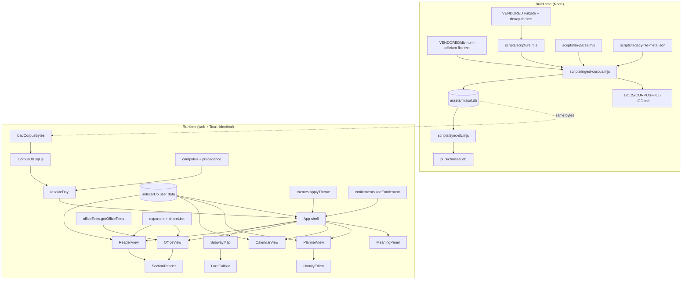

# St. Android's Missal — Authoritative Architecture

**Status:** authoritative for v0.2.x · **Supersedes:** `DOCS/ARCHITECTURE/StAndroidsMissal-v1.md` (retained as the v0.1 historical record) · **Identifier:** `mba.robin.standroidsmissal` · **Version string:** one string across `package.json` / `src-tauri/tauri.conf.json` / `src-tauri/Cargo.toml`

## 1. Overview

St. Android's Missal renders the Traditional Latin Mass and Divine Office as a navigable subway map. The liturgical corpus is László Kiss' Divinum Officium flat-text tree, **vendored whole into this repository** and re-realized at ingest time as a graph + vector SQLite database (`assets/missal.db`) consumed identically on web and native (Tauri 2). v0.2 adds, on top of the shipped v0.1 surfaces: corpus sovereignty (Phase 0, shipped), reader/navigation fixes (A, shipped), the full Ordinary + Divine Office texts (B), subway-map lore callouts (C), a sync-ready user-data sidecar with homily-planner/journal (D), a 6-family × light/dark theme system (E), print/export/share (F), and a modular RevenueCat-authoritative entitlement layer (G).

Requirements source: the operator plan `~/.windsurf/plans/missal-vendor-reader-planner-d2d153.md` (phases quoted per-task in `CHECKLIST.md`).

## 2. Source documents

- `README.md` — product intent, platforms.
- `~/.windsurf/plans/missal-vendor-reader-planner-d2d153.md` — the v0.2 requirements plan (Phases 0, A–G).
- `DOCS/ARCHITECTURE/StAndroidsMissal-v1.md` — v0.1 entity table, decisions 1–7 (all still binding).
- `DOCS/CORPUS-SCHEMA.md` — DO flat-text format, directive grammar, gap-fill policy, `missal.db` schema.
- `DOCS/CORPUS-FILL-LOG.md` — regenerated fill audit (2,595 fills at last ingest).
- `LOGS/pr2-6jul2026.md` — session transcript in which Phase 0/A/B1 landed.
- `VENDORED/*/PROVENANCE.md` — upstream pins for divinum-officium, vulgate-clementina, douay-rheims.

## 3. UI Design Reference

**Phase 0.5 (Stitch elucidation) — documented skip.** This is a brownfield product whose design system is the shipped application itself (parchment skeuomorphic base, rail nav, seasonal accent theming, SVG subway idiom). The operator supplied the new surfaces' design intent directly and in detail in the plan file (hover lore callouts C3, calendar indicators D2, theme-painting D4, split-pane editor D6, six named theme families E2) — treated as the operator carve-out design source. New v0.2 surfaces extend existing screens rather than introduce novel journeys. If any C/D/E surface proves visually ambiguous during CODE, iterate back to a Stitch pass under `LIBS/UI/STITCH/` before improvising.

## 4. Architectural decisions

Decisions 1–7 are inherited verbatim from v0.1 (`StAndroidsMissal-v1.md § Decisions`) and remain binding: (1) one query layer everywhere — the collinear rule; (2) directives become edges; (3) commune gap-fill non-inverted; (4) deterministic offline embeddings, model-agnostic table; (5) Latin normative; (6) no placeholder data; (7) one version string.

8. **Corpus sovereignty (shipped, Phase 0).** The entire divinum-officium repo is snapshot into `VENDORED/divinum-officium/` (no `.git`, no upstream tracking); scripture fallbacks in `VENDORED/vulgate-clementina/` + `VENDORED/douay-rheims/`. No build path references outside the repo. Alternative rejected: submodule / external HelloWord db (upstream mercy, offline break).
9. **Generation never breaks (shipped, V0.7).** Broken directives resolve through a fixed chain — same section elsewhere → `vide` Commune → vendored scripture by parsed citation → marked placeholder — every fill logged to `DOCS/CORPUS-FILL-LOG.md`, `meta.filled` on the node.
10. **Two-plane memory.** `missal.db` is canonical, read-only, regenerated only by ingest. All user data lives in a **separate sidecar SQLite** (`SidecarDb`) whose every row carries `id` (uuid) / `device_id` / `updated_at` / `deleted_at` (tombstone) so multi-device + parish-group sync can be layered on without schema change. The two planes never mix; the sidecar never stores corpus text, only `nodeKey`/liturgical-key anchors.
11. **Liturgical-key anchoring for recyclable content.** Homilies anchor to the *liturgical* key (`weekKey` or `Sancti/MM-DD` feast key), not the civil date, with optional per-year overlay rows (`year` column; `year IS NULL` = the base homily). Content recycles annually by construction.
12. **One shared bilingual renderer.** `SectionReader` (extracted from `ReaderView`) renders `ReaderEntry[]` for both Mass and Office modes — annotations, selection menu, and exegesis machinery are written once.
13. **Semantic theme tokens.** All component CSS consumes semantic tokens (`--surface`, `--surface-2`, `--ink`, `--ink-soft`, `--accent`, `--pane-latin-bg`, `--pane-english-bg`, `--rail-bg`, `--card-border`); a theme is a `data-theme` (family) + `data-mode` (light|dark) pair on `<html>`; the seasonal liturgical accent (`data-color`) stays orthogonal. Seven families × two modes = fourteen themes as pure token blocks — no component edits per theme (the seventh, `sanctissimissa`, is the Sanctissimissa-template-derived card family, §7.7).
14. **Lore is hand-authored data, not fetched.** Station/line lore ships as a typed constant module (`stationLore.ts`); no network, no LLM in this phase (decision 6 applies — no fabricated liturgical claims at runtime).
15. **Entitlements: RevenueCat authoritative, gates are data.** The client asks only RevenueCat (key via `VITE_REVENUECAT_API_KEY`, never hardcoded); BTCPay/WooCommerce sync *into* RevenueCat via a server-side bridge specified in `DOCS/ENTITLEMENT-SYNC.md` (interface spec; separate deployable, not this repo's code). `FEATURE_GATES` maps feature → required entitlement or `null` (ungated); v0.2 ships all-`null` (G3) so deciding tiers later edits one map.
16. **Deep links are URL params, parsed once at boot.** `?view=&date=&section=&quote=` — `parseDeepLink` feeds initial App state; share payloads embed the same URL.
17. **The map is ever-present (shipped 2026-07-11, Phase M).** HelloWord's defining affordance — a persistent subway strip at the top of the app so the user always knows *where in the Mass they are* — is a first-class shell element (`MapStrip`), not a view. One `MASS_ORDO` model, two projections: the full vertical map (the `map` view) and the compact horizontal strip (every other view; suppressed where a view already displays its own map — the full-map view, and the office view while its side loop is visible ≥981px). Position tracking is HelloWord's mechanism (IntersectionObserver over the reader's `data-section` anchors, asymmetric reading band, programmatic-scroll guard, index-based past/active/future); theming is ours (`--line-catechumens`/`--line-faithful`/`--line-office` segments, propers as interchange rings in the day's `--accent`). The Office receives the same treatment (novel — HelloWord had none): the eight-hour cursus as the strip in the office view. Hover/focus on any station or hour opens `MapFlyout`: dual-language incipit of the day's real text (English-missing explicitly flagged), a hand-authored one-breath description (`STATION_INFO`/`HOUR_INFO`), and a planned-media slot (inventory: `DOCS/MEDIA-PLAN.md`; flagged until the asset ships — decision 6 applies). Ferial Mass delegation is data-layer policy: `massTextsForDay` says the week's Sunday Mass ("de Dominica praecedenti") when a Tempora feria file carries no Mass sections, rows keeping their true sourcePath.

18. **Corpus delivery is platform-tiered — Android fast-follows (operator, 2026-07-14).** The interpretive layer grew `missal.db` to ~193 MB, at/over Play's AAB base-module download ceiling. Resolution: **desktop** keeps `include_bytes!` (no store limits); **web/PWA** keeps lazy `fetch('/missal.db')`; **Android (Play)** stops embedding — the corpus ships as a Play Asset Delivery asset pack `corpus_pack` with `deliveryType fastFollow` (install completes immediately; the pack streams automatically right after). Android `load_corpus` resolves through a chain: (1) `AssetPackManager.getPackLocation('corpus_pack')` file path once delivered; (2) while fast-follow is still downloading, the existing corpus-loading splash shows pack download progress (AssetPackStateUpdateListener events bridged to the frontend); (3) sideload/F-Droid builds (no Play services) keep today's `include_bytes!` path via a build flag (`SAM_EMBED_CORPUS=1`, the non-Play default — mirrors B-8's build-time-exclusion pattern). One `CorpusPackPlugin` (Kotlin) owns all Play-side pack logic; the Rust `load_corpus` command gains a cfg-gated Android branch that reads the resolved path. The collinear rule is untouched — sql.js still consumes identical bytes everywhere; only byte *transport* differs per platform, exactly as `loadCorpus.ts` already isolates. Decision 19 further shrinks the base pack: the interpretive layer leaves `missal.db` entirely.

19. **Module system — modular by design, premium-gated with a free sample (operator, 2026-07-14).** The app is a host shell + **module registry**. A `Module` = `{ id, kind: 'content' | 'feature', title, railIcon?, entitlement: string | null, delivery: 'builtin' | 'asset-pack' | 'download', version }`. **Content modules** are additional SQLite databases in the *same* graph schema, attached into query scope via `CorpusDb.attachModule(id, bytes)` — the commentary sources leave the base `missal.db` (splitting it back to ~140 MB) and become the first modules: **complete Haydock ships FREE as the sample module** (the canonical DR companion — the free app remains a whole commentary Bible; amendable by operator), Catena Aurea + the 13-source PD roadmap gate on the **`study_library`** entitlement. Future content modules: Gregorian chant notation, Liber Usualis ↔ Mass alignment, per-source patristics/doctors. **Feature modules** are lazily-loaded route components registered into `NAV` — the rail has room for their icons. Roadmap (recorded, not this wave): Publishing Desk (article authoring — journaling's rich-text + the vector reference store behind a writing surface), Latin lessons/translator, choir photo/video post-production, altar-server training. Gating stays pure data (B-1/B-4): `MODULE_GATES: Record<ModuleId, string | null>` reads RC only; free-sample = `null` gate (content-level trial, no expiry — consistent with the trial-is-a-client-side-cap doctrine, no time bombs). Delivery per platform: Play = on-demand asset packs (base corpus stays fast-follow per decision 18); web/desktop/sideload = CC12-stamped versioned downloads from standroid.robin.mba, cached (web IndexedDB/OPFS; desktop app-data). Charging is for the *integration* (verse-keyed alignment, graph + vector surfacing, offline packaging), never for the public-domain texts themselves — Priority Zero optics are load-bearing. **Portability mandate (operator, 2026-07-14):** this module system is the evolution/practice run for the same capability at the core of **EnZIME** and similar hosts — the registry, gating map, attach mechanism, and delivery plumbing must be host-agnostic (no missal-specific imports in the module core; the host supplies the registry contents), so the whole layer lifts into sibling products unchanged.

20. **Interpretive nuclei are a lossless ordering grammar for vector abundance, never a separate result list or a manual-tag prerequisite (operator, 2026-07-14).** Every user-facing free-text similarity operation first retains its complete requested candidate horizon (`candidateK`, default 64), makes each hit atomic with `bestClause`, and obtains the nearest nucleus clauses through `CorpusDb.interpretiveNucleiForText`. Each candidate is assigned to its most-affine nucleus and receives `contextScore = 0.7 * queryScore + 0.3 * nucleusAffinity`; key-ascending ties are stable. The UI shows at most five context-ordered nucleus groups with at most three representative hits each, then an expandable **Further associations** tail containing every remaining candidate in descending `contextScore`. The completeness invariant is binding: every raw candidate appears exactly once in either a representative slot or the tail; nucleation reorders and explains but never filters. If no nucleus exists, the same complete set falls back to existing concept grouping. Haydock's whole-commentary embeddings provide the first coarse nucleus shortlist; `bestClause` makes each nucleus an atomic, quotable unit carrying `COMMENTS_ON` verse anchors and inherited `INSTANCE_OF` concepts. Manual theme tags remain optional curation/override; no meaning, connection, theme-surfacing, grouping, or long-tail path waits for manual classification. The API operates over the active corpus/module query scope so decision 19's free Haydock module preserves the substrate after the commentary split.

21. **Catholic lore is multi-source and edition-rights-specific; authority is a visible facet, not a relevance multiplier (operator, 2026-07-14).** Nucleus-capable modules may declare `authorityKind: 'scriptural-commentary' | 'catechesis' | 'magisterium' | 'patristics' | 'scholastic-theology' | 'spiritual-classic' | 'encyclopedic'`. Semantic context orders results; the UI displays and filters authority/source chips but never collapses ecclesial authority into a scalar score. Every source ships an exact-edition `NucleusSourceManifest` recording work/edition/translation dates, languages, translator/editor, publication place, rights basis, provenance URL, and checksum. Immediate public-domain seed candidates are the 1833 Donovan *Roman Catechism* scan, Baltimore Catechism Nos. 1–4, pre-1931 U.S. editions of the *Catholic Encyclopedia* and English Dominican *Summa*, and nineteenth-century ANF/NPNF translations. Denzinger's 1911 Latin edition and historical papal/council act editions enter only after jurisdiction/edition review. Modern Vatican portal texts and translations remain link-only unless separately licensed: ancient authorship or magisterial status does not make a modern edition or translation reusable. Historical bulls, conciliar decrees, `Acta Sanctae Sedis`, and early `Acta Apostolicae Sedis` are first-class roadmap material through qualifying old editions or newly prepared transcriptions of source-language text, with modern translations never silently substituted.

## 5. Component diagram



## 6. Data flow (critical paths)

**Day resolution (unchanged, shipped):** ISO date → `computus.getWeekKey/getSeason` → `Tempora/<weekKey>` + `Sancti/MM-DD*` nodes → `precedence.resolveWinner` → `DayInfo` (cached per date, never pre-generated).

**Full-Mass reader (shipped, B1; amended M):** `massTextsForDay(db, day)` (propers via `CorpusDb.getMassTexts` with non-inverted commune fill, ferial→Sunday delegation) + `CorpusDb.getOrdoTexts()` (Ordinary) interleaved by `READER_ORDER` into `ReaderEntry[]`, seasonal chant-switch sections filtered by `stationActive`; station click → `App.onStation` → `focus {section, nonce}` → `ReaderView` scrolls its own container deterministically to the `data-section` anchor (`ORDO_STATION_SECTION` maps ordinary station ids → Ordo sections).

**Map-strip position sync (shipped, M):** reader `IntersectionObserver` (band `-20% 0px -65% 0px`, root = the scrolling `.content`, mute-guard around programmatic scrolls) → `onVisibleSection(anchor)` → `stationForAnchor` → `App.activeStation` → `MapStrip` past/active/future by index; strip/office-hour clicks flow the reverse way. Search-hit open (`onOpenKey`) navigates to the hit's source day: Sancti → month-day, Tempora → `dateForWeekKey` inversion, Horas → office view at the named hour.

**Office assembly (B2):** `getOfficeTexts(db, day, hourId)` picks the day's `Horas/` file (`Horas/<winner.key>` else `Horas/<temporaPath>`), pulls its real stored sections via `CorpusDb.getFileSections` (commune fallback via `communeOf`), and orders/filters them through `HOUR_SECTION_PATTERNS[hourId]` (regex slot plans over the ingested DO section names — `Ant Laudes`, `Capitulum Nona`, `Lectio1..9`, …) → `ReaderEntry[]` → `SectionReader`. v0.2 renders every real section the corpus carries per hour; full DO-engine hour construction (psalm schema per weekday/rank) is backlog (§10).

**Sidecar write path (D):** UI mutation → `SidecarDb` upsert (uuid, `device_id`, `updated_at=now ISO`, tombstone delete) → debounced `persist()` (web: IndexedDB blob `sidecar.db`; Tauri: `save_sidecar` command → app-data file).

**Share/deep link (F3):** selection → `buildShareUrl({view,date,section,quote})` → recipient loads app → `parseDeepLink(location.search)` → initial `view/date/focus` state + quote highlight.

## 7. Data model

**`assets/missal.db`** (canonical, read-only — full schema in `DOCS/CORPUS-SCHEMA.md`): `nodes(id, kind∈{file,section}, key, title, category, rank_class, rank_num, color, meta)` · `edges(src, dst, rel∈{HAS_SECTION,CROSS_REF,INCLUDES,EXPANDS}, meta)` · `text_blocks(node_id, section, latin, english)` · `embeddings(node_id, dim, vec int8[128])` · FTS5 `search(key, section, content)`.

**Sidecar `sidecar.db`** (user plane, `SIDECAR_SCHEMA_SQL`, all timestamps ISO-8601 UTC text):

```sql
CREATE TABLE IF NOT EXISTS annotations (
  id TEXT PRIMARY KEY, device_id TEXT NOT NULL, updated_at TEXT NOT NULL, deleted_at TEXT,
  node_key TEXT NOT NULL, quote TEXT NOT NULL, note TEXT, color TEXT NOT NULL DEFAULT 'gold',
  created_at TEXT NOT NULL);
CREATE TABLE IF NOT EXISTS homilies (
  id TEXT PRIMARY KEY, device_id TEXT NOT NULL, updated_at TEXT NOT NULL, deleted_at TEXT,
  liturgical_key TEXT NOT NULL, year INTEGER,           -- NULL = base (recyclable) homily
  title TEXT NOT NULL DEFAULT '', body_md TEXT NOT NULL DEFAULT '',
  status TEXT NOT NULL DEFAULT 'unstarted',             -- unstarted|in-progress|complete
  color TEXT, theme_span_id TEXT);
CREATE TABLE IF NOT EXISTS journal_entries (
  id TEXT PRIMARY KEY, device_id TEXT NOT NULL, updated_at TEXT NOT NULL, deleted_at TEXT,
  liturgical_key TEXT NOT NULL, date TEXT NOT NULL, title TEXT NOT NULL DEFAULT '',
  body_md TEXT NOT NULL DEFAULT '', anchors TEXT NOT NULL DEFAULT '[]');  -- JSON array of nodeKey/verse-ref strings
CREATE TABLE IF NOT EXISTS theme_spans (
  id TEXT PRIMARY KEY, device_id TEXT NOT NULL, updated_at TEXT NOT NULL, deleted_at TEXT,
  label TEXT NOT NULL, color TEXT NOT NULL, start_date TEXT NOT NULL, end_date TEXT NOT NULL,
  cadence TEXT NOT NULL DEFAULT 'weekly');               -- daily|weekly
CREATE TABLE IF NOT EXISTS settings (
  key TEXT PRIMARY KEY, device_id TEXT NOT NULL, updated_at TEXT NOT NULL, value TEXT NOT NULL);
```

Settings keys used: `mode` (`priest`|`laity`), `theme.family`, `theme.mode`, `massForm` (`lecta`|`cantata`|`sollemnis`), `roleLens` (`celebrant`|`diaconus`|`subdiaconus`|`ministri`|`laity`|`none`), `rubrics.visible` (`1`|`0`), `type.face`, `type.size`.

## 7.5 Office-generation plane (v0.3 — the product core; supersedes decision 7's interim scope)

**Mandate (operator, 2026-07-06):** the app generates the **complete Divine Office** — all eight hours, any date — exactly as Divinum Officium's engine reckons it. HelloWord was the Mass-only proof of concept; this product completes it. Nothing office-generation-related is "out of scope"; the interim `HOUR_SECTION_PATTERNS` assembly (P-B rows above) remains only as the already-specified fallback layer under the engine.

**Ingest v3 adds these tables to `missal.db`** (formats verified against the vendored tree 2026-07-06; a live normalization demo produced 257 psalm-schema rows, 24 nocturn versicles, 3,427 skeleton lines across 411 sections, 22 seasonal rows):

```sql
CREATE TABLE office_psalm_schema (   -- from Psalterium/Psalmi/Psalmi {major,matutinum,minor}.txt
  day_key TEXT NOT NULL,             -- 'Day0'(Sun)..'Day6'(Sat)
  hour TEXT NOT NULL,                -- 'Matutinum','Laudes1','Laudes2','Prima','Tertia','Sexta','Nona','Vespera','Completorium'
  nocturn INTEGER,                   -- Matins 1..3, else NULL
  slot_ord INTEGER NOT NULL,
  antiphon_la TEXT, antiphon_en TEXT,
  psalm_ref TEXT NOT NULL,           -- '92', '9(2-11)', '118(33-48)'
  festal_bracket INTEGER NOT NULL DEFAULT 0);  -- bracketed = displaced on feasts
CREATE TABLE office_nocturn_versicle (day_key TEXT, nocturn INTEGER, versicle_la TEXT, response_la TEXT, versicle_en TEXT, response_en TEXT);
CREATE TABLE office_skeleton (       -- from Psalterium/Special/{Matutinum,Major,Minor,Prima} Special.txt + Preces.txt
  hour_file TEXT NOT NULL, section TEXT NOT NULL, ord INTEGER NOT NULL,
  line TEXT NOT NULL,                -- verbatim: text, or @/&/$ directive, or (condition)
  is_directive INTEGER NOT NULL, is_condition INTEGER NOT NULL);
CREATE TABLE office_seasonal (kind TEXT NOT NULL, key TEXT NOT NULL, body_la TEXT, body_en TEXT);
  -- kind ∈ invitatory (SOURCE: 'Matutinum Special.txt' [Invit*] sections — NOT Major Special), marian_ant (Mariaant.txt), doxology (Doxologies.txt), benediction (Benedictions.txt)
CREATE TABLE role_rubrics (          -- DO-provided granularity ONLY (operator 2026-07-06): parsed from missa Ordo.txt '!' rubric prose
  section_key TEXT NOT NULL,         -- e.g. 'Ordo/Missae#Incensatio'
  form TEXT NOT NULL,                -- 'lecta' | 'sollemnis' | 'both'  (Cantata = derived display: sollemnis minus sacred-minister rows)
  role TEXT NOT NULL,                -- 'celebrant'|'diaconus'|'subdiaconus'|'ministri'|'all'
  ord INTEGER NOT NULL, latin TEXT, english TEXT,
  source_line TEXT NOT NULL);        -- provenance: 'Ordo.txt:62'
```

**Runtime engine:** `OfficeEngine` (`src/core/office/engine.ts`) — `buildHour(db: CorpusDb, day: DayInfo, hourId: string, opts: OfficeOpts): ReaderEntry[]`. Algorithm: (1) select the hour's skeleton sections; (2) evaluate `(condition)` lines against `{season, rank, weekday, rubricSet: '1960'}` (grammar: `sed rubrica …`, `si …`, day/season names — the vendored `(sed rubrica praedicatorum/cisterciensis/monastica)` branches are skipped: we fix rubricSet 1960/Romana); (3) resolve `@file:section[:xform]` / `&macro` / `$prayer` directives at generation time against the graph (same resolver contract as ingest, now runtime — `INCLUDES`/`EXPANDS` edges make targets queryable); (4) psalmody from `office_psalm_schema[day_key]` with festal displacement (feast propers/commune override bracketed slots; I-class = proper psalms where the Sancti file carries them); (5) seasonal layer: invitatory, hymn doxology, Paschal alleluia appendage, Marian antiphon at Compline (`office_seasonal`); (6) precedence/commemoration from the existing `resolveWinner` + occurring Sancti (commemoration = the commemorated office's antiphon+versicle+oratio after the day's collect; this rule also resolves the Octava-placeholder cluster in `DOCS/MISSING-REFERENCES.md` §1); (7) missing-text resolution per routes S→A→C below. Mass side reuses steps 2–3 to build the `role_rubrics`-aware rubric layer.

**Missing-primary-material resolution (operator policy, final priority):**
- **Route S (primary preferred):** scriptural text (explicit `!` citation or derivable — psalm number, lesson incipit) with one language held → counterpart **looked up** from Clementine Vulgate (la) / Douay-Rheims (en), both vendored, public domain.
- **Route A:** non-scriptural text present elsewhere in the DO tree → substitute; missing counterpart language → in-style ecclesiastical cross-translation (metre/constructions matched).
- **Route C:** Ordinary/euchology absent from DO → in-style our-licensed generation; neither language → two-step (our interpretation, then our translation of our interpretation). Licensing impediments anywhere also route here.
- All supplied text: `meta.translationSupplied`/`meta.filled`, rendered via tokens `--supplied-ink`/`--supplied-bg` (lighter ink, tinted bg, all 12 themes), provenance on hover, every fill in the fill log. Register: `DOCS/MISSING-REFERENCES.md` (166 distinct directives; 13,596 Latin-only + 263 English-only sections). Target after routes run: **0 shipped `textus deest`** (gauntlet O-16).

**Presentation tray** (`src/ui/TrayPanel.tsx`, slide-out on all views): theme family + light/dark (relocates ThemePicker), Mass-form toggle (lecta / cantata-derived / sollemnis), role lens (DO-provided roles only), rubrics on/off master toggle, typeface selection (bundled-local families: serif liturgical default + sans + dyslexia-friendly; no remote fonts) and font-size control — all persisted in sidecar `settings` (keys above), applied via `data-*` attrs/CSS vars. Gauntlet §Y binds.

## 7.6 Bible + Accompaniment plane (v0.4 — scripture, one-object sidecar, companion, parish edition)

**Mandate (operator, 2026-07-12):** promote the vendored Bibles to a first-class **Bible plane** — full reading experience, annotating journal, bible-study program with in-parish support materials, Chat-with-Bible, daily reading programming, Android home-screen widgetry — and unify all user-authored material into **one object**.

**Unification decision (supersedes the §7 `homilies`/`journal_entries`/`theme_spans` three-table split):** journaling, the priest's homily-management system, bible-study support materials, and parish newsletters/admin distribution materials (institutional edition) are **one object type** — the rich-text **Accompaniment** — differentially exposed. An accompaniment is optionally anchored to deep-linkable content (verse, section, day) and surfaced by *occurrence selectors*: fixed dates, moveable feasts (temporal week-keys), immovable feasts (MM-DD), seasons, free-form themes (the priest dreams up a theme and applies it arbitrarily; Commune classes and the concept taxonomy are autocomplete *suggestions*, never the domain), and non-liturgical recurrences (every-Wednesday class, First Fridays). Highlights/margin notes are lightweight accompaniments (the §7 `annotations` shape migrates in, old localStorage key preserved read-only). Provenance (`authored`/`generated`/`vendored`) is a field, not a filter on what may exist; generated parish materials are curated-and-reviewed before shipping, attributed as AI-assisted — live generation happens only in chat, where its nature is self-evident.

**Ingest Pass 4 — Bible corpus (`scripts/ingest-bible.mjs`, wired into `ingest-corpus.mjs`):** the two vendored Bibles land in the *existing* graph tables — nodes `book:Gen` / `chapter:Gen/1` / `verse:Gen/1/1` (kinds `book|chapter|verse`), `text_blocks` latin=Clementine Vulgate (`vul.tsv`) / english=Douay-Rheims (`EntireBible-DR.json`), edges `HAS_CHAPTER`/`HAS_VERSE`, verse FTS rows, verse-level embeddings (~35k × 128 int8). A 73-book mapping table (`BOOK_MAP`: DR JSON keys ↔ vul.tsv names/abbrevs ↔ canonical key) is the shared vocabulary. Liturgical sections gain **`CITES` edges** to verse ranges (from the existing citation parse), meta `{quality: 'exact'|'adapted'}`. **Normalization boundary:** displayed liturgical text stays verbatim — liturgical quotations are adapted (spliced verses, alleluias, Old-Latin psalter readings) and the prayed text is normative (Decision 5); but gap-filled scripture (`meta.filled`) becomes a verse *reference* instead of copied text — verbatim by construction, deduplicating storage and making every fill verse-traceable. New `missal.db` tables: `reading_plans(id, title, kind)` + `plan_day(plan_id, ord, verse_refs)` for daily reading programming (liturgical-year-aligned + canonical whole-Bible plans).

**Sidecar v2 (`SIDECAR_SCHEMA_SQL_V2`, SQLite via the already-loaded sql.js — the collinear rule extended to user data; platforms differ only in byte persistence: web OPFS/IndexedDB, Tauri app-data file, mirroring `loadCorpus.ts`):**

```sql
CREATE TABLE IF NOT EXISTS accompaniments (
  id TEXT PRIMARY KEY, device_id TEXT NOT NULL, updated_at TEXT NOT NULL, deleted_at TEXT,
  title TEXT NOT NULL DEFAULT '', body_pm TEXT NOT NULL DEFAULT '',   -- ProseMirror JSON
  body_html TEXT NOT NULL DEFAULT '',                                 -- rendered snapshot (share/print/export)
  anchors TEXT NOT NULL DEFAULT '[]',                                 -- JSON array of node keys ('verse:Gen/1/1','section:…') or []
  exposure TEXT NOT NULL,                    -- 'journal'|'homily'|'study'|'newsletter'
  provenance TEXT NOT NULL DEFAULT 'authored',  -- 'authored'|'generated'|'vendored'
  quote TEXT, color TEXT,                    -- lightweight highlight fields (annotation migration)
  created_at TEXT NOT NULL);
CREATE TABLE IF NOT EXISTS occurrences (     -- occurrence selectors, N per accompaniment
  id TEXT PRIMARY KEY, accompaniment_id TEXT NOT NULL, kind TEXT NOT NULL,
  -- kind ∈ date(iso) | temporal(weekKey) | sancti(mmdd) | season(name) | theme(free-form tag) | recurrence(rule)
  value TEXT NOT NULL);
CREATE TABLE IF NOT EXISTS lore (            -- CompanionMemory layer 1: SOUL.md-style, user-visible AND user-editable
  id TEXT PRIMARY KEY, device_id TEXT NOT NULL, updated_at TEXT NOT NULL,
  kind TEXT NOT NULL,                        -- 'journey'|'parish'|'persona'
  body_md TEXT NOT NULL DEFAULT '');
CREATE TABLE IF NOT EXISTS sidecar_embeddings (  -- CompanionMemory layer 2: embedText (Decision 4, model-agnostic)
  ref_id TEXT PRIMARY KEY, dim INTEGER NOT NULL, vec BLOB NOT NULL);
CREATE TABLE IF NOT EXISTS parish_profile (  -- institutional edition: header space / masthead
  key TEXT PRIMARY KEY, value TEXT NOT NULL);  -- name, logo(dataURI), letterhead, colors, address
CREATE TABLE IF NOT EXISTS reading_progress (plan_id TEXT NOT NULL, ord INTEGER NOT NULL, completed_at TEXT NOT NULL);
-- settings table carried over from §7 unchanged
```

**Resolution:** `accompanimentsForDay(db, sidecar, iso)` projects every selector kind onto a concrete date via the existing computus (`resolveDay`, `dateForWeekKey`) and recurrence evaluation; `forAnchor(nodeKey)` and theme/tag facets serve anchored and longitudinal queries.

**Deep links (address layer for shares, widgets, chat):** hash routes `#/verse/Gen/1/1` · `#/section/<path>#<name>` · `#/day/YYYY-MM-DD` · `#/acc/<id>` layered onto the existing history-based back-nav; the deployed web app (standroid.robin.mba) is the public resolver for shared links (`navigator.share`/copy: rendered snapshot + deep link to the primary source).

**Exposure surfaces:** `BibleView` (rail "Sacred Scripture": book/chapter navigation, bilingual verse reader on ReaderView patterns, selection → MeaningPanel unchanged, "appears in the liturgy" via CITES) · `JournalView` (date timeline) · `HomilyPlanner` (selector-projected planning calendar; "this Sunday's drafts") · `StudyBuilder` (class centroid: recurrence group + passage anchors + session materials; print stylesheet for handouts) · `NewsletterDesk` (**institutional entitlement only**: `anchors: []` + calendar selectors; outputs from `body_html` — print, email-ready HTML export, share link; `parish_profile` masthead). One rich-text editor for all: `AccompanimentEditor` (TipTap/ProseMirror, MIT; stores `body_pm` + `body_html`).

**Companion (journey companion with lore memory; same CompanionEngine across the app, own rail icon):** `CompanionEngine` interface + `OnDeviceEngine` (LiteRT-LM, Gemma 4 E2B; WebGPU path on web) + `HostedEngine` (metered proxy). Read access to the full sidecar and corpus. Serves the end user (navigating, discussing a theme, evaluating over time how a theme has figured in their life as journaled) and the priest (examples/inspirations while writing, over his own past homilies + journal + commentary + the feast's liturgy). `CompanionMemory`: lore documents (distillation loop on idle/save, size-capped to E2B context, user-editable) + vector recall over `sidecar_embeddings` fused with theme/date facets. Context per turn: persona + lore + retrieved memories + current position + CITES links; replies cite deep links; saved insights become accompaniments (`provenance='generated'`).

**Entitlement vocabulary (I-3; RC per BILLING_CONVENTIONS B-1..B-6, one controller `has(entitlementId)`):** `companion_ondevice` (unlimited on-device) · `companion_hosted` (metered hosted, RC consumable/credits) · `institutional` (parish edition: NewsletterDesk + ParishProfile). Free trial = client-side cap on companion feature activation, no entitlement.

**Commentary reference layer:** Haydock (public-domain DR commentary) vendored at `VENDORED/haydock/` per the vendoring regime (provenance lock before assimilation), ingested as verse-keyed commentary blocks, rendered read-only in BibleView, insertable as `vendored` material in StudyBuilder.

**Android widget:** Kotlin `AppWidgetProvider` in `src-tauri/gen/android` — today's feast + daily reading refs, deep-link intent (hash route); data JSON maintained by the app + daily refresh. Web = PWA shortcuts; desktop skipped in v1.

## 7.7 Presentation & meaning plane (v0.5 — sanctissima theme, interleaved bilingual, similarity UX, Scripture Atlas, interpretive layer, journal sidecar workspace)

**Mandate (operator, 2026-07-14):** five coupled presentation/meaning upgrades — an alternate theme derived from `DOCS/Sanctissimissa-Template.html`; a mobile-usable interleaved bilingual layout with dual-language selection; vector similarity made *useful* (clause atomicity, relative-distance glyph, imagery grouping); meaning-first Scripture navigation (imagery/scenarios, Gospel parallels, differential sizing); and the Journal/Homily Management workspace per `DOCS/standroids-journal-sidecar-standalone.html` + the 2026-07-14 PRD (`DOCS/StAndroidsMissal-Additional-PRD-pieces_copilot_message_export_july_14_2026_1_50am.md`). Architected for parallel coder dispatch: one shared-file owner per wave (open question 8 amended below).

**Sanctissimissa theme family (extends decision 13):** `ThemeFamily` gains `'sanctissimissa'`. Background tokens retain the parchment framework (operator: keep the framework's background colouring); content surfaces render as **elevated white cards** (`--card`, `--card-shadow`, 12px radii), accordion section heads on the existing fold/unfold affordance, propers sections carry a gold left border + warm tint. New **liturgical text-role tokens consumed by every family**: `--rubric` (rubric red), `--dialogue-p` (priest/versicle voice), `--dialogue-s` (server/response voice). Line-prefix detection (`dialogueClass`, `src/core/text/dialogue.ts`) is rendering-level only — stored corpus text is never modified: `V.`/`℣.`/leading `P.` → dialogue-p; `R.`/`℟.`/leading `S.` → dialogue-s. Selectable alternate: `DEFAULT_FAMILY` stays `'skeuomorphic'`; both families ship light + dark. Fonts stay bundled-local (the template's Crimson-Pro feel = local serif stack bias, no remote fonts). The template's translation-popup idiom is already served by the shipped word-callout/echo grammar — not duplicated.

**Interleaved bilingual mode:** below 1100px (and later by user preference `reader.layout`), the two-pane grid is replaced by a single interleaved column rendered by the shared renderer `BilingualText` (`src/ui/BilingualText.tsx`, extracted from ReaderView's internal TextBlock; adopted by ReaderView, OfficeView-via-SectionReader when P-B lands, and BibleView at verse granularity): per aligned line *i* — Latin first (**bold**, `--ink`), its English beneath (indented 1.1em, italic, `--ink-faint`), then a gap before the next pair; NULL English → Latin-only row. The existing `selectionchange` single-line echo extends to the **full line-range** of the live selection, lighting every counterpart row (`.xlate-echo`) in both directions — the cursor effectively selects both languages simultaneously. CSS block `.bilingual-interleaved`.

**Similarity UX (MeaningPanel):** each similar-hit gains (a) **clause focus** — `bestClause(text, query)` (`src/core/vector/clause.ts`) splits on `.:;·` boundaries (min 25 chars/clause), embeds clauses via the existing `embedText`, cosine-argmax; the winning clause renders emphasized with the remainder collapsed behind "more" — hits become quotable at semantic-clause granularity; (b) **`SimilarityGlyph`** (`src/ui/SimilarityGlyph.tsx`) — an icon-sized radial SVG: query at center, this hit's dot at radius ∝ (1−score), siblings ghosted, so relative relatedness is visible at a glance; the raw score demotes to a tooltip; (c) **imagery grouping** — `IMAGERY_CONCEPTS` (~15 imagery/metaphor/typology concepts with seed phrases: Light & Darkness, Shepherd & Flock, Vine & Vineyard, Water & Baptism, Bread from Heaven, Lamb & Sacrifice, King & Kingdom, Bridegroom & Bride, Desert & Exile, Mountain of God, Temple & Dwelling, Harvest & Vintage, The Way, Rock & Foundation, Fire & Spirit) merged into `concepts.ts` and ingested exactly like the existing taxonomy, so `INSTANCE_OF` grouping spans OT/Psalms/NT through the verse nodes; (d) **lossless nucleus ordering** — every `groupedSimilarToText` UI consumer moves to `nucleatedSimilarToText`: context-matching nucleus groups and atomic representatives first, the complete non-representative remainder under **Further associations**. Every card retains query score, nucleus affinity, source/authority chip, and why-bridge; nuclei are automatic, and manual theme tags are optional curation only.

**Scripture Atlas (BibleView navigation modes):** `AtlasMode = 'canonical' | 'imagery' | 'parallels'` — meaning-first navigation is additive; canonical grids remain. *Imagery mode:* imagery concepts as a differential-size label field (font-size ∝ √(linked verse count); liturgical prominence via CITES counts) grouped under hand-authored `SCENARIO_CLUSTERS` (Creation & Fall, Exodus & Desert, Kingdom & Exile, Wisdom & Psalter, Incarnation, Public Ministry, Passion, Resurrection & Church); tapping a label lists its verse ranges grouped OT/Psalms/NT. *Parallels mode:* `PERICOPES` (`src/core/ontology/parallels.ts`, curated ~60-pericope spine × Mt/Mc/Lc/Jo columns, cross-checked against the vendored Catena Aurea) as aligned rows, font weight ∝ CITES count, click-through `#/verse/…`; chapter-level embedding cosine supplies "complementarities" between untabled stretches.

**Interpretive layer (generalizes the §7.6 Haydock row):** any cleared source vendored under `VENDORED/<source>/` (clone-at-home; `PROVENANCE.md` + `NucleusSourceManifest` lock **before** assimilation — INC-15; additive, nothing deleted) ingests into the existing graph tables with source/authority metadata, embeddings, and FTS. Verse commentary uses `kind='commentary'`, key `commentary:<source>/<Book>/<ch>/<verse>`, and `COMMENTS_ON`; catechetical, magisterial, patristic, scholastic, spiritual, and encyclopedic atomic units keep source-native keys and connect by explicit `CITES`/`INSTANCE_OF` evidence rather than fabricated verse alignment. Query surfaces: `CorpusDb.commentaryFor(book, ch, verse?)` for direct attribution, `CorpusDb.interpretiveNucleiForText(text, opts?)` for atomic multi-source nuclei, and `CorpusDb.nucleatedSimilarToText(text, opts?)` for the complete ordered similarity set. This wave's active nucleus provider is Haydock: whole records coarse-rank by committed embeddings, `bestClause` reranks the shortlist, and verse/concept evidence attaches without re-ingest or manual tags. **This wave ships Haydock 1883** (fulfils the §7.6 row) **and Catena Aurea** (Newman tr. 1841–45); the remaining sources in `DOCS/ScripturalReferences-PublicDomain.md`, plus decision 21's catechetical/magisterial roster, are roadmap modules over the same source-manifest and nucleus contracts. BibleView renders direct commentary read-only; MeaningPanel and ConnectionsPanel consume the lossless nucleated result set.

**Journal sidecar workspace (UI elaboration of §7.6 B-C/B-D per the prototype + PRD):** reader context menus (ReaderView, BibleView, OfficeView once SectionReader lands) gain **"✎ Add to Journal/Homily notes"** and **"🖍 Highlight both panes"**. Capture opens `JournalSidecar` (`src/ui/JournalSidecar.tsx`, right split pane on the MeaningPanel pattern): source block (bilingual quote via `alignSelection` + anchor nodeKey/verse ref + capture timestamp), embedded `AccompanimentEditor`, `ConnectionsPanel` (corpus vector hits via `nucleatedSimilarToText` over note+quote, the user's own past accompaniments via runtime `embedText` against `sidecar_embeddings`, and direct commentary blocks; every card carries a why-bridge line + evidence chips + add-as-source/dismiss — routes, not bare similarity scores), a destinations row mapping to `exposure` + `OccurrenceSelector` (keep as journal | promote to homily seed | attach to theme/series | schedule for a liturgical occasion), and toast feedback. Dual-pane highlight = lightweight accompaniment (quote + quoteAlt) rendered through the existing `mark.ann` pipeline in **both** panes. Priest/laity vocabulary from settings `mode`. Voice dictation and attachments: schema-ready (`attachments` JSON per PRD), out of scope this wave.

## 8. Entity Table

Status: **S** = shipped (on disk now) · **P-<phase>** = planned, target location. Independent agents must produce these identifiers byte-identically.

### Corpus pipeline (build time)

| Entity | Type | File:line | St | Role | Key signatures / fields |
|---|---|---|---|---|---|
| `ingest-corpus` | Node script | `scripts/ingest-corpus.mjs:1` | S | VENDORED flat-text → `assets/missal.db`; regenerates fill log | `node --experimental-strip-types scripts/ingest-corpus.mjs [outDb]` |
| `parseDOFile` | function | `scripts/do-parse.mjs` | S | DO `.txt` → ordered `[Section]` map (qualifier → `meta.qualifier`) | exported by `do-parse.mjs` |
| `parseRank` / `ruleVide` | functions | `scripts/do-parse.mjs` | S | `[Rank]` `name;;class;;num` parse; `vide C-ref` extraction | — |
| `CorpusTree` / `loadPrayers` / `resolveContent` | class/fns | `scripts/do-parse.mjs` | S | vendored-tree file access; `&`/`$` prayer expansion; `@include` + xform resolution | — |
| `FillLog` / `firstCitation` | class/fn | `scripts/do-parse.mjs` | S | fill audit rows → `DOCS/CORPUS-FILL-LOG.md`; `!Ps 27:8-9` citation parse | — |
| `Scripture` | class | `scripts/scripture.mjs` | S | citation → verse text from vendored Vulgate (la) / Douay-Rheims (en) | — |
| `sync-db` | Node script | `scripts/sync-db.mjs:1` | S | `assets/missal.db` → `public/missal.db` (pre-dev/pre-build) | — |
| `legacy-file-meta.json` | data | `scripts/legacy-file-meta.json` | S | rank/color per file key salvaged from legacy HelloWord db, consumed by ingest | `{ "<path>": {color, rankClass, rankNum, title} }` |
| `missal.db` | SQLite | `assets/missal.db` | S | canonical read-only corpus (nodes/edges/text_blocks/embeddings/search) | schema §7 |
| `embedText` / `EMBED_DIM` / `cosine` | fn/const/fn | `src/core/vector/embed.ts:1` | S | 128-d hashed-trigram int8 embedding; cosine over Int8Array | `embedText(text): Int8Array`, `EMBED_DIM = 128` |

### Core model + calendar (runtime)

| Entity | Type | File:line | St | Role | Key signatures / fields |
|---|---|---|---|---|---|
| `computus` | module | `src/core/calendar/computus.ts:1` | S | Butcher's Easter, DO week keys, season/color (feast-title fallback knows martyr/blood/cross/apostle→red, cathedra/Marian/angel→white), UTC-safe | `getEaster(year)`, `parseISODate(iso)`, `getWeekKey(date)`, `getSeason(weekKey)`, `seasonColor(weekKey, feast?)`, `dateForWeekKey(weekKey, nearISO)` |
| `resolveWinner` / `DayFileMeta` | fn/type | `src/core/calendar/precedence.ts:1` | S | 1962 precedence incl. privileged Lenten ferias | `resolveWinner(dow, season, tempora, sancti[])` |
| `Station` | interface | `src/core/model/massOrdo.ts:1` | S | subway station | `{ id, latin, english, kind: 'ordinary'\|'proper'\|'conditional'\|'switch', line, sectionKey?, branch?, activeIn?, note? }` |
| `MASS_ORDO` / `trunkOf` / `branchOf` / `stationActive` | const/fns | `src/core/model/massOrdo.ts:55` | S | all stations; line/branch selectors; seasonal activity | — |
| `stripStations` / `stationForAnchor` | fns | `src/core/model/massOrdo.ts:171` | S | map-strip station sequence (skeleton trunks + season's chant switches after the Epistle); inverse reader-anchor → station id for scroll-spy | `stripStations(season): Station[]`, `stationForAnchor(anchor): string \| null` |
| `StationInfo` / `PlannedMedia` / `STATION_INFO` / `HOUR_INFO` | types/consts | `src/core/model/stationLore.ts:1` | S | one-breath "what this is" + planned media asset per station / hour, feeding `MapFlyout`; inventory `DOCS/MEDIA-PLAN.md` (39 assets); C1's four-field `STATION_LORE` will join this file | `StationInfo { about, media: PlannedMedia { id, kind: 'video'\|'photo', caption } }` |
| `MASS_SECTION_ORDER` | const | `src/core/model/massOrdo.ts:39` | S | canonical proper-section order | `readonly string[]` |
| `ORDO_STATION_SECTION` | const | `src/core/model/massOrdo.ts:99` | S | ordinary station id → `Ordo/Missae` section | `Record<string, string>` |
| `READER_ORDER` | const | `src/core/model/massOrdo.ts:121` | S | Ordinary ⋈ propers interleave for the full-Mass reader | `{ kind: 'ordo'\|'proper'; section: string; title?: string }[]` |
| `Hour` / `OFFICE_CURSUS` | interface/const | `src/core/model/officeCursus.ts:8` | S | eight hours, rubrical skeleton | `Hour { id, latin, english, clock, parts[] }`; ids `matutinum, laudes, prima, tertia, sexta, nona, vesperae, completorium` |
| `Lore` | interface | `src/core/model/stationLore.ts:1` | P-C | one lore record | `{ what: string; origins: string; evolution: string; novusOrdo: string }` |
| `STATION_LORE` | const | `src/core/model/stationLore.ts` | P-C | lore per `Station.id` — **every** id in `MASS_ORDO` | `Record<string, Lore>` |
| `LINE_LORE` | const | `src/core/model/stationLore.ts` | P-C | lore per track/route element | `Record<LineLoreId, Lore>`; `type LineLoreId = 'line-catechumens'\|'line-faithful'\|'connector'\|'ember-loop'\|'chant-graduale'\|'chant-alleluia'\|'chant-tractus'\|'chant-graduale-p'\|'super-populum-spur'` |

### Data layer (runtime)

| Entity | Type | File:line | St | Role | Key signatures / fields |
|---|---|---|---|---|---|
| `GraphNode` / `SectionText` / `SimilarHit` / `ConcordanceHit` / `CrossRef` / `DayInfo` | types | `src/core/data/types.ts:1` | S | shared data shapes | `SectionText { nodeKey, section, latin, english, sourcePath, fromCommune }` |
| `ReaderEntry` | interface | `src/core/data/types.ts` | P-B | renderable reader row (moves out of ReaderView.tsx) | `extends SectionText { ordinary: boolean; displayTitle: string; anchor: string }` |
| `CorpusDb` | class | `src/core/data/corpusDb.ts:34` | S | single sql.js query layer (web = native) | `static open(bytes)`, `getFileNode`, `getSanctiForDate`, `asDayMeta`, `communeOf`, `getMassTexts(path)`, `getOrdoTexts()`, `crossRefs`, `similarToText`, `concordance` |
| `CorpusDb.getFileSections` / `CorpusDb.hasFile` | methods | `src/core/data/corpusDb.ts` | P-B | public ordered section access (meta sections excluded) / file existence | `getFileSections(path: string): SectionText[]`, `hasFile(path: string): boolean` |
| `loadCorpusBytes` / `isTauri` | fns | `src/core/data/loadCorpus.ts:13` | S | the only platform-divergent data code | web `fetch('/missal.db')`; Tauri `invoke('load_corpus')` |
| `resolveDay` | fn | `src/core/data/liturgicalDay.ts:15` | S | date → `DayInfo`, memoized | `resolveDay(db, iso)` |
| `massTextsForDay` | fn | `src/core/data/liturgicalDay.ts:56` | S | day's Mass propers with ferial delegation ("de Dominica praecedenti" when the feria file has no Mass sections); rows keep real sourcePath | `massTextsForDay(db, day): { texts: SectionText[]; sourcePath: string }` |
| `Incipit` / `firstWords` / `stationIncipits` | type/fns | `src/core/data/stationIncipits.ts:1` | S | first words of the day's actual texts per station, dual-language (Latin normative, English nullable) — the live layer of the flyouts | `stationIncipits(db, day): Map<string, Incipit { la, en }>` |
| `OfficeSlot` / `HOUR_SECTION_PATTERNS` | type/const | `src/core/data/officeTexts.ts` | P-B | per-hour ordered regex slot plans over ingested DO section names | `OfficeSlot { pattern: RegExp; title?: string }`; `Record<string, OfficeSlot[]>` keyed by the eight `Hour.id`s |
| `getOfficeTexts` | fn | `src/core/data/officeTexts.ts:1` | P-B | assemble one hour's bilingual texts for a day (own sections first, commune fallback, dedup by anchor) | `getOfficeTexts(db: CorpusDb, day: DayInfo, hourId: string): ReaderEntry[]` |
| `OFFICE_SCHEMA_SQL` | const | `scripts/ingest-office.mjs:26` | S | office-plane DDL applied into `missal.db` at ingest (office_psalm_schema, office_nocturn_versicle, office_skeleton, kalendar, kalendar_transfer). *Deviation from the §7.5 draft:* skeletons ingest from `horas/Ordinarium/<Hour>.txt` (DO's actual hour scripts) rather than the Special files, and the §7.5 `office_seasonal` set (invitatories, Marian antiphons, doxologies, benedictions) is served by the ordinary section tables (`Psalterium/Special/*`, `Psalterium/Mariaant`, …) — no separate table | string |
| `ingestOfficePlane` | fn | `scripts/ingest-office.mjs` | S | ingest v3 stage: Psalmi {major,matutinum,minor} → psalm schema (La+En merged), Ordinarium skeletons, Kalendaria chain (1570→1960) + Transfer tables. `role_rubrics` (OA.4) and the full S/A/C route sweep (OA.5) remain open | invoked from `ingest-corpus.mjs` |
| `OfficeEngine` / `buildHour` / `OfficeOpts` | class/fn/type | `src/core/office/engine.ts` | S | §7.5 runtime hour construction: skeleton walk → conditional eval (full day context) → macro/psalm expansion → psalmody with feast-antiphon override → lessons/responsories/Te Deum → capitulum-hymn-versicle chains → canticles → oratio + commemorations → seasonal Marian antiphon | `buildHour(db, day, hourId, opts): OfficeEntry[]`; `OfficeOpts { rubricSet: '1960' }` (massForm/roleLens land with `role_rubrics`) |
| `vero` / `processConditionalLines` / `applyConditionals` | fns | `src/core/liturgy/conditionals.ts` | S | faithful port of DO SetupString conditional semantics (stopwords/scopes/subjects); two-phase: ingest resolves version facts, runtime the rest. Supersedes the drafted `evalCondition` | `vero(cond, ctx): boolean\|null`, `applyConditionals(text, ctx): string` |
| `resolveDirectiveRuntime` | fn | `src/core/office/resolve.ts:1` | P-O | runtime `@`/`&`/`$` resolver against the graph (same contract as ingest resolver) + S/A/C supplied-text lookup | `(db, directive, ctx) => SectionText \| null` |
| `MassForm` / `RoleLens` | types | `src/core/office/types.ts:1` | P-O | `'lecta'\|'cantata'\|'sollemnis'`; `'celebrant'\|'diaconus'\|'subdiaconus'\|'ministri'\|'laity'\|'none'` | — |
| `TrayPanel` | comp | `src/ui/TrayPanel.tsx:1` | P-O | slide-out tray: theme, mode, mass form, role lens, rubrics on/off, typeface, font size — persisted to sidecar settings | props `{ sidecar: SidecarDb \| null }` |
| `--supplied-ink` / `--supplied-bg` | CSS tokens | `src/styles.css` | P-O | supplied-content rendering (lighter ink, tinted bg) in all 12 themes | — |
| `SIDECAR_SCHEMA_SQL` | const | `src/core/data/sidecarDb.ts` | P-D | DDL §7 verbatim | string |
| `SidecarDb` | class | `src/core/data/sidecarDb.ts:1` | P-D | user-data plane (sql.js; IndexedDB blob on web, file via Tauri cmds) | `static open(): Promise<SidecarDb>`, `persist()`, `listAnnotations(nodeKey?)`, `addAnnotation(a)`, `removeAnnotation(id)`, `listHomilies(liturgicalKey?, year?)`, `upsertHomily(h)`, `listJournalEntries(liturgicalKey?)`, `upsertJournalEntry(e)`, `listThemeSpans()`, `upsertThemeSpan(t)`, `deleteRow(table, id)` (tombstone), `getSetting(key)`, `setSetting(key, value)` |
| `migrateLocalStorageAnnotations` | fn | `src/core/data/sidecarDb.ts` | P-D | one-shot import of v0.1 localStorage annotations | `(sdb: SidecarDb) => number` (rows migrated; idempotent via settings flag `migrated.localStorage`) |
| `Homily` / `JournalEntry` / `ThemeSpan` / `UserMode` | types | `src/core/data/types.ts` | P-D | sidecar row shapes (camelCase mirrors of §7 columns) | `UserMode = 'priest' \| 'laity'` |
| `annotations store (legacy)` | module | `src/core/annotations/store.ts:1` | S | v0.1 localStorage store — kept until D-migration, then delegates to SidecarDb | `Annotation { id, nodeKey, quote, note, color, createdAt }`, `addAnnotation`, `removeAnnotation`, `annotationsFor` |

### Feature modules

| Entity | Type | File:line | St | Role | Key signatures / fields |
|---|---|---|---|---|---|
| `ThemeFamily` / `ThemeMode` | types | `src/core/theme/themes.ts:1` | P-E | `'glass-acrylic'\|'glass-clear'\|'skeuomorphic'\|'retro-futurist'\|'brutalist'\|'neo-brutalist'\|'sanctissimissa'` (§7.7); `'light'\|'dark'` | — |
| `THEME_FAMILIES` / `DEFAULT_FAMILY` | consts | `src/core/theme/themes.ts` | P-E | picker metadata; default `'skeuomorphic'` | `{ id: ThemeFamily; label: string }[]` |
| `applyTheme` / `systemMode` | fns | `src/core/theme/themes.ts` | P-E | sets `data-theme` + `data-mode` on `<html>`; `prefers-color-scheme` probe | `applyTheme(family: ThemeFamily, mode: ThemeMode): void`, `systemMode(): ThemeMode` |
| `ExportOpts` / `exportHtml` / `exportMarkdown` / `exportJson` / `downloadFile` | type/fns | `src/core/export/exporters.ts:1` | P-F | serialize current day/hour entries ± annotations | `exportHtml(day: DayInfo, entries: ReaderEntry[], opts: ExportOpts): string` (same shape for Md/Json); `ExportOpts { includeAnnotations: boolean; annotations: Annotation[] }`; `downloadFile(name, mime, content)` |
| `SharePayload` / `buildShareUrl` / `parseDeepLink` | type/fns | `src/core/share/shareLink.ts:1` | P-F | deep-linkable share payload | `SharePayload { view: string; date: string; section?: string; quote?: string }`; `parseDeepLink(search: string): SharePayload \| null` |
| `FeatureId` / `FEATURE_GATES` | type/const | `src/core/entitlements/index.ts:1` | P-G | gate map is data; all `null` (ungated) in v0.2 | `FeatureId = 'homily-planner'\|'journal'\|'themes-premium'\|'export'\|'share'\|'office'`; `Record<FeatureId, string \| null>` |
| `initEntitlements` / `hasEntitlement` / `useEntitlement` / `entitlementsReady` / `EntitlementGate` | fns/hook/comp | `src/core/entitlements/index.ts` | P-G | RevenueCat-authoritative check; graceful gate UI | `initEntitlements(apiKey: string \| null): Promise<void>`, `hasEntitlement(f: FeatureId): boolean`, `useEntitlement(f: FeatureId): boolean`, `entitlementsReady(): boolean`, `<EntitlementGate feature fallback?>{children}</EntitlementGate>` |
| `VITE_REVENUECAT_API_KEY` | env var | `.env` (gitignored) | P-G | RC public key; absent ⇒ everything ungated | — |
| `DOCS/ENTITLEMENT-SYNC.md` | spec doc | `DOCS/ENTITLEMENT-SYNC.md` | P-G | BTCPay/WooCommerce → RevenueCat server bridge interface spec | webhook intake, HMAC, idempotent grant — spec only, separate deployable |

### UI surfaces

| Entity | Type | File:line | St | Role | Key signatures / fields |
|---|---|---|---|---|---|
| `App` / `View` / `NAV` | comp/type/const | `src/App.tsx:22` | S | shell, rail nav, day chip, `MapStrip` under the masthead, `.split`/`.single` layout, focus routing, source-day search-hit navigation | `View = 'map'\|'reader'\|'calendar'\|'office'` → P-D adds `'planner'`; state `focus { section, nonce }`, `activeStation: string \| null`, `officeHour: string` |
| `MapStrip` | comp | `src/ui/MapStrip.tsx:1` | S | ever-present compact subway strip (decision 17): Mass line / Office cursus, index-based journey states, container-only auto-centering, hover flyouts | props `{ db, day, view, activeStation, officeHour, onStation, onHour }` |
| `MapFlyout` / `FlyoutData` | comp/type | `src/ui/MapFlyout.tsx:1` | S | hover/focus flyout shared by strip + full map: dual-language incipit, about, flagged planned-media slot | props `FlyoutData { title, subtitle, incipit, about, media, x, y }` |
| `SubwayMap` / `StationDot` | comps | `src/ui/SubwayMap.tsx:28` | S | SVG Mass map; hover flyouts via `data-sid` event delegation (M); P-C adds lore callout triggers | props `{ db, day, onStation }` |
| `LoreCallout` | comp | `src/ui/LoreCallout.tsx:1` | P-C | rich positioned popover, keyboard/touch accessible, scrollable | props `{ title: string; subtitle?: string; lore: Lore; x: number; y: number; onClose: () => void }` |
| `ReaderView` | comp | `src/ui/ReaderView.tsx:81` | S | full-Mass entry assembler; scroll-spy for the strip; accordion section headings (▾/▸, focus-nav auto-unfolds); seasonal chant filter (delegates rendering to `SectionReader` after P-B refactor) | props `{ db, day, focusSection, focusNonce, onAction, onVisibleSection? }` |
| `SectionReader` / `SelectionAction` | comp/type | `src/ui/SectionReader.tsx:1` | P-B | shared bilingual section renderer + annotations + selection menu + optional print/export/share toolbar (`SelectionAction` definition moves here) | props `{ entries: ReaderEntry[]; focusSection: string \| null; focusNonce: number; onAction: (a: SelectionAction) => void; emptyMessage?: React.ReactNode; toolbar?: { day: DayInfo; view: string } }`; `SelectionAction { kind: 'meaning'\|'similar'\|'crossrefs'; term: string; nodeKey: string \| null }` |
| `MeaningPanel` | comp | `src/ui/MeaningPanel.tsx:26` | S | concordance + vector exegesis grouped by concept; human references (`humanRef`: section — feast title · readable source) with click-through in-context open; LLM slot labelled | props `{ db, action, onClose, onOpenKey }` |
| `CalendarView` | comp | `src/ui/CalendarView.tsx:1` | S | perpetual month grid; P-D adds indicator dots (`.cal-dot`), status chips (`.cal-status--*`), theme-span bars (`.cal-themespan`) | props `{ db, selected, onPick }` → P-D adds `sidecar: SidecarDb \| null`, `onOpenPlanner?: (iso: string) => void` |
| `OfficeView` | comp | `src/ui/OfficeView.tsx:17` | S | loop line + engine-built hour texts; hour selection lifted to App (controlled, strip-synced); accordion sections; P-B adds `SectionReader`/`onAction` | props `{ db, day, hour, onHour }` → P-B adds `onAction` |
| `PlannerView` | comp | `src/ui/PlannerView.tsx:1` | P-D | homily-planner (priest) / journal (laity) mini-app: month grid + theme painting + status colors; opens `HomilyEditor` overlay | props `{ db, sidecar, mode: UserMode, initialDate?: string }` |
| `HomilyEditor` | comp | `src/ui/HomilyEditor.tsx:1` | P-D | split-pane editor: day/season/readings header, markdown body, anchored passages, base-vs-year toggle | props `{ db, sidecar, mode: UserMode, day: DayInfo, onClose: () => void }` |
| `ThemePicker` | comp | `src/ui/ThemePicker.tsx:1` | P-E | family × mode picker in the rail; persists to sidecar settings | props `{ sidecar: SidecarDb \| null }` |
| `styles.css` tokens | CSS | `src/styles.css` | S/P-E | semantic tokens (§4 d.13); `html[data-theme='…'][data-mode='…']` blocks; `@media print` (P-F) | `--surface --surface-2 --ink --ink-soft --accent --pane-latin-bg --pane-english-bg --rail-bg --card-border` |

### Native, tests, CI

| Entity | Type | File:line | St | Role | Key signatures / fields |
|---|---|---|---|---|---|
| `load_corpus` | Tauri cmd | `src-tauri/src/lib.rs` | S | embedded corpus bytes | `#[tauri::command] fn load_corpus() -> Vec<u8>` |
| `load_sidecar` / `save_sidecar` | Tauri cmds | `src-tauri/src/lib.rs` | P-D | sidecar file in app-data dir | `load_sidecar() -> Option<Vec<u8>>`, `save_sidecar(bytes: Vec<u8>) -> Result<(), String>` |
| tests | node:test | `tests/{computus,embed,massOrdo,ingest,normalize,conceptSearch,office,mapStrip}.test.ts` | S | 44 passing (2026-07-11); P-phases add `tests/officeTexts.test.ts`, `tests/sidecarDb.test.ts`, `tests/shareLink.test.ts` | `npm test` |
| CI | workflow | `.github/workflows/build-all-platforms.yml` | S | web/NSIS/deb+AppImage/APK | — |
| `.gitattributes` | config | `.gitattributes:1` | S | `VENDORED/** -diff -merge linguist-vendored`; `missal.db binary` | — |

### Bible + Accompaniment plane (v0.4, §7.6 — status P-S)

Supersessions within the entity table: `PlannerView`/`HomilyEditor` (P-D) are **absorbed** into the exposure surfaces below (`HomilyPlanner` is PlannerView's evolution; `AccompanimentEditor` replaces HomilyEditor's markdown body with rich text); §7 sidecar tables `homilies`/`journal_entries`/`theme_spans` are superseded by `accompaniments`+`occurrences` (§7.6 DDL; `annotations` migrates in); `FeatureId`/`FEATURE_GATES` (P-G) gains gates rather than a parallel controller; `shareLink.ts` (P-F) gains routes rather than a parallel deep-link module.

| Entity | Type | File:line | St | Role | Key signatures / fields |
|---|---|---|---|---|---|
| `ingest-bible` | Node script | `scripts/ingest-bible.mjs:1` | P-S | Pass 4: Bibles → book/chapter/verse nodes, text_blocks, HAS_CHAPTER/HAS_VERSE + CITES edges, verse FTS + embeddings, reading plans; fills become verse refs | invoked from `ingest-corpus.mjs`; §7.6 |
| `BOOK_MAP` | const | `scripts/ingest-bible.mjs` | P-S | 73-book canonical mapping | `{ key, drName, vulName, abbrev, chapters }[]` |
| `reading_plans` / `plan_day` | tables | `assets/missal.db` | P-S | daily reading programming (liturgical-year + whole-Bible) | `plan_day(plan_id, ord, verse_refs JSON)` |
| `CorpusDb.getBooks` / `getChapter` / `getVerseRange` / `citationsOf` | methods | `src/core/data/corpusDb.ts` | P-S | Bible plane query surface | `getBooks(): {key,title,chapters}[]`, `getChapter(book, ch): SectionText[]`, `getVerseRange(ref): SectionText[]`, `citationsOf(nodeKey): CrossRef[]` |
| `SIDECAR_SCHEMA_SQL_V2` / `SidecarDb` (v2) | const/class | `src/core/accompaniment/store.ts:1` | P-S | sidecar SQLite v2 (§7.6 DDL) — accompaniments, occurrences, lore, sidecar_embeddings, parish_profile, reading_progress; annotation migration on first open | `SidecarDb.open(bytes|null)`, `list(exposure, filter?)`, `save(acc)`, `remove(id)`, `export(): Uint8Array` |
| `Accompaniment` / `OccurrenceSelector` / `Exposure` | types | `src/core/accompaniment/types.ts:1` | P-S | the one object, four exposures (§7.6) | per §7.6 DDL; `Exposure = 'journal'\|'homily'\|'study'\|'newsletter'` |
| `accompanimentsForDay` / `forAnchor` / `matchesSelector` | fns | `src/core/accompaniment/resolve.ts:1` | P-S | selector → concrete dates via computus; anchored + longitudinal queries | `accompanimentsForDay(db, sidecar, iso): Accompaniment[]` |
| `AccompanimentEditor` | comp | `src/ui/AccompanimentEditor.tsx:1` | P-S | one rich-text editor for all exposures (TipTap/ProseMirror) | props `{ sidecar, acc: Accompaniment \| null, day?: DayInfo, onClose }` |
| `BibleView` | comp | `src/ui/BibleView.tsx:1` | P-S | rail "Sacred Scripture": book/chapter nav, bilingual verses, selection → MeaningPanel, CITES "appears in the liturgy" | props `{ db, sidecar, focusRef?: string, onAction }` |
| `JournalView` / `HomilyPlanner` / `StudyBuilder` / `NewsletterDesk` | comps | `src/ui/{JournalView,HomilyPlanner,StudyBuilder,NewsletterDesk}.tsx:1` | P-S | exposure surfaces (§7.6); NewsletterDesk institutional-gated, parish_profile masthead | each `{ db, sidecar, day? }`; NewsletterDesk behind `EntitlementGate feature='newsletter-desk'` |
| `FeatureId` additions | type | `src/core/entitlements/index.ts` | P-S | extends P-G gate map | adds `'companion'\|'companion-hosted'\|'newsletter-desk'`; RC entitlement ids `companion_ondevice`, `companion_hosted`, `institutional` |
| `SharePayload` routes | type | `src/core/share/shareLink.ts` | P-S | extends P-F deep links | adds `#/verse/<book>/<ch>/<v>`, `#/acc/<id>`, `#/day/<iso>` |
| `CompanionEngine` / `OnDeviceEngine` / `HostedEngine` | interface/classes | `src/core/companion/engine.ts:1` | P-S | swappable inference (LiteRT-LM Gemma 4 E2B / metered proxy), entitlement-selected | `CompanionEngine { generate(ctx: CompanionCtx, msgs: ChatMsg[]): AsyncIterable<string> }` |
| `CompanionMemory` | class | `src/core/companion/memory.ts:1` | P-S | lore docs + distillation loop + vector recall over sidecar_embeddings (§7.6) | `assemble(ctx): string`, `distill(newItems): Promise<void>`, `recall(query, k): MemoryHit[]` |
| `CompanionView` | comp | `src/ui/CompanionView.tsx:1` | P-S | rail icon chat; journey companion; save-insight → accompaniment(`generated`) | props `{ db, sidecar, day, position }` |
| `MissalWidgetProvider` | Kotlin class | `src-tauri/gen/android/app/src/main/java/mba/robin/standroidsmissal/widget/MissalWidgetProvider.kt:1` | P-S | home-screen widget: today's feast + readings, deep-link intent | AppWidgetProvider; data JSON in app files, daily refresh |
| `VENDORED/haydock/` | vendored corpus | `VENDORED/haydock/PROVENANCE.md` | P-S | public-domain DR commentary, verse-keyed; read-only layer in BibleView; `vendored` material in StudyBuilder | vendoring regime: provenance lock before assimilation |
| tests | node:test | `tests/{bible,accompaniment}.test.ts` | P-S | ingest counts (73 books, canon verse counts, Gen 1:1 exact, CITES spots); selector resolution incl. moveable feasts across year boundaries; migration | `npm test` |

### Presentation & meaning plane (v0.5, §7.7 — status P-T)

| Entity | Type | File:line | St | Role | Key signatures / fields |
|---|---|---|---|---|---|
| `dialogueClass` | fn | `src/core/text/dialogue.ts:1` | P-T | line-prefix → liturgical text-role class (render-level only; corpus text untouched) | `dialogueClass(line: string): 'dialogue-p' \| 'dialogue-s' \| null` (`V.`/`℣.`/`P.` → p; `R.`/`℟.`/`S.` → s) |
| `--card` / `--card-shadow` / `--rubric` / `--dialogue-p` / `--dialogue-s` | CSS tokens | `src/styles.css` | P-T | card-surface + text-role tokens, defined in every family block | — |
| `sanctissimissa` theme blocks | CSS | `src/styles.css` | P-T | `html[data-theme='sanctissimissa'][data-mode='light'\|'dark']` token blocks per §7.7 | — |
| `BilingualText` | comp | `src/ui/BilingualText.tsx:1` | P-T | shared bilingual renderer (extracted from ReaderView TextBlock): columns \| interleaved; text-role classes; echo/quote marks | props `{ latin: string \| null; english: string \| null; quotes?: string[]; echoLine?: number; layout: 'columns' \| 'interleaved' }` |
| `useNarrow` | hook | `src/ui/BilingualText.tsx` | P-T | matchMedia width probe driving the interleave switch | `useNarrow(px?: number): boolean` (default 1100) |
| `.bilingual-interleaved` | CSS | `src/styles.css` | P-T | interleaved pair styling: `.il-la` bold `--ink`; `.il-en` indent 1.1em italic `--ink-faint`; pair gap | — |
| `Clause` / `splitClauses` / `bestClause` | type/fns | `src/core/vector/clause.ts:1` | P-T | clause segmentation + best-clause-vs-query via `embedText` cosine | `Clause { text; start; end }`, `splitClauses(text: string): Clause[]`, `bestClause(text: string, query: string): (Clause & { score: number }) \| null` |
| `SimilarityGlyph` | comp | `src/ui/SimilarityGlyph.tsx:1` | P-T | icon-sized radial SVG: query center, hit dot radius ∝ (1−score), siblings ghosted; score → tooltip | props `{ score: number; siblings: number[]; size?: number }` |
| `IMAGERY_CONCEPTS` | const | `src/core/ontology/concepts.ts` | P-T | ~15 imagery/metaphor/typology concepts (§7.7 list) merged into the exported taxonomy | same shape as existing `CONCEPTS` entries |
| `Pericope` / `PERICOPES` / `SCENARIO_CLUSTERS` | type/consts | `src/core/ontology/parallels.ts:1` | P-T | curated Gospel-parallel spine + scenario clusters | `Pericope { id: string; title: string; cluster: string; refs: { Matt?: string; Marc?: string; Luc?: string; Joann?: string } }` (keys = BOOK_MAP canonical Gospel keys) |
| `AtlasMode` / `ScriptureAtlas` | type/comp | `src/ui/ScriptureAtlas.tsx:1` | P-T | imagery + parallels navigation modes hosted by BibleView's mode switch | `AtlasMode = 'canonical' \| 'imagery' \| 'parallels'`; props `{ db: CorpusDb; mode: AtlasMode; onOpenKey: (k: string) => void }` |
| `CorpusDb.commentaryFor` / `conceptVerseCounts` / `chapterCiteCounts` | methods | `src/core/data/corpusDb.ts` | P-T | interpretive-layer + atlas query surface | `commentaryFor(book: string, ch: number, verse?: number): SectionText[]`, `conceptVerseCounts(): { conceptId: string; label: string; count: number }[]`, `chapterCiteCounts(book: string): Map<number, number>` |
| `NucleusAuthorityKind` / `NucleusSourceManifest` | type/interface | `src/core/data/types.ts` | P-T | source role + exact-edition provenance; authority is displayed/faceted, never added to relevance score | `NucleusAuthorityKind = 'scriptural-commentary' \| 'catechesis' \| 'magisterium' \| 'patristics' \| 'scholastic-theology' \| 'spiritual-classic' \| 'encyclopedic'`; `NucleusSourceManifest { id: string; label: string; authorityKind: NucleusAuthorityKind; workDate: string; editionDate: string; translationDate: string \| null; languages: string[]; translator: string \| null; publicationPlace: string; rightsBasis: string; provenanceUrl: string; sha256: string; moduleId: string }` |
| `InterpretiveNucleus` / `CorpusDb.interpretiveNucleiForText` | interface/method | `src/core/data/types.ts`; `src/core/data/corpusDb.ts` | P-T | atomic source nuclei that organize similarity candidates; Haydock is the first active provider; manual tags optional | `InterpretiveNucleus { key: string; title: string; clause: string; queryScore: number; anchors: string[]; concepts: { conceptId: string; label: string }[]; source: string; authorityKind: NucleusAuthorityKind }`; `interpretiveNucleiForText(text: string, opts?: { k?: number; sources?: string[] }): InterpretiveNucleus[]` (default `k=5`; source record shortlist ≥ `k*4` → `bestClause`; descending queryScore then key) |
| `NucleatedSimilarityHit` / `NucleatedSimilarityGroup` / `NucleatedSimilaritySet` | interfaces | `src/core/data/types.ts` | P-T | lossless atomic presentation model over the requested raw candidate horizon | `NucleatedSimilarityHit { hit: SimilarHit; clause: string; nucleusKey: string \| null; nucleusAffinity: number; contextScore: number }`; `NucleatedSimilarityGroup { nucleus: InterpretiveNucleus \| null; label: string; representatives: NucleatedSimilarityHit[] }`; `NucleatedSimilaritySet { candidateCount: number; groups: NucleatedSimilarityGroup[]; tail: NucleatedSimilarityHit[] }` |
| `CorpusDb.nucleatedSimilarToText` | method | `src/core/data/corpusDb.ts` | P-T | context-first nucleus groups plus complete inspirational tail; never discards a raw candidate | `nucleatedSimilarToText(text: string, opts?: { candidateK?: number; nucleusK?: number; excludeKey?: string }): NucleatedSimilaritySet` (defaults 64/5; `contextScore=.7*queryScore+.3*nucleusAffinity`; ≤5 groups × ≤3 representatives; every raw candidate occurs exactly once in groups or tail; stable key ties; concept-group fallback when nuclei empty) |
| `ingest-commentary` / `COMMENTARY_SOURCES` | script/const | `scripts/ingest-commentary.mjs:1` | P-T | `VENDORED/<source>/` → `commentary:` nodes + `COMMENTS_ON` edges + embeddings + FTS (§7.7) | invoked from `ingest-corpus.mjs`; `COMMENTARY_SOURCES: { id, dir, label, parse }[]` |
| `VENDORED/catena-aurea/` | vendored corpus | `VENDORED/catena-aurea/PROVENANCE.md` | P-T | Catena Aurea (Newman tr., PD), verse-keyed patristic chains; parallels cross-check source | vendoring regime: provenance lock before assimilation |
| `JournalSidecar` | comp | `src/ui/JournalSidecar.tsx:1` | P-T | capture workspace pane (§7.7): source block, `AccompanimentEditor` embed, connections, destinations, toast | props `{ db: CorpusDb; sidecar: SidecarDb; capture: { quote: string; quoteAlt?: string; anchor: string \| null }; day: DayInfo \| null; onClose: () => void; onOpenKey: (k: string) => void }` |
| `ConnectionsPanel` | comp | `src/ui/JournalSidecar.tsx` | P-T | why-bridge + evidence-chip connection cards over corpus vectors + own accompaniments + commentary | props `{ db; sidecar; text: string; anchor: string \| null; onAddSource: (k: string) => void; onOpenKey }` |
| `AccompanimentEditor.themeSuggestions` | prop | `src/ui/AccompanimentEditor.tsx` | P-T | non-blocking automatic concept suggestions derived from Haydock nuclei; clicking persists a manual override/tag, ignoring them does not disable nucleus surfacing | `themeSuggestions?: { value: string; label: string; evidence: string }[]` |
| tests | node:test | `tests/{clause,parallels,interpretiveNuclei}.test.ts` | P-T | clause argmax determinism; pericope integrity; Haydock nucleus source/filter, clause atomicity, stable rank, verse/concept evidence | `npm test` |

## 9. Open questions resolved

1. **Where does Office text assembly live?** In the data layer (`officeTexts.ts`), not in `OfficeView` — keeps the collinear rule (decision 1) and testability (`tests/officeTexts.test.ts` runs headless).
2. **Reuse ReaderView for the Office or extract?** Extract `SectionReader`; `ReaderView` and `OfficeView` become thin entry-assemblers (decision 12). Duplicating the annotation/menu machinery was the rejected alternative.
3. **Sidecar persistence on web?** Single-blob IndexedDB write of the exported sql.js image, debounced — simplest crash-safe option without adding a dependency; OPFS rejected (Safari friction), localStorage rejected (size).
4. **Homily yearly recycling model?** Base row (`year IS NULL`) + per-year overlay rows sharing `liturgical_key` (decision 11), not copy-on-write duplicates.
5. **Do lore callouts gate on entitlements?** No — lore is core content; `FEATURE_GATES` covers planner/journal/themes-premium/export/share/office and ships all-`null` anyway (G3).
6. **Theme count.** Plan says "6 families × light/dark" and also "twelve themes" — resolved as 6 × 2 = 12 (family list in `ThemeFamily`). *Amended 2026-07-14 (§7.7):* + `sanctissimissa` ⇒ 7 × 2 = 14; the v0.5 wave shipped token blocks for `skeuomorphic` + `sanctissimissa` only. *Superseded by §10/BX.3:* all retained families become token-complete and `hello-word-glow` becomes the eighth family (8 × 2 = 16 family/mode pairs).
7. **SUPERSEDED (operator, 2026-07-06) — full office engine is IN SCOPE.** The original v0.2 carve-out ("pattern-based assembly; engine is backlog") was rejected: generating the complete Divine Office **is the product**. §7.5 is the binding contract; `HOUR_SECTION_PATTERNS` assembly survives only as the engine's proper-section selection layer, never as the shipped depth. The "no invented content" rationale was a category error — the engine deterministically *reckons* offices; implementing that reckoning (schema + population + directive interpretation) is the spec.
8. **Shared-file ownership under parallel dispatch.** Exactly one CHECKLIST task owns each shared shell file (`src/App.tsx` → APP.1; `src/styles.css` → E2; `src/ui/SectionReader.tsx` created by B3.1 with APP.2 as its same-worktree follow-up) so the whole wave dispatches concurrently without merge collisions (I-22 axis 1). *Amended 2026-07-14 for the v0.5 wave:* `src/styles.css` → **BJ.2** (token refactor + `sanctissimissa` blocks + every §7.7 CSS block — interleave, glyph, atlas, workspace); `src/App.tsx` → **BO.3** (integration: ThemePicker mount, `View` additions, `#/acc/` route); `src/ui/ReaderView.tsx` → **BK.1** (BilingualText extraction) with BO.1 (ctx-menu capture) as its same-worktree follow-up; `src/ui/BibleView.tsx` → **BN.1** (atlas modes + commentary layer) with BO.1's Bible half as follow-up.
9. **Gospel-parallels data source (operator, 2026-07-14).** Vendor the public-domain interpretive sources of `DOCS/ScripturalReferences-PublicDomain.md` (this wave: Haydock + Catena Aurea) rather than embedding-only derivation or a third-party synopsis dataset; the curated `PERICOPES` spine is cross-checked against the vendored Catena during ingest, embeddings supply complementarities only.

## 10. Out of scope (v0.2)

- Fine-tuned ecclesiastical-Latin LLM behind the Meaning panel (labelled slot stays).
- Real sentence-transformer embeddings (schema is ready; not swapped).
- Actual multi-device/parish sync transport (sidecar schema is sync-*ready*; no server ships).
- Entitlement tier decisions and any paid gating (map ships all-`null`); the BTCPay/Woo bridge *implementation* (spec doc only).
- Full corpus browser / cross-corpus navigation beyond same-day sections (v0.1 Phase-5 backlog item).
- External-manual role lenses (M-C, detailed server choreography, laity postures from a St. Stephen's-type ceremonies manual) — release ships the DO-provided role granularity (§7.5 `role_rubrics`); manual vendoring + transcription is next-major (operator, 2026-07-06).
- Signed Android store builds (tracked in CHECKLIST v0.1 Phase 5 / signing SOP).

---

**Attestation (2026-07-06, second re-attestation).** Amended per operator direction: §7.5 office-generation plane added (full DO-engine-equivalent construction IN scope — decision 7 superseded), `role_rubrics` at DO-provided granularity, S/A/C missing-material resolution routes (scripture-first primary), presentation tray, supplied-content tokens; §10 office carve-out removed. Status header's "v0.2" now denotes this complete contract including the office plane (labelled P-O in the entity table).

**Attestation (2026-07-12, third re-attestation).** Amended per operator direction (this session): §7.6 Bible + Accompaniment plane added (v0.4, labelled P-S in the entity table) — vendored Bibles promoted to first-class graph citizens (book/chapter/verse nodes, CITES edges, fill-normalization boundary), the one-object/four-exposures Accompaniment unification (superseding §7's `homilies`/`journal_entries`/`theme_spans` split and absorbing P-D `PlannerView`/`HomilyEditor`), sidecar-as-SQLite v2 with lore + vector memory, journey-companion CompanionEngine with SOUL.md-style CompanionMemory, entitlement vocabulary (`companion_ondevice`/`companion_hosted`/`institutional`), free-form theme selectors, ParishProfile header space, Haydock commentary vendoring, deep-link address layer, Android widget.

## 9. v2.17 correction wave and shared Companion evolution (2026-07-14)

The annotated requirements sources are
`DOCS/StAndroidsMissal Three Fixes 2026-7-14 at 8.34.40 PM.pdf` and
`DOCS/ThreeFixes-to-Text-Selection-Vector-search-resullts-14jul2026-20h50.png`.
The immediate v2.17 wave corrects bilingual selection and result rendering. It
does not wait for the later Latin-analysis, entitlement, Companion, voice, or
media-generation modules.

### 9.1 Immediate entity table (binding for CHECKLIST stanza B-S)

| Entity | Type | File:line | Role | Key signatures / fields |
|---|---|---|---|---|
| `PhraseSelectionInput` / `PhraseAlignment` / `alignPhrase` | types/fn | `src/core/text/align.ts:14` | corpus-attested live range alignment: use the exact source language, paired-line index and character endpoints (not a first text match), derive counterpart token anchors through `wordEcho`, and map partial boundary tokens by normalized grapheme proportion; deterministic positional fallback stays inside the paired line | `PhraseSelectionInput { srcLang, idx, start, end }`; `PhraseAlignment { srcLang, idx, srcLine, srcStart, srcEnd, dstLine, dstStart, dstEnd, countsMatch, method: 'attested-anchors'\|'positional-fallback' }`; `alignPhrase(db, block, selection:PhraseSelectionInput): PhraseAlignment \| null` |
| `SelectionEcho` | type | `src/ui/BilingualText.tsx:79` | visual counterpart phrase range; native DOM selection remains on the dragged side because browsers expose one selection, while the counterpart is marked in real time | `{ lang: 'latin'\|'english'; line: number; start: number; end: number }` |
| `TextLines.selectionEcho` / `BilingualText.selectionEcho` | props | `src/ui/BilingualText.tsx:87` | renders only the aligned counterpart phrase as `mark.selection-echo`; line-level `.xlate-echo` remains the fallback/context band | optional `selectionEcho?: SelectionEcho` |
| `ReaderView.livePhraseEcho` | state/effect | `src/ui/ReaderView.tsx:75` | on every `selectionchange`, identify language/line/text, call `alignPhrase`, and update the other pane without opening the context menu; collapsed/empty selections clear it | `SelectionEcho \| null` |
| `BibleView.livePhraseEcho` | state/effect | `src/ui/BibleView.tsx` | **BS.1R2 (mandatory).** The §9.1 echo contract binds *every* bilingual reader surface. BibleView renders the paired Latin/English verse through the same `TextLines`/`BilingualText` components (BK.2 verse-pair granularity), so on every non-collapsed in-verse `selectionchange` it computes the exact `PhraseSelectionInput` from the DOM `Range` endpoints, calls `alignPhrase`, and sets the result's destination range (`dstStart`/`dstEnd`, consumed — never discarded) as a `SelectionEcho`; the whole-verse `echoVerse` hover band and the exact native source `Selection` stay independent; clears on collapse / cross-verse / outside-root / missing translation; no second DOM `Selection` | `SelectionEcho \| null`; both bilingual render panes (Latin column, English column, interleaved `BilingualText`) receive `selectionEcho={livePhraseEcho ?? undefined}` |
| `BilingualResultText` / `buildBilingualResult` | type/fn | `src/core/text/bilingualResult.ts:1` | selects the query-matching primary language, closest clause, exact query spans, and same-line counterpart for concordance/vector/nucleated results | `BilingualResultText { primary, primaryLang, companion, companionLang, matchSpans }`; `buildBilingualResult(block, query): BilingualResultText` |
| `ResultSnippet` | comp | `src/ui/ResultSnippet.tsx:1` | one safe React result renderer shared by concordance, vector, nuclei, and long tail; no `dangerouslySetInnerHTML` | props `{ result: BilingualResultText }`; matched phrase renders `<mark className="result-query"><strong><em>…</em></strong></mark>`; companion renders `.result-companion` |
| `ConcordanceHit.latin` / `.english` | fields | `src/core/data/types.ts` + `src/core/data/corpusDb.ts:754` | hydrate both stored languages for each literal hit so reciprocal companion rendering never re-queries in UI | `latin: string \| null; english: string \| null` |

Binding behavior: selecting Latin or English highlights the corresponding phrase
on the other side as the pointer moves; result cards emphasize the matching
phrase with bold italic marker treatment; every result shows the other language
immediately beneath, indented, lighter and italic. Missing translations degrade
to primary-only. Context-first nuclei remain first and every remaining result
stays in the accessible long tail.

**Operator clarification (2026-07-14, supersedes BO.1's persistent-highlight
menu wording and BS.1's text-only lookup).** Reciprocal highlighting is always
the default during native cursor drag. Every `selectionchange` while extending,
contracting, or reversing the range updates the other language. The native side
keeps its exact character endpoints; the visual counterpart never expands to a
whole line. A boundary cut through a word maps to a proportional normalized
grapheme boundary inside the attested destination token. Repeated source text is
resolved by the explicit line/range, not `indexOf(term)`. Browsers still expose
only one native selection, so the counterpart remains `mark.selection-echo`.
The `Highlight both panes` context-menu action is removed from both ReaderView
and BibleView; live selection is transient and does not silently persist a
sidecar annotation. `Add to Journal/Homily notes` remains available.

### 9.2 Ecclesiastical Latin analysis (staged, nonblocking)

`LatinAnalysisEngine` consumes a selected Latin phrase and returns
`LatinAnalysis { tokens: MorphologicalToken[]; syntax; idiom; style; ecclesiasticalUsage; sources[] }`.
Each `MorphologicalToken` names surface form, lemma, morphemes, part of speech,
case/number/gender or person/number/tense/mood/voice, syntactic role, confidence,
and source provenance. Example invariants: *quæsumus* is first-person plural
present active indicative; *Domine* is vocative singular. Automatic analysis is
never required to read, select, search, annotate, journal, or export. Exact
public-domain editions/datasets must pass the `NucleusSourceManifest` rights and
provenance audit before ingestion.

### 9.3 Entitlement boundary (staged, B-1 through B-8)

Core reader, search, annotation, rich editing, journaling, homily planning, and
all locally authored content remain functional. The gate is the rich editor's
outbound boundary: `EditorOutboundAction = 'copy'|'paste'|'export'|'print'|'share'`.
Every gate calls the single `EntitlementController.has(entitlementId)` surface;
no screen reads a processor or receipt.

Haydock is permanently included and therefore has no gate. Each other reference
module has one stable entitlement `reference_<moduleId>`. A subscription product
and a lifetime/non-consumable product both grant that same entitlement. The
all-library products grant `study_library_all`. A three-day introductory trial
is a RevenueCat/store offering granting `study_library_all`; no client clock or
manual approval controls expiry. Play builds expose Play Billing only; direct
processor adapters remain build-time absent from Play and sync server-side to RC
elsewhere. `EntitlementSyncBridge` remains production-grade per B-6.

### 9.4 Actively managed rich user lore and the shared Companion contract

Kintsugi contributes inference routing/runtime delivery; StAndroid contributes
domain-aware Companion + Accompaniment integration; EnZIME contributes canonical
memory provenance, capability truth, inspectable recall and the **proffered
prosthetic polymath**. Haydock nucleation supplies the ordering invariant:
context-matching signal first, exploratory associations after it, lossless tail.

| Entity | Contract |
|---|---|
| `CompanionSession` / `CompanionTurn` | one canonical conversation/turn shared by full chat, quick question, text, speech and avatar; every event has `turnId`, sequence and timestamp |
| `InferenceBackend` / `InferenceSession` / `InferenceRouter` / `SelectionReport` | capability-probed adapters for LiteRT-LM, llama.cpp-family, wllama WebView/WASM, hosted OpenAI-compatible services, and honest offline fallback; provider claims follow a real `probe()` + smoke generation |
| `ConversationService` / `ContextAssembler` | persistence, streaming, cancellation, citations/tools; assembles current selection/position, corpus evidence and lore without exposing provider details |
| `MemoryItem` / `MemorySource` / `MemoryRevision` / `MemoryEdge` | canonical, source-linked, revisioned user lore with explicit entity/topic/causal/contradiction/supersession relationships |
| `MemoryWorkbench` | inspect, edit, pin/promote, demote, merge, supersede, forget, export and rebuild; forgetting removes the item from retrieval immediately |
| `LoreRecallBundle` / `LoreUsageTrace` | every turn runs top five vector recall and top five explicit graph/ontology recall in parallel; duplicates merge but retain both reasons; IDs, scores, paths, dates and provenance enter context; model may use none/some/all; actual use/citation is recorded |
| `AssociativePolicy` / `AssociationSet` / `ProfferedInsight` | focused/balanced/divergent control; sourced/inferred/speculative labels; absurd/distant analogues may yield evidence, analogy, metaphor, transferable mechanism, experiment or delightful trinket, but never masquerade as evidence |
| `LoreExchangeEnvelope` / `CrossProjectLoreBridge` | previewed, provenance-preserving export/import of user-approved lore among StAndroid, Kintsugi and EnZIME; never silent shared-database mutation |
| `CompanionView` | left-rail main-screen Companion workspace: rich conversation, lore self-management, provenance/why-surfaced, associative controls and saved Accompaniments |
| `QuickQuestionLauncher` / `QuickQuestionPanel` / `OpenInCompanion` | fixed bottom-right quick-question entry; expands over any screen and promotes the exact same `CompanionSession` to the full view |

Journaling uses lore to surface resonances, tensions and unfinished threads for
inspiration. Homily work uses the same lore goal-directedly for themes,
scriptural/liturgical connections, examples and prior lines without displacing
authorship. EnZIME additionally invites labelled speculative parallels and
radical applications. Suggestions can always be ignored; no core workflow waits
for Companion output.

### 9.5 Concurrent voice/avatar transport (staged, optional)

`CompanionMediaRouter` fans mixed text/speech input into the one turn and fans
text, citations, audio and avatar events out concurrently. `DuplexVoiceSession`
is the automatic two-way path: microphone/VAD → streaming ASR → shared
`CompanionTurn` → streamed response → TTS → speaker/avatar. `EchoControl`,
`TurnDetector` and `BargeInController` provide return-audio suppression,
automatic boundaries, and cancellation of active generation/TTS.

The reference transport is Hugging Face `speech-to-speech`: modular threaded
VAD→STT→LLM→TTS and OpenAI-Realtime-compatible `/v1/realtime`. Current documented
TTS labels are Qwen3-TTS and optional Kokoro-82M. Provider/model identifiers are
configuration. Text remains fully functional without microphone, avatar,
network, quota, or any hosted service.

### 9.6 Atomic rubric-clip generation (staged, optional)

`RubricClipPipeline` ingests operator-owned reference video, segments stable
actions, extracts start/mid/end stills, maps them to rubric/concept nodes, emits
one-motion 3–5 second prompt briefs, calls a configured image-to-video provider,
rejects identity/vesture/object/posture/camera drift, and persists both approved
and rejected attempts. `RubricClipProvenance` stores source timecode/still,
prompt, seed/settings, model/Space revision, duration, approval status and human
recorded alternative. Original footage is authoritative; generated clips are
supplemental projections. The configured candidate is the operator's Wan2.2 14B
Hugging Face Space. Manual review is accommodated but automated rubric checks
must make the pipeline function without it.

### 9.7 Release-state executable correction (BT.2R)

`scripts/release-state.mjs` is a plain Node ESM executable because
`scripts/build-release.sh` invokes it as `node scripts/release-state.mjs`.
Therefore it contains no TypeScript-only syntax. `ReleaseState` is expressed as
JSDoc and the production functions are exported behind an `isMain` CLI guard so
tests import the exact implementation. `expandHomePath(value, home)` replaces
the nonexistent Node API `path.expanduser`; it handles `~` and `~/...`
deterministically and rejects unsupported `~user` syntax. `--help` is a true
nonmutating path. Tests spawn the real CLI in a hermetic fixture and must never
reimplement lock logic. §9.9 (BT.2R2) is the mandatory strict acceptance gate
that extends this contract: the BT.2R test must pass a forced strict `tsc`,
exercise `main` by import and by real-CLI spawn on every path (no literal
stand-ins), prove one stub stamp across two real calls, keep corrupt/mismatched
locks byte-identical, and gitignore `release.lock`.

### 9.8 BibleView reciprocal range echo (BS.1R2 — mandatory correction)

The §9.1 echo contract is binding for **every** bilingual reader surface, not only `ReaderView`. `BibleView` renders the paired Latin/English verse through the same `TextLines` / `BilingualText` components (BK.2 verse-pair granularity, `bible-verse` + `il-pair` data attributes), so it carries the same live reciprocal phrase echo. A first pass shipped `BibleView` selection handling that calls `alignPhrase` but discards the returned `dstStart` / `dstEnd` and instead sets only the whole-verse `echoVerse`, producing a whole-verse `.xlate-echo` band in place of the aligned phrase — a BS.1 / BS.1R reciprocity regression on the Bible surface (confirmed by fresh independent verification 2026-07-14: ReaderView exact reciprocal character-range echo passes; BibleView does not).

**Normative state.** `BibleView` declares `livePhraseEcho: SelectionEcho | null`. On every `selectionchange` whose native `Range` is non-collapsed and contained in one verse line of one language, it derives the exact `PhraseSelectionInput { srcLang, idx, start, end }` from the DOM `Range` character endpoints against that verse's source line, calls `alignPhrase(db, { latin, english }, selection)`, and converts the result's destination range — `{ lang: opposite(result.srcLang); line: dstIdx; start: result.dstStart; end: result.dstEnd }` — into the `SelectionEcho`. `dstStart` / `dstEnd` are consumed; they are never discarded and never replaced by the whole destination verse. When `alignPhrase` returns `null`, `livePhraseEcho` is `null`.

**Independence and clearing.** The whole-verse `echoVerse` (the `.xlate-echo` hover / active band) and the exact native source `Selection` are independent of `livePhraseEcho`; the live selection must never be routed through `echoVerse`, and a reciprocal range that degenerates to the full destination line is permitted only when the source range is the full source line. `livePhraseEcho` clears on selection collapse, a range crossing a verse / line boundary or language, an anchor leaving the reader root, or a missing counterpart translation. No second native DOM `Selection` is created.

**Threading.** `selectionEcho={livePhraseEcho ?? undefined}` is passed to every bilingual render call site — the Latin column `TextLines`, the English column `TextLines`, and the interleaved `BilingualText` — so the counterpart phrase renders as `mark.selection-echo` in whichever layout is active. Coverage is exhaustive over the drag lifecycle: forward, reverse, expanding, contracting, partial-word boundary cuts, repeated source phrases, and both language directions; the `.selection-echo` style is the one already defined by BS.1.

**Duplicate interface.** `src/core/text/align.ts` keeps exactly one `interface PhraseAlignment` (the §9.1 normative declaration); the redundant duplicate declaration is removed. No signature changes.

**Verification is fully automated and idempotent (no manual dependency).** A focused source-contract test, `tests/bibleEchoContract.test.ts`, reads `src/core/text/align.ts` and `src/ui/BibleView.tsx` as text and **fails** if any of these regress: more than one `interface PhraseAlignment` (or `interface PhraseSelectionInput`) survives; `BibleView` does not import `SelectionEcho`; `livePhraseEcho` is not `SelectionEcho | null`; the `alignPhrase(...)` result's `.dstStart` / `.dstEnd` are not referenced (discarded); the reciprocal destination range is routed only through `echoVerse`; or `selectionEcho={livePhraseEcho` is absent from any bilingual render pane (Latin column, English column, interleaved). The same test also exercises `alignPhrase` behaviorally with a stub `EchoDb` for Latin→English and English→Latin over forward / reverse endpoints, repeated source phrases, one-character and partial-word boundary expansion and contraction, and asserts every returned `dstStart` / `dstEnd` lies inside `dstLine` and round-trips to the reported destination substring, with a full source line mapping to the full destination line but a sub-phrase never returning the whole line. BS.1 and BS.1R cannot be marked ✅ (and BS.1R's existing `[X]` cannot advance to ✅) until BS.1R2 is `[X]` / ✅ and every Verify / Accept command exits 0. The fresh-verifier browser protocol of §10.4 remains optional confirmation, not an Accept gate.

### 9.9 Release-state strict real-CLI acceptance (BT.2R2)

The §9.7 BT.2R contract (plain-ESM executable, JSDoc `ReleaseState`,
`expandHomePath`, nonmutating `--help`, real-CLI-spawned tests) is necessary but
not sufficient. Fresh Phase verification (2026-07-15) shows the shipped BT.2R
test fails a forced strict `tsc` with **76 errors**, `main` is exported but
**never called** on any path, the Fresh/Stage test cases are **literal
stand-ins** that reimplement lock/stage behaviour instead of importing or
spawning production code, **no test proves** two real CLI invocations consume
one stamp and run each stage exactly once, and `release.lock` is **not
gitignored** (the tool writes a tracked file). BT.2R2 is the mandatory
acceptance gate: BT.2 (`[X]`) and BT.2R (`[X]`) cannot receive ✅ until it lands.

**Declaration strategy — exact typed exports for the actual production module.**
`scripts/release-state.d.mts` is the exact, hand-authored TypeScript declaration
companion to `scripts/release-state.mjs`: TypeScript resolves the `.mjs`
import's types from this sibling `.d.mts` (same-basename declaration pairing,
resolvable under **both** the project's `moduleResolution: bundler` — the project
`tsc -b` / `npm run build` gate — and the forced `nodenext` strict gate; one symbol
set, one resolution story). Every public symbol carries **strict, explicit (non-inferred)
types** — no `any`, no implicit returns: the `ReleaseState` lock shape
`{ version: string; sourceHead: string; startedAt: string; completedStages: string[] }`,
`expandHomePath(value: string, home?: string): string`, `runReleaseStage(...)`
with explicit param/return types, the lock read/validate/write functions,
archive/restart, the unified `interface ReleaseDeps` (covers the stamp AND every stage; see below), and
`main(argv: readonly string[], deps?: ReleaseDeps): Promise<number>`. The `.mjs`
remains plain Node ESM (no TypeScript-only syntax) and is the single behaviour
source.

**Hermetic unified command runner — covers the stamp AND every stage.** `main`
never invokes the version stamp or any release stage directly. Every external
command — the one version **stamp** (`'stamp'`, the `npm run stamp` equivalent)
and every named release **stage** (`'test'`, `'web'`, `'linux'`, `'windows'`,
`'android-debug'`, `'android-release'`, `'symbols'`, `'collect'`) — is funneled
through a single injected/env-selected runner `runCommand(name)`. `main` resolves
it as `deps?.runCommand` when injected, otherwise from the environment (an
env-selected selector whose default maps the name to the real `build-release.sh`
command — `'stamp'` to the stamp recipe, a stage name to `runReleaseStage`).
Because the stamp and every stage share this one surface, a fresh `main` invoked
with an injected stub `runCommand` executes **no** real `npm run stamp` and **no**
real platform build/collect — the hermetic invariant is total, not partial. The
whole CLI surface — fresh, interrupted, resumed, mismatched, corrupt, `--restart`,
completed/archive, and `--help`/`-h` (nonmutating) — is reachable through this one
runner. The `isMain` guard keeps import side-effect-free.

**Deterministic fixture protocol.** Tests never touch the working tree. A fixture
directory owns its own `release.lock`, outbox, and a `run-command.log`. The
spawned CLI is pointed at it through two stable env selectors read from
`deps.env` / `process.env`: `RELEASE_STATE_FIXTURE=<dir>` (lock, outbox, and log
paths all live under it) and `RELEASE_STATE_RUNNER=stub` (selects the hermetic
in-process stub; the real `build-release.sh` default otherwise). The stub runner
appends each `runCommand(name)` invocation to `<fixtureDir>/run-command.log`, so
after a spawn the test reads one deterministic ordered log — no wall-clock, and
no real subprocess beyond `node scripts/release-state.mjs`. The import-and-call
mode observes the same calls directly through the injected `deps.runCommand` spy.

**Two exercising modes, no literal stand-ins.** The test never reimplements
lock/stage logic: (1) it **imports and calls the production `main`** directly
with an injected stub `runCommand` spy for unit cases over every branch (fresh,
interrupted, resumed, mismatched, corrupt, `--restart`, completed/archive,
`--help`); (2) it **spawns the real CLI** (`node scripts/release-state.mjs`)
against a hermetic fixture with `RELEASE_STATE_RUNNER=stub` and
`RELEASE_STATE_FIXTURE=<dir>` for the same paths.

**Two-call invocation semantics (concrete).** One assertion spawns **two** real
CLI invocations against one shared fixture: call 1 runs fresh — one `'stamp'`
plus the leading stages, then is interrupted before completion by a stub that
exits non-zero on a chosen stage; call 2 resumes the same lock — no `'stamp'`,
the remaining stages. The test reads `<fixtureDir>/run-command.log` after both
spawns and asserts the concatenated log lists the token `'stamp'` exactly once
and each stage name exactly once, in canonical stage order: one stub stamp across
two real calls and every stage run exactly once (resume one-stamp/two-call
idempotency). No real platform build, no real `npm run stamp`, no real collect.

**Byte-identical nonmutation on failure.** A corrupt or version-mismatched lock
causes fail-closed behaviour and leaves the lock file byte-identical — never
overwritten, never moved. A test records the fixture lock bytes, runs the failing
path, and asserts they are unchanged.

**`release.lock` is gitignored.** `.gitignore` carries `release.lock`; the resume
lock is never tracked. `git check-ignore release.lock` exits 0.

**Verification is automated, manual-free, and idempotent, including a forced
strict `tsc`.** Every Verify/Accept clause is a repeatable shell command
depending on no human step, and the suite includes a forced strict type-check of
the test and declaration tree (compiling `tests/releaseState.test.ts` through
`scripts/release-state.d.mts` under `strict`) that exits 0 with zero errors — the
gate the 76 strict-`tsc` errors close on. No platform build and no real stamp run.

| Entity | Type | File:line | Role | Key signatures / fields |
|---|---|---|---|---|
| `scripts/release-state.d.mts` | TS declaration | `scripts/release-state.d.mts:1` | exact, hand-authored typed companion to the `.mjs` production module; strict non-inferred declarations resolved under **both** `bundler` (project `tsc -b`) and `nodenext` (forced strict gate) | declares `ReleaseState`, `expandHomePath`, `runReleaseStage`, lock read/validate/write, archive/restart, `ReleaseDeps`, `runCommand`, `main` |
| `ReleaseDeps` | interface | `scripts/release-state.d.mts` | **unified** hermetic command runner covering the one **stamp** AND every named stage, injected into `main` | `{ runCommand?: (name: string) => Promise<number \| void>; env?: Record<string, string \| undefined>; cwd?: string; fixtureDir?: string }` |
| `main` | fn | `scripts/release-state.mjs` | single entry over every path; `isMain` guard; imported-and-called by tests AND spawned as the real CLI; every external command (stamp + stages) funnels through `ReleaseDeps.runCommand` or its env-selected default | `main(argv: readonly string[], deps?: ReleaseDeps): Promise<number>` |
| fixture selectors | env contract | `scripts/release-state.mjs` + `tests/releaseState.test.ts` | deterministic, working-tree-free hermetic harness | `RELEASE_STATE_FIXTURE=<dir>` (lock/outbox/log root), `RELEASE_STATE_RUNNER=stub` (in-process stub logging each `runCommand` to `<fixtureDir>/run-command.log`); default = real `build-release.sh` |
| `release.lock` ignore | config | `.gitignore` | the resume lock is never tracked | `git check-ignore release.lock` exits 0 |

BT.2 and BT.2R remain non-✅ until BT.2R2 is `[X]`/✅ and every Verify/Accept
command exits 0.

### 9.10 Release-state controlled interrupt/resume (BT.2R3 — mandatory correction)

The §9.9 BT.2R2 contract (declaration-typed surface, hermetic unified runner,
real-CLI-spawned tests, byte-identical nonmutation, gitignored lock) is
necessary but not sufficient. Fresh Phase verification (2026-07-15) shows the
shipped BT.2R2 stub `runCommand` returns `0` unconditionally in the
`RELEASE_STATE_RUNNER=stub` + `RELEASE_STATE_FIXTURE` branch — there is no
mechanism by which a stage can fail under the stub, so no interruption can be
produced. The committed "two-call interrupt/resume" test spawns exactly one
successful CLI invocation (`code === 0`), sets an `INTERRUPT_AT` environment
variable that no production code reads, and records its own admission in
comments ("The stub mode doesn't actually interrupt"; "we simulate this by…"):
there is no second spawn, no nonzero exit, and no production-written partial
lock. The resume idempotency §9.9 claims to prove is therefore unproven — no
test demonstrates that a real production-written partial `release.lock` survives
a real nonzero interruption and is resumed without re-stamping. BT.2R3 is the
mandatory correction: it adds a deterministic, production-owned
controlled-interrupt protocol to the stub runner and a committed two-real-spawn
test that proves one stamp and every stage exactly once across two actual CLI
processes. BT.2 (`[X]`), BT.2R (`[X]`), and BT.2R2 (`[X]`) cannot receive ✅
until BT.2R3 is `[X]`/✅.

**Scope — strictly hermetic; normal production unchanged.** The interrupt
protocol is honoured exclusively inside the existing `isStub && fixtureDir`
branch of `runCommand` (`scripts/release-state.mjs:208`). It is selected by one
new environment selector read from `deps.env` / `process.env`:
`RELEASE_STATE_INTERRUPT_AT=<canonical-stage>`. The selector is ignored entirely
unless `RELEASE_STATE_RUNNER=stub` and a valid `RELEASE_STATE_FIXTURE=<dir>` are
both set; with neither (the real `build-release.sh` default) the selector has no
effect and normal production release behaviour is byte-identical to before. If
the selector is set inside stub+fixture mode but its value is not one of the
eight canonical `STAGE_ORDER` members, production fails closed before any command
runs.

**One-shot receipt state.** A fourth artifact joins the fixture directory:
alongside `release.lock` and `run-command.log`, production owns
`interrupt-receipt.json` (`INTERRUPT_RECEIPT_FILENAME`). The receipt is the
single source of truth that the configured target has already been
interrupted-and-logged; it is written by production, never by the test. Its
shape is the strict interface
`InterruptReceipt { target: string; consumed: true; writtenAt: string }`, where
`target` is the canonical stage equal to the `RELEASE_STATE_INTERRUPT_AT` value,
`consumed` is the literal `true` marker, and `writtenAt` is the ISO 8601
timestamp production stamped at write time.

**Deterministic interrupt semantics (first reach of the target).** Inside the
stub branch, when `name === RELEASE_STATE_INTERRUPT_AT` and no valid receipt
exists (`readInterruptReceipt(fixtureDir)` returns `null`), production (i)
appends `${name}\n` to the shared `run-command.log` — the command genuinely
executed, (ii) atomically writes `interrupt-receipt.json` via
`writeInterruptReceipt(name, fixtureDir)` (temp-file + `renameSync`, mirroring
`writeLock` at `:141`), and (iii) returns the named nonzero constant
`INTERRUPT_EXIT_CODE` (`70`). `runReleaseStage` (`:298`) observes the nonzero
return and throws before `markStageComplete` (`:152`) runs, so the target is NOT
appended to `release.lock.completedStages`; `main`'s rejection propagates to the
`isMain` `.catch` handler (`:514`) and the process exits nonzero. End state of
call 1: process exit nonzero; `release.lock.completedStages` contains exactly
the stages that completed before the target; `run-command.log` ends with the
target line; `interrupt-receipt.json` exists and is valid.

**Deterministic resume semantics (second reach of the target).** Call 2 is
spawned against the SAME fixture with the SAME env (`RELEASE_STATE_RUNNER=stub`,
`RELEASE_STATE_FIXTURE`, `RELEASE_STATE_INTERRUPT_AT`) and the UNTOUCHED
production-written lock and receipt; it does not stamp (the lock validates and
resumes). Because the target was the stage at which call 1 was interrupted, it
is the first member of `pendingStages`, so it is the first `runCommand`
invocation of call 2. When `name === RELEASE_STATE_INTERRUPT_AT` and a valid
receipt exists with `receipt.target === RELEASE_STATE_INTERRUPT_AT`, production
recognises the consumed receipt, returns `0` for that already-logged target
WITHOUT appending to `run-command.log` a second time, and `runReleaseStage`
marks the target complete and `main` continues the later stages. The receipt is
one-shot and target-specific: it is consumed exactly once and only matches its
own target.

**Combined invariant across exactly two spawned CLI processes.** After call 1
(nonzero exit) and call 2 (zero exit) against one shared fixture — with no
manual lock creation/editing, no log reset, no second fixture, and no test-only
reimplementation — the single shared `run-command.log` reads exactly `stamp`,
then every canonical stage in `STAGE_ORDER` order: `stamp` once and each
canonical stage exactly once total, and the archived lock records all eight
stages complete.

**Explicit failure semantics (fail closed, no lock mutation).** A corrupt
receipt (file present but invalid JSON, or structurally not `InterruptReceipt`)
or a mismatched receipt (`receipt.target !== RELEASE_STATE_INTERRUPT_AT`) causes
production to return the named nonzero `RECEIPT_MISMATCH_EXIT_CODE` (`71`) at the
moment the target is first reached in the run; because the target is the first
pending stage on a proper resume, `markStageComplete` has not yet run, so
`release.lock` is left byte-identical and `interrupt-receipt.json` is left
byte-identical. An invalid `RELEASE_STATE_INTERRUPT_AT` value (not a canonical
stage) fails closed with the same `RECEIPT_MISMATCH_EXIT_CODE` on the first
`runCommand` invocation, before any stamp or stage. The existing
corrupt/version/`sourceHead` lock byte-identical failure paths (§9.9) and the
nonmutating `--help`/`-h` path remain binding and unchanged.

**Declaration surface — strict typed additions.** `scripts/release-state.d.mts`
preserves every existing declaration and gains strict, explicit (non-inferred)
declarations for the new entities: the `InterruptReceipt` interface, the
`INTERRUPT_RECEIPT_FILENAME` / `INTERRUPT_EXIT_CODE` / `RECEIPT_MISMATCH_EXIT_CODE`
constants, the `getReceiptPath` / `readInterruptReceipt` / `writeInterruptReceipt`
function signatures, and documentation of the `RELEASE_STATE_INTERRUPT_AT` env
selector on `ReleaseDeps.env`. The `.mjs` remains plain Node ESM and the single
behaviour source. The forced strict `tsc` gate (§9.9) compiles the updated
declaration tree and `tests/releaseState.test.ts` to zero errors.

**Committed test — exactly two real spawns, no stand-ins.** The shipped fake
"two-call interrupt/resume" test (which spawns once, asserts `code === 0`, and
describes resume in comments) is deleted. Its replacement spawns two real
`node scripts/release-state.mjs` processes against one shared fixture: call 1
sets `RELEASE_STATE_RUNNER=stub`, `RELEASE_STATE_FIXTURE`, and
`RELEASE_STATE_INTERRUPT_AT=linux` and asserts a nonzero process exit plus a
production-written partial lock whose `completedStages` ends before `linux` and a
production-written `interrupt-receipt.json`; call 2 uses the same
env/fixture/lock/receipt and asserts a zero exit. After both spawns, the test
asserts receipt continuity (the same file, unchanged by call 2) and that the
single shared `run-command.log` is exactly
`['stamp','test','web','linux','windows','android-debug','android-release','symbols','collect']`
— `stamp` once, every canonical stage exactly once, in order. Two further
real-spawn tests assert the corrupt-receipt and mismatched-receipt fail-closed
paths leave `release.lock` byte-identical. No preseeded/manual lock mutation, no
log reset, no second fixture, no literal stand-in, no custom test-only
reimplementation.

| Entity | Type | File:line | Role | Key signatures / fields |
|---|---|---|---|---|
| `RELEASE_STATE_INTERRUPT_AT` | env selector | `scripts/release-state.mjs` (`runCommand` stub branch, `:208`) | selects the canonical target stage at which the hermetic stub interrupts; honoured ONLY when `RELEASE_STATE_RUNNER=stub` + `RELEASE_STATE_FIXTURE` are set; ignored in real `build-release.sh` mode | read from `deps.env` / `process.env`; value must be a member of `STAGE_ORDER`; default unset |
| `InterruptReceipt` | interface | `scripts/release-state.d.mts` (new) + `scripts/release-state.mjs` (JSDoc `@typedef`) | the one-shot consumed-receipt shape written by production | `{ target: string; consumed: true; writtenAt: string }` |
| `INTERRUPT_RECEIPT_FILENAME` | const | `scripts/release-state.mjs` (new, near `STAGE_ORDER` `:186`) + `.d.mts` | the receipt filename inside the fixture dir | `'interrupt-receipt.json'` |
| `INTERRUPT_EXIT_CODE` | const | `scripts/release-state.mjs` (new) + `.d.mts` | named nonzero code returned on first reach of the target (controlled interrupt) | `70` |
| `RECEIPT_MISMATCH_EXIT_CODE` | const | `scripts/release-state.mjs` (new) + `.d.mts` | named nonzero code for corrupt/mismatched receipt or invalid target (fail closed) | `71` |
| `getReceiptPath` | fn | `scripts/release-state.mjs` (new) + `.d.mts` | resolves the receipt path inside the fixture | `(fixtureDir: string): string` |
| `readInterruptReceipt` | fn | `scripts/release-state.mjs` (new) + `.d.mts` | reads + validates the receipt; `null` if absent; throws on corrupt | `(fixtureDir: string): InterruptReceipt \| null` |
| `writeInterruptReceipt` | fn | `scripts/release-state.mjs` (new) + `.d.mts` | atomically writes the consumed receipt (temp + `renameSync`) | `(target: string, fixtureDir: string): void` |
| `runCommand` (stub branch) | fn | `scripts/release-state.mjs:196` (stub branch `:208–215` extended) | gains the controlled-interrupt protocol inside `isStub && fixtureDir`; real-`execSync` and injected-`deps.runCommand` branches unchanged | `runCommand(name: string, deps?: ReleaseDeps, root?: string): Promise<number>` (signature unchanged) |
| two-spawn test | test | `tests/releaseState.test.ts` (replaces `:676–714`) | proves one stamp + each stage once across two real CLI spawns; corrupt + mismatched receipt fail-closed | `describe('BT.2R3 controlled interrupt/resume (two real CLI spawns)')`; its `'two real CLI spawns prove controlled interrupt then resume (one stamp, each stage once)'`, `'corrupt interrupt receipt fails closed without mutating the lock'`, `'mismatched interrupt receipt fails closed without mutating the lock'` |

BT.2, BT.2R, and BT.2R2 remain non-✅ until BT.2R3 is `[X]`/✅, every
Verify/Accept command exits 0, and a fresh independent (GLM-5.2) replay of the
exact gates semantically confirms production is the sole behaviour source.

**Attestation (2026-07-14, fourth re-attestation).** Amended per operator direction (this session): §7.7 presentation & meaning plane added (v0.5, labelled P-T in the entity table) — `sanctissimissa` theme family (7th family; decision 13 + open question 6 amended; text-role tokens `--rubric`/`--dialogue-p`/`--dialogue-s` with render-level `dialogueClass`), interleaved bilingual mode (`BilingualText` extraction, selection-range echo), similarity UX (clause focus `bestClause`, `SimilarityGlyph`, `IMAGERY_CONCEPTS`), Scripture Atlas (imagery/scenario + Gospel-parallels navigation, `PERICOPES` spine), generalized interpretive layer (`ingest-commentary.mjs`, `COMMENTS_ON` edges; Haydock + Catena Aurea this wave, 13-source PD roadmap), and the journal sidecar workspace (`JournalSidecar`/`ConnectionsPanel`, capture + highlight-both-panes context actions, destinations → exposure/selectors). Open question 8 amended with v0.5 shared-file ownership; open question 9 added (parallels data source).

**Attestation.** This document is complete, stub-free, and depicts the end-state production release: every named entity carries an exact identifier, target `file:line`, role, and signature; no TBD markers remain; open questions are resolved above. Shipped rows were verified against the working tree via codegraph on the date below; planned rows are normative targets and are cited verbatim by `CHECKLIST.md` stanzas (v0.2 wave, O-stanzas, B-stanzas, and the v0.5 BJ–BO stanzas). Re-attested after adding §7.7 + the P-T entity rows.

## 10. Bible-reader workspace and navigation correction wave (2026-07-14)

The annotated source is
`DOCS/BibleReaderProblems-Overlap-ResizableBar-14jul2026-22h22.png`.
This wave follows BS.1–BS.3. It corrects interaction geometry and navigation,
then makes the already-exposed theme registry visually truthful. CodeGraph does
not index CSS; the targeted `src/styles.css` selector read used for this design
pass is the recorded I-1 escalation gap, not a survey-style source read.

### 10.1 Product-design pass

**Subject and single job.** The surface is a contemplative bilingual Catholic
Bible reader. Its job is to keep the verse under study visible while related
language, Scripture, commentary, journal, and homily tools remain reachable.

**Layout.** Desktop uses a quiet three-part reading desk. The inspector width is
a user preference; the divider is a real keyboard/pointer control. Narrow
screens keep one reading column and present the inspector as a dismissible
overlay without making any reading action unavailable.

```text
┌──────────── rail ────────────┬──────────── reading desk ─────────────┬╫┬──── inspector ────┐
│ Scripture                    │ Latin                  English         │╫│ Similar passages   │
│ Journal                      │          ┌ callout above/below ┐       │╫│ ▾ Matthew           │
│ Homily Writer                │ verse    └─────────────────────┘       │╫│   ▾ chapter 5       │
│                              │                                        │╫│      verse 13       │
│ Settings · Help/About        │                                        │╫│ ▸ John              │
│ date / feast                 │                                        │╫│ ▸ Further material  │
└──────────────────────────────┴────────────────────────────────────────┴╫┴─────────────────────┘
```

The callout measures its rendered box and the active word/line anchor. It chooses
above or below with a 12px exclusion gap, clamps horizontally and vertically,
and never covers the anchor rectangle. Book/chapter/verse grouping is a view over
the complete result set: theme-first remains the default and every tail result
remains available in both views.

**Theme design.** Every registered family must define the full semantic token
contract; a selector name alone is not a theme. `skeuomorphic` uses layered
weft/warp gradients, a lightly piped edge, and a shallow inward tension shadow
on bilingual cards—recognizably tented fabric without photographic texture.
`hello-word-glow` is the deliberately modern family: Midnight Nave `#07111f`,
Chapel Blue `#0b1f3a`, Luminous Cyan `#63e6ff`, Marian Violet `#8b7cff`, Warm
Ivory `#f3ebd8`, and Rubric Coral `#ff6b72`. Its single signature is a slow,
soft subway-line/card-edge luminance pulse; `prefers-reduced-motion: reduce`
removes it. Existing text roles keep the app's serif reading voice and utility
sans is confined to controls/metadata.

**Navigation.** Journal and Homily Writer are distinct full workspaces over the
same `SidecarDb`; there is no duplicated store. Theme controls move into a full
Settings workspace. Help/About becomes a routed, full-size reading section with
room for an operator-authored origin story, purpose, acknowledgements, corpus,
privacy, version, and links; the old 440px modal is removed.

### 10.2 Binding entity table (CHECKLIST stanza B-X)

| Entity | Type | File:line | Role | Key signatures / fields |
|---|---|---|---|---|
| `FloatingCalloutPlacement` / `placeFloatingCallout` | type/fn | `src/core/ui/calloutPlacement.ts:1` | choose an above/below, viewport-clamped box that excludes the active word/line rectangle | `{ left:number; top:number; side:'above'\|'below' }`; `placeFloatingCallout(anchor:DOMRectLike, box:Size, viewport:Size, gap?:number): FloatingCalloutPlacement` |
| `BibleWordCallout` | comp | `src/ui/BibleView.tsx:81` | measure `.xlate-callout`, anchor it to the word/verse line, and recompute on pointer/resize without obscuring the referenced line | state `{ anchor:DOMRectLike; echo:WordEchoResult }`; one `ref`, one `useLayoutEffect` |
| `InspectorWidth` / `clampInspectorWidth` | type/fn | `src/core/ui/inspectorLayout.ts:1` | finite persisted desktop panel width | `type InspectorWidth = number`; `clampInspectorWidth(value, viewportWidth): number` with 280px minimum and `min(720px, 60vw)` maximum |
| `ResizableInspectorLayout` | comp | `src/ui/ResizableInspectorLayout.tsx:1` | single/split workspace with pointer + keyboard separator and sidecar-backed `layout.inspectorWidth` preference | props `{ main:ReactNode; inspector:ReactNode|null; settings:SettingsStore|null }`; separator has `role="separator"`, `aria-orientation="vertical"`, Arrow/Home/End handling |
| `ThemeTokenContract` | contract | `src/core/theme/themes.ts:7` + `src/styles.css` | every `ThemeFamily` supplies surface, ink, card, border, rail, pane, shadow and text-role tokens plus an intentional component idiom | add `'hello-word-glow'`; retain all existing stable IDs |
| `SettingsView` | comp | `src/ui/SettingsView.tsx:1` | full workspace for `ThemePicker`, live material preview, light/dark/system choice and future preferences | props `{ sidecar:SettingsStore|null }` |
| `ResultGroupingMode` / `organizeResultsByCanon` | type/fn | `src/core/text/resultHierarchy.ts:1` | lossless alternative ordering for Bible results | `'themes'\|'biblical-order'`; returns ordered `CanonicalBookGroup[]` with chapter/verse children and one non-Bible group |
| `ResultGroupingToolbar` / `CanonicalResultTree` | comps | `src/ui/MeaningPanel.tsx:169` | switch theme-first vs foldable Book→chapter→verse navigation without deleting nuclei or tail items | props receive the one `NucleatedSimilaritySet`; `<details>` groups retain stable hit keys |
| `View` / `PRIMARY_NAV` / `UTILITY_NAV` | type/constants | `src/App.tsx:24` | distinct `journal`, `homily`, `settings`, and `about` routes; utility destinations stay near the date card | `View` adds `'homily'\|'settings'\|'about'`; remove `journalTab` and `aboutOpen` |
| `AboutContent` / `ABOUT_CONTENT` | interface/data | `src/content/about.ts:1` | operator-editable origin-story and product-information source without layout code changes | `{ originStory:string[]; purpose:string[]; acknowledgements:string[]; privacy:string[] }` plus existing version/link data in view |
| `AboutView` | comp | `src/ui/AboutView.tsx:1` | full-size Help/About reading workspace, responsive and scrollable | props `{ versionInfo; links; content:AboutContent }` |

### 10.3 Ordering and ownership

BX.1, BX.2, and BX.3 are independent worktree cohorts. BX.4 begins only after
BS.3 lands because it reorganizes the shared bilingual result renderer. BX.2
owns the first `src/App.tsx` layout edit; BX.5 begins after BX.2 and BX.3, then
becomes the serialized final `src/App.tsx` navigation owner because Settings
owns `ThemePicker`. CSS merges keep one labelled block per task.

### 10.4 Fresh-verifier browser protocol (not a CHECKLIST Accept clause)

A fresh GLM-5.2 seat exercises the production web/native surface at desktop and
narrow widths. It proves: callout never intersects the referenced line at top,
middle, or bottom of viewport; separator pointer drag and keyboard arrows persist
after reload; all eight theme families visibly differ; skeuomorphic cards show
tented fabric edges; `hello-word-glow` glows softly and stops under reduced
motion; theme/canonical result views contain identical hit IDs; Book and chapter
folds navigate; Journal and Homily Writer open distinct workspaces with the same
typographic system; Settings owns themes; Help/About is a full routed section
with long origin-story text and no modal size ceiling.
— Authored and attested by Claude Fable 5 (`claude-fable-5`, Claude Code session, operator-directed architect pass) · 2026-07-14
