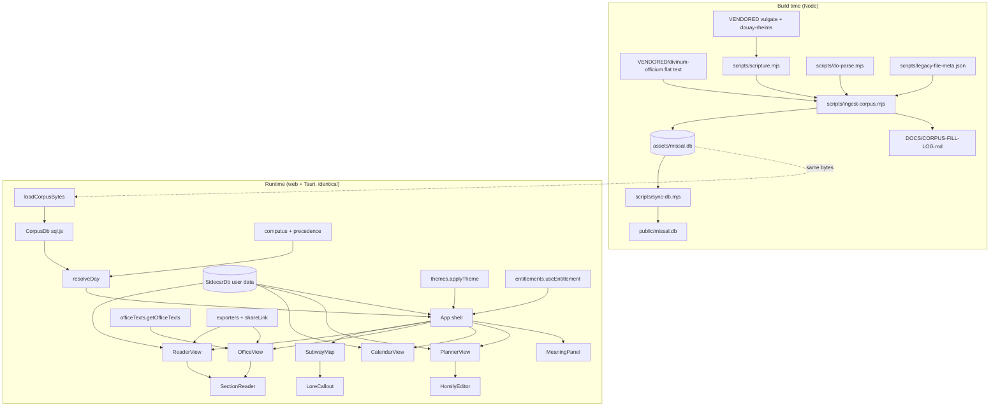

# St. Android's Missal — Authoritative Architecture

**Status:** authoritative for v0.2.x · **Supersedes:** `DOCS/ARCHITECTURE/StAndroidsMissal-v1.md` (retained as the v0.1 historical record) · **Identifier:** `mba.robin.standroidsmissal` · **Version string:** one string across `package.json` / `src-tauri/tauri.conf.json` / `src-tauri/Cargo.toml`

## 1. Overview

St. Android's Missal renders the Traditional Latin Mass and Divine Office as a navigable subway map. The liturgical corpus is László Kiss' Divinum Officium flat-text tree, **vendored whole into this repository** and re-realized at ingest time as a graph + vector SQLite database (`assets/missal.db`) consumed identically on web and native (Tauri 2). v0.2 adds, on top of the shipped v0.1 surfaces: corpus sovereignty (Phase 0, shipped), reader/navigation fixes (A, shipped), the full Ordinary + Divine Office texts (B), subway-map lore callouts (C), a sync-ready user-data sidecar with homily-planner/journal (D), a 6-family × light/dark theme system (E), print/export/share (F), and a modular RevenueCat-authoritative entitlement layer (G).

Requirements source: the operator plan `~/.windsurf/plans/missal-vendor-reader-planner-d2d153.md` (phases quoted per-task in `CHECKLIST.md`).

## 2. Source documents

- `README.md` — product intent, platforms.
- `~/.windsurf/plans/missal-vendor-reader-planner-d2d153.md` — the v0.2 requirements plan (Phases 0, A–G).
- `DOCS/ARCHITECTURE/StAndroidsMissal-v1.md` — v0.1 entity table, decisions 1–7 (all still binding).
- `DOCS/CORPUS-SCHEMA.md` — DO flat-text format, directive grammar, gap-fill policy, `missal.db` schema.
- `DOCS/CORPUS-FILL-LOG.md` — regenerated fill audit (2,595 fills at last ingest).
- `LOGS/pr2-6jul2026.md` — session transcript in which Phase 0/A/B1 landed.
- `VENDORED/*/PROVENANCE.md` — upstream pins for divinum-officium, vulgate-clementina, douay-rheims.

## 3. UI Design Reference

**Phase 0.5 (Stitch elucidation) — documented skip.** This is a brownfield product whose design system is the shipped application itself (parchment skeuomorphic base, rail nav, seasonal accent theming, SVG subway idiom). The operator supplied the new surfaces' design intent directly and in detail in the plan file (hover lore callouts C3, calendar indicators D2, theme-painting D4, split-pane editor D6, six named theme families E2) — treated as the operator carve-out design source. New v0.2 surfaces extend existing screens rather than introduce novel journeys. If any C/D/E surface proves visually ambiguous during CODE, iterate back to a Stitch pass under `LIBS/UI/STITCH/` before improvising.

## 4. Architectural decisions

Decisions 1–7 are inherited verbatim from v0.1 (`StAndroidsMissal-v1.md § Decisions`) and remain binding: (1) one query layer everywhere — the collinear rule; (2) directives become edges; (3) commune gap-fill non-inverted; (4) deterministic offline embeddings, model-agnostic table; (5) Latin normative; (6) no placeholder data; (7) one version string.

8. **Corpus sovereignty (shipped, Phase 0).** The entire divinum-officium repo is snapshot into `VENDORED/divinum-officium/` (no `.git`, no upstream tracking); scripture fallbacks in `VENDORED/vulgate-clementina/` + `VENDORED/douay-rheims/`. No build path references outside the repo. Alternative rejected: submodule / external HelloWord db (upstream mercy, offline break).
9. **Generation never breaks (shipped, V0.7).** Broken directives resolve through a fixed chain — same section elsewhere → `vide` Commune → vendored scripture by parsed citation → marked placeholder — every fill logged to `DOCS/CORPUS-FILL-LOG.md`, `meta.filled` on the node.
10. **Two-plane memory.** `missal.db` is canonical, read-only, regenerated only by ingest. All user data lives in a **separate sidecar SQLite** (`SidecarDb`) whose every row carries `id` (uuid) / `device_id` / `updated_at` / `deleted_at` (tombstone) so multi-device + parish-group sync can be layered on without schema change. The two planes never mix; the sidecar never stores corpus text, only `nodeKey`/liturgical-key anchors.
11. **Liturgical-key anchoring for recyclable content.** Homilies anchor to the *liturgical* key (`weekKey` or `Sancti/MM-DD` feast key), not the civil date, with optional per-year overlay rows (`year` column; `year IS NULL` = the base homily). Content recycles annually by construction.
12. **One shared bilingual renderer.** `SectionReader` (extracted from `ReaderView`) renders `ReaderEntry[]` for both Mass and Office modes — annotations, selection menu, and exegesis machinery are written once.
13. **Semantic theme tokens.** All component CSS consumes semantic tokens (`--surface`, `--surface-2`, `--ink`, `--ink-soft`, `--accent`, `--pane-latin-bg`, `--pane-english-bg`, `--rail-bg`, `--card-border`); a theme is a `data-theme` (family) + `data-mode` (light|dark) pair on `<html>`; the seasonal liturgical accent (`data-color`) stays orthogonal. Six families × two modes = twelve themes as pure token blocks — no component edits per theme.
14. **Lore is hand-authored data, not fetched.** Station/line lore ships as a typed constant module (`stationLore.ts`); no network, no LLM in this phase (decision 6 applies — no fabricated liturgical claims at runtime).
15. **Entitlements: RevenueCat authoritative, gates are data.** The client asks only RevenueCat (key via `VITE_REVENUECAT_API_KEY`, never hardcoded); BTCPay/WooCommerce sync *into* RevenueCat via a server-side bridge specified in `DOCS/ENTITLEMENT-SYNC.md` (interface spec; separate deployable, not this repo's code). `FEATURE_GATES` maps feature → required entitlement or `null` (ungated); v0.2 ships all-`null` (G3) so deciding tiers later edits one map.
16. **Deep links are URL params, parsed once at boot.** `?view=&date=&section=&quote=` — `parseDeepLink` feeds initial App state; share payloads embed the same URL.

## 5. Component diagram



## 6. Data flow (critical paths)

**Day resolution (unchanged, shipped):** ISO date → `computus.getWeekKey/getSeason` → `Tempora/<weekKey>` + `Sancti/MM-DD*` nodes → `precedence.resolveWinner` → `DayInfo` (cached per date, never pre-generated).

**Full-Mass reader (shipped, B1):** `CorpusDb.getMassTexts(winnerPath)` (propers, non-inverted commune fill) + `CorpusDb.getOrdoTexts()` (Ordinary) interleaved by `READER_ORDER` into `ReaderEntry[]`; station click → `App.onStation` → `focus {section, nonce}` → `ReaderView` scrolls to `data-section` anchor (`ORDO_STATION_SECTION` maps ordinary station ids → Ordo sections).

**Office assembly (B2):** `getOfficeTexts(db, day, hourId)` picks the day's `Horas/` file (`Horas/<winner.key>` else `Horas/<temporaPath>`), pulls its real stored sections via `CorpusDb.getFileSections` (commune fallback via `communeOf`), and orders/filters them through `HOUR_SECTION_PATTERNS[hourId]` (regex slot plans over the ingested DO section names — `Ant Laudes`, `Capitulum Nona`, `Lectio1..9`, …) → `ReaderEntry[]` → `SectionReader`. v0.2 renders every real section the corpus carries per hour; full DO-engine hour construction (psalm schema per weekday/rank) is backlog (§10).

**Sidecar write path (D):** UI mutation → `SidecarDb` upsert (uuid, `device_id`, `updated_at=now ISO`, tombstone delete) → debounced `persist()` (web: IndexedDB blob `sidecar.db`; Tauri: `save_sidecar` command → app-data file).

**Share/deep link (F3):** selection → `buildShareUrl({view,date,section,quote})` → recipient loads app → `parseDeepLink(location.search)` → initial `view/date/focus` state + quote highlight.

## 7. Data model

**`assets/missal.db`** (canonical, read-only — full schema in `DOCS/CORPUS-SCHEMA.md`): `nodes(id, kind∈{file,section}, key, title, category, rank_class, rank_num, color, meta)` · `edges(src, dst, rel∈{HAS_SECTION,CROSS_REF,INCLUDES,EXPANDS}, meta)` · `text_blocks(node_id, section, latin, english)` · `embeddings(node_id, dim, vec int8[128])` · FTS5 `search(key, section, content)`.

**Sidecar `sidecar.db`** (user plane, `SIDECAR_SCHEMA_SQL`, all timestamps ISO-8601 UTC text):

```sql
CREATE TABLE IF NOT EXISTS annotations (
  id TEXT PRIMARY KEY, device_id TEXT NOT NULL, updated_at TEXT NOT NULL, deleted_at TEXT,
  node_key TEXT NOT NULL, quote TEXT NOT NULL, note TEXT, color TEXT NOT NULL DEFAULT 'gold',
  created_at TEXT NOT NULL);
CREATE TABLE IF NOT EXISTS homilies (
  id TEXT PRIMARY KEY, device_id TEXT NOT NULL, updated_at TEXT NOT NULL, deleted_at TEXT,
  liturgical_key TEXT NOT NULL, year INTEGER,           -- NULL = base (recyclable) homily
  title TEXT NOT NULL DEFAULT '', body_md TEXT NOT NULL DEFAULT '',
  status TEXT NOT NULL DEFAULT 'unstarted',             -- unstarted|in-progress|complete
  color TEXT, theme_span_id TEXT);
CREATE TABLE IF NOT EXISTS journal_entries (
  id TEXT PRIMARY KEY, device_id TEXT NOT NULL, updated_at TEXT NOT NULL, deleted_at TEXT,
  liturgical_key TEXT NOT NULL, date TEXT NOT NULL, title TEXT NOT NULL DEFAULT '',
  body_md TEXT NOT NULL DEFAULT '', anchors TEXT NOT NULL DEFAULT '[]');  -- JSON array of nodeKey/verse-ref strings
CREATE TABLE IF NOT EXISTS theme_spans (
  id TEXT PRIMARY KEY, device_id TEXT NOT NULL, updated_at TEXT NOT NULL, deleted_at TEXT,
  label TEXT NOT NULL, color TEXT NOT NULL, start_date TEXT NOT NULL, end_date TEXT NOT NULL,
  cadence TEXT NOT NULL DEFAULT 'weekly');               -- daily|weekly
CREATE TABLE IF NOT EXISTS settings (
  key TEXT PRIMARY KEY, device_id TEXT NOT NULL, updated_at TEXT NOT NULL, value TEXT NOT NULL);
```

Settings keys used: `mode` (`priest`|`laity`), `theme.family`, `theme.mode`.

## 8. Entity Table

Status: **S** = shipped (on disk now) · **P-<phase>** = planned, target location. Independent agents must produce these identifiers byte-identically.

### Corpus pipeline (build time)

| Entity | Type | File:line | St | Role | Key signatures / fields |
|---|---|---|---|---|---|
| `ingest-corpus` | Node script | `scripts/ingest-corpus.mjs:1` | S | VENDORED flat-text → `assets/missal.db`; regenerates fill log | `node --experimental-strip-types scripts/ingest-corpus.mjs [outDb]` |
| `parseDOFile` | function | `scripts/do-parse.mjs` | S | DO `.txt` → ordered `[Section]` map (qualifier → `meta.qualifier`) | exported by `do-parse.mjs` |
| `parseRank` / `ruleVide` | functions | `scripts/do-parse.mjs` | S | `[Rank]` `name;;class;;num` parse; `vide C-ref` extraction | — |
| `CorpusTree` / `loadPrayers` / `resolveContent` | class/fns | `scripts/do-parse.mjs` | S | vendored-tree file access; `&`/`$` prayer expansion; `@include` + xform resolution | — |
| `FillLog` / `firstCitation` | class/fn | `scripts/do-parse.mjs` | S | fill audit rows → `DOCS/CORPUS-FILL-LOG.md`; `!Ps 27:8-9` citation parse | — |
| `Scripture` | class | `scripts/scripture.mjs` | S | citation → verse text from vendored Vulgate (la) / Douay-Rheims (en) | — |
| `sync-db` | Node script | `scripts/sync-db.mjs:1` | S | `assets/missal.db` → `public/missal.db` (pre-dev/pre-build) | — |
| `legacy-file-meta.json` | data | `scripts/legacy-file-meta.json` | S | rank/color per file key salvaged from legacy HelloWord db, consumed by ingest | `{ "<path>": {color, rankClass, rankNum, title} }` |
| `missal.db` | SQLite | `assets/missal.db` | S | canonical read-only corpus (nodes/edges/text_blocks/embeddings/search) | schema §7 |
| `embedText` / `EMBED_DIM` / `cosine` | fn/const/fn | `src/core/vector/embed.ts:1` | S | 128-d hashed-trigram int8 embedding; cosine over Int8Array | `embedText(text): Int8Array`, `EMBED_DIM = 128` |

### Core model + calendar (runtime)

| Entity | Type | File:line | St | Role | Key signatures / fields |
|---|---|---|---|---|---|
| `computus` | module | `src/core/calendar/computus.ts:1` | S | Butcher's Easter, DO week keys, season/color, UTC-safe | `getEaster(year)`, `parseISODate(iso)`, `getWeekKey(date)`, `getSeason(weekKey)`, `seasonColor(weekKey, feast?)` |
| `resolveWinner` / `DayFileMeta` | fn/type | `src/core/calendar/precedence.ts:1` | S | 1962 precedence incl. privileged Lenten ferias | `resolveWinner(dow, season, tempora, sancti[])` |
| `Station` | interface | `src/core/model/massOrdo.ts:1` | S | subway station | `{ id, latin, english, kind: 'ordinary'\|'proper'\|'conditional'\|'switch', line, sectionKey?, branch?, activeIn?, note? }` |
| `MASS_ORDO` / `trunkOf` / `branchOf` / `stationActive` | const/fns | `src/core/model/massOrdo.ts:55` | S | all stations; line/branch selectors; seasonal activity | — |
| `MASS_SECTION_ORDER` | const | `src/core/model/massOrdo.ts:39` | S | canonical proper-section order | `readonly string[]` |
| `ORDO_STATION_SECTION` | const | `src/core/model/massOrdo.ts:99` | S | ordinary station id → `Ordo/Missae` section | `Record<string, string>` |
| `READER_ORDER` | const | `src/core/model/massOrdo.ts:121` | S | Ordinary ⋈ propers interleave for the full-Mass reader | `{ kind: 'ordo'\|'proper'; section: string; title?: string }[]` |
| `Hour` / `OFFICE_CURSUS` | interface/const | `src/core/model/officeCursus.ts:8` | S | eight hours, rubrical skeleton | `Hour { id, latin, english, clock, parts[] }`; ids `matutinum, laudes, prima, tertia, sexta, nona, vesperae, completorium` |
| `Lore` | interface | `src/core/model/stationLore.ts:1` | P-C | one lore record | `{ what: string; origins: string; evolution: string; novusOrdo: string }` |
| `STATION_LORE` | const | `src/core/model/stationLore.ts` | P-C | lore per `Station.id` — **every** id in `MASS_ORDO` | `Record<string, Lore>` |
| `LINE_LORE` | const | `src/core/model/stationLore.ts` | P-C | lore per track/route element | `Record<LineLoreId, Lore>`; `type LineLoreId = 'line-catechumens'\|'line-faithful'\|'connector'\|'ember-loop'\|'chant-graduale'\|'chant-alleluia'\|'chant-tractus'\|'chant-graduale-p'\|'super-populum-spur'` |

### Data layer (runtime)

| Entity | Type | File:line | St | Role | Key signatures / fields |
|---|---|---|---|---|---|
| `GraphNode` / `SectionText` / `SimilarHit` / `ConcordanceHit` / `CrossRef` / `DayInfo` | types | `src/core/data/types.ts:1` | S | shared data shapes | `SectionText { nodeKey, section, latin, english, sourcePath, fromCommune }` |
| `ReaderEntry` | interface | `src/core/data/types.ts` | P-B | renderable reader row (moves out of ReaderView.tsx) | `extends SectionText { ordinary: boolean; displayTitle: string; anchor: string }` |
| `CorpusDb` | class | `src/core/data/corpusDb.ts:34` | S | single sql.js query layer (web = native) | `static open(bytes)`, `getFileNode`, `getSanctiForDate`, `asDayMeta`, `communeOf`, `getMassTexts(path)`, `getOrdoTexts()`, `crossRefs`, `similarToText`, `concordance` |
| `CorpusDb.getFileSections` / `CorpusDb.hasFile` | methods | `src/core/data/corpusDb.ts` | P-B | public ordered section access (meta sections excluded) / file existence | `getFileSections(path: string): SectionText[]`, `hasFile(path: string): boolean` |
| `loadCorpusBytes` / `isTauri` | fns | `src/core/data/loadCorpus.ts:13` | S | the only platform-divergent data code | web `fetch('/missal.db')`; Tauri `invoke('load_corpus')` |
| `resolveDay` | fn | `src/core/data/liturgicalDay.ts:15` | S | date → `DayInfo`, memoized | `resolveDay(db, iso)` |
| `OfficeSlot` / `HOUR_SECTION_PATTERNS` | type/const | `src/core/data/officeTexts.ts` | P-B | per-hour ordered regex slot plans over ingested DO section names | `OfficeSlot { pattern: RegExp; title?: string }`; `Record<string, OfficeSlot[]>` keyed by the eight `Hour.id`s |
| `getOfficeTexts` | fn | `src/core/data/officeTexts.ts:1` | P-B | assemble one hour's bilingual texts for a day (own sections first, commune fallback, dedup by anchor) | `getOfficeTexts(db: CorpusDb, day: DayInfo, hourId: string): ReaderEntry[]` |
| `SIDECAR_SCHEMA_SQL` | const | `src/core/data/sidecarDb.ts` | P-D | DDL §7 verbatim | string |
| `SidecarDb` | class | `src/core/data/sidecarDb.ts:1` | P-D | user-data plane (sql.js; IndexedDB blob on web, file via Tauri cmds) | `static open(): Promise<SidecarDb>`, `persist()`, `listAnnotations(nodeKey?)`, `addAnnotation(a)`, `removeAnnotation(id)`, `listHomilies(liturgicalKey?, year?)`, `upsertHomily(h)`, `listJournalEntries(liturgicalKey?)`, `upsertJournalEntry(e)`, `listThemeSpans()`, `upsertThemeSpan(t)`, `deleteRow(table, id)` (tombstone), `getSetting(key)`, `setSetting(key, value)` |
| `migrateLocalStorageAnnotations` | fn | `src/core/data/sidecarDb.ts` | P-D | one-shot import of v0.1 localStorage annotations | `(sdb: SidecarDb) => number` (rows migrated; idempotent via settings flag `migrated.localStorage`) |
| `Homily` / `JournalEntry` / `ThemeSpan` / `UserMode` | types | `src/core/data/types.ts` | P-D | sidecar row shapes (camelCase mirrors of §7 columns) | `UserMode = 'priest' \| 'laity'` |
| `annotations store (legacy)` | module | `src/core/annotations/store.ts:1` | S | v0.1 localStorage store — kept until D-migration, then delegates to SidecarDb | `Annotation { id, nodeKey, quote, note, color, createdAt }`, `addAnnotation`, `removeAnnotation`, `annotationsFor` |

### Feature modules

| Entity | Type | File:line | St | Role | Key signatures / fields |
|---|---|---|---|---|---|
| `ThemeFamily` / `ThemeMode` | types | `src/core/theme/themes.ts:1` | P-E | `'glass-acrylic'\|'glass-clear'\|'skeuomorphic'\|'retro-futurist'\|'brutalist'\|'neo-brutalist'`; `'light'\|'dark'` | — |
| `THEME_FAMILIES` / `DEFAULT_FAMILY` | consts | `src/core/theme/themes.ts` | P-E | picker metadata; default `'skeuomorphic'` | `{ id: ThemeFamily; label: string }[]` |
| `applyTheme` / `systemMode` | fns | `src/core/theme/themes.ts` | P-E | sets `data-theme` + `data-mode` on `<html>`; `prefers-color-scheme` probe | `applyTheme(family: ThemeFamily, mode: ThemeMode): void`, `systemMode(): ThemeMode` |
| `ExportOpts` / `exportHtml` / `exportMarkdown` / `exportJson` / `downloadFile` | type/fns | `src/core/export/exporters.ts:1` | P-F | serialize current day/hour entries ± annotations | `exportHtml(day: DayInfo, entries: ReaderEntry[], opts: ExportOpts): string` (same shape for Md/Json); `ExportOpts { includeAnnotations: boolean; annotations: Annotation[] }`; `downloadFile(name, mime, content)` |
| `SharePayload` / `buildShareUrl` / `parseDeepLink` | type/fns | `src/core/share/shareLink.ts:1` | P-F | deep-linkable share payload | `SharePayload { view: string; date: string; section?: string; quote?: string }`; `parseDeepLink(search: string): SharePayload \| null` |
| `FeatureId` / `FEATURE_GATES` | type/const | `src/core/entitlements/index.ts:1` | P-G | gate map is data; all `null` (ungated) in v0.2 | `FeatureId = 'homily-planner'\|'journal'\|'themes-premium'\|'export'\|'share'\|'office'`; `Record<FeatureId, string \| null>` |
| `initEntitlements` / `hasEntitlement` / `useEntitlement` / `entitlementsReady` / `EntitlementGate` | fns/hook/comp | `src/core/entitlements/index.ts` | P-G | RevenueCat-authoritative check; graceful gate UI | `initEntitlements(apiKey: string \| null): Promise<void>`, `hasEntitlement(f: FeatureId): boolean`, `useEntitlement(f: FeatureId): boolean`, `entitlementsReady(): boolean`, `<EntitlementGate feature fallback?>{children}</EntitlementGate>` |
| `VITE_REVENUECAT_API_KEY` | env var | `.env` (gitignored) | P-G | RC public key; absent ⇒ everything ungated | — |
| `DOCS/ENTITLEMENT-SYNC.md` | spec doc | `DOCS/ENTITLEMENT-SYNC.md` | P-G | BTCPay/WooCommerce → RevenueCat server bridge interface spec | webhook intake, HMAC, idempotent grant — spec only, separate deployable |

### UI surfaces

| Entity | Type | File:line | St | Role | Key signatures / fields |
|---|---|---|---|---|---|
| `App` / `View` / `NAV` | comp/type/const | `src/App.tsx:22` | S | shell, rail nav, day chip, `.split`/`.single` layout, focus routing | `View = 'map'\|'reader'\|'calendar'\|'office'` → P-D adds `'planner'`; focus state `{ section: string \| null; nonce: number }` |
| `SubwayMap` / `StationDot` | comps | `src/ui/SubwayMap.tsx:28` | S | SVG Mass map; P-C adds hover/focus/long-press lore triggers replacing `<title>` | props `{ day, onStation }` |
| `LoreCallout` | comp | `src/ui/LoreCallout.tsx:1` | P-C | rich positioned popover, keyboard/touch accessible, scrollable | props `{ title: string; subtitle?: string; lore: Lore; x: number; y: number; onClose: () => void }` |
| `ReaderView` | comp | `src/ui/ReaderView.tsx:81` | S | full-Mass entry assembler (delegates rendering to `SectionReader` after P-B refactor; re-exports `SelectionAction`) | props `{ db, day, focusSection, focusNonce, onAction }` |
| `SectionReader` / `SelectionAction` | comp/type | `src/ui/SectionReader.tsx:1` | P-B | shared bilingual section renderer + annotations + selection menu + optional print/export/share toolbar (`SelectionAction` definition moves here) | props `{ entries: ReaderEntry[]; focusSection: string \| null; focusNonce: number; onAction: (a: SelectionAction) => void; emptyMessage?: React.ReactNode; toolbar?: { day: DayInfo; view: string } }`; `SelectionAction { kind: 'meaning'\|'similar'\|'crossrefs'; term: string; nodeKey: string \| null }` |
| `MeaningPanel` | comp | `src/ui/MeaningPanel.tsx:26` | S | concordance + vector exegesis; LLM slot labelled | props `{ db, action, onClose, onOpenKey }` |
| `CalendarView` | comp | `src/ui/CalendarView.tsx:1` | S | perpetual month grid; P-D adds indicator dots (`.cal-dot`), status chips (`.cal-status--*`), theme-span bars (`.cal-themespan`) | props `{ db, selected, onPick }` → P-D adds `sidecar: SidecarDb \| null`, `onOpenPlanner?: (iso: string) => void` |
| `OfficeView` | comp | `src/ui/OfficeView.tsx:17` | S | loop line + skeleton; P-B renders real hour texts via `SectionReader` | props `{ day }` → P-B `{ db, day, onAction }` |
| `PlannerView` | comp | `src/ui/PlannerView.tsx:1` | P-D | homily-planner (priest) / journal (laity) mini-app: month grid + theme painting + status colors; opens `HomilyEditor` overlay | props `{ db, sidecar, mode: UserMode, initialDate?: string }` |
| `HomilyEditor` | comp | `src/ui/HomilyEditor.tsx:1` | P-D | split-pane editor: day/season/readings header, markdown body, anchored passages, base-vs-year toggle | props `{ db, sidecar, mode: UserMode, day: DayInfo, onClose: () => void }` |
| `ThemePicker` | comp | `src/ui/ThemePicker.tsx:1` | P-E | family × mode picker in the rail; persists to sidecar settings | props `{ sidecar: SidecarDb \| null }` |
| `styles.css` tokens | CSS | `src/styles.css` | S/P-E | semantic tokens (§4 d.13); `html[data-theme='…'][data-mode='…']` blocks; `@media print` (P-F) | `--surface --surface-2 --ink --ink-soft --accent --pane-latin-bg --pane-english-bg --rail-bg --card-border` |

### Native, tests, CI

| Entity | Type | File:line | St | Role | Key signatures / fields |
|---|---|---|---|---|---|
| `load_corpus` | Tauri cmd | `src-tauri/src/lib.rs` | S | embedded corpus bytes | `#[tauri::command] fn load_corpus() -> Vec<u8>` |
| `load_sidecar` / `save_sidecar` | Tauri cmds | `src-tauri/src/lib.rs` | P-D | sidecar file in app-data dir | `load_sidecar() -> Option<Vec<u8>>`, `save_sidecar(bytes: Vec<u8>) -> Result<(), String>` |
| tests | node:test | `tests/{computus,embed,massOrdo,ingest}.test.ts` | S | 16 passing; P-phases add `tests/officeTexts.test.ts`, `tests/sidecarDb.test.ts`, `tests/shareLink.test.ts` | `npm test` |
| CI | workflow | `.github/workflows/build-all-platforms.yml` | S | web/NSIS/deb+AppImage/APK | — |
| `.gitattributes` | config | `.gitattributes:1` | S | `VENDORED/** -diff -merge linguist-vendored`; `missal.db binary` | — |

## 9. Open questions resolved

1. **Where does Office text assembly live?** In the data layer (`officeTexts.ts`), not in `OfficeView` — keeps the collinear rule (decision 1) and testability (`tests/officeTexts.test.ts` runs headless).
2. **Reuse ReaderView for the Office or extract?** Extract `SectionReader`; `ReaderView` and `OfficeView` become thin entry-assemblers (decision 12). Duplicating the annotation/menu machinery was the rejected alternative.
3. **Sidecar persistence on web?** Single-blob IndexedDB write of the exported sql.js image, debounced — simplest crash-safe option without adding a dependency; OPFS rejected (Safari friction), localStorage rejected (size).
4. **Homily yearly recycling model?** Base row (`year IS NULL`) + per-year overlay rows sharing `liturgical_key` (decision 11), not copy-on-write duplicates.
5. **Do lore callouts gate on entitlements?** No — lore is core content; `FEATURE_GATES` covers planner/journal/themes-premium/export/share/office and ships all-`null` anyway (G3).
6. **Theme count.** Plan says "6 families × light/dark" and also "twelve themes" — resolved as 6 × 2 = 12 (family list in `ThemeFamily`).
7. **Office hour construction depth (v0.2).** The DO engine builds hours from per-weekday/rank psalm schemas at runtime; reproducing that engine is out of v0.2 scope. v0.2 assembles each hour from the **real stored sections** of the day's `Horas/` file (plus commune fallback), ordered by `HOUR_SECTION_PATTERNS` regexes over the actual ingested section names (`Ant Laudes`, `Capitulum Nona`, `Lectio1..9`, `Responsory Breve Sexta`, …) — no fabricated content, decision 6 preserved. Full engine-equivalent construction is backlog (§10).
8. **Shared-file ownership under parallel dispatch.** Exactly one CHECKLIST task owns each shared shell file (`src/App.tsx` → APP.1; `src/styles.css` → E2; `src/ui/SectionReader.tsx` created by B3.1 with APP.2 as its same-worktree follow-up) so the whole wave dispatches concurrently without merge collisions (I-22 axis 1).

## 10. Out of scope (v0.2)

- Fine-tuned ecclesiastical-Latin LLM behind the Meaning panel (labelled slot stays).
- Real sentence-transformer embeddings (schema is ready; not swapped).
- Actual multi-device/parish sync transport (sidecar schema is sync-*ready*; no server ships).
- Entitlement tier decisions and any paid gating (map ships all-`null`); the BTCPay/Woo bridge *implementation* (spec doc only).
- Full DO-engine hour construction (psalm schema per weekday/rank) — v0.2 ships pattern-based assembly of real stored sections (decision 7 / §9.7).
- Full corpus browser / cross-corpus navigation beyond same-day sections.
- Signed Android store builds (tracked in CHECKLIST v0.1 Phase 5 / signing SOP).

---

**Attestation.** This document is complete, stub-free, and depicts the end-state v0.2 production release: every named entity carries an exact identifier, target `file:line`, role, and signature; no TBD markers remain; open questions are resolved above. Shipped rows were verified against the working tree via codegraph on the date below; planned rows are normative targets and are cited verbatim by the self-contained v0.2 task wave in `CHECKLIST.md`. Re-attested after reconciling entity rows (`HOUR_SECTION_PATTERNS`, `CorpusDb.getFileSections`/`hasFile`, `SectionReader` toolbar/`SelectionAction` move, theme/entitlement/calendar/planner signatures, decisions 7–8) with the checklist wave.
— Authored and attested by Claude Fable 5 (`claude-fable-5`, Claude Code session, orchestrated architect pass) · 2026-07-06
