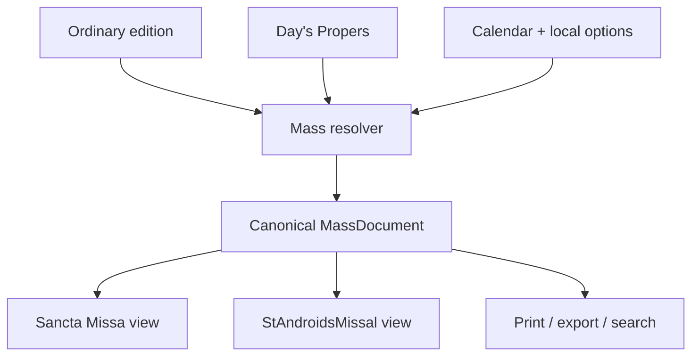
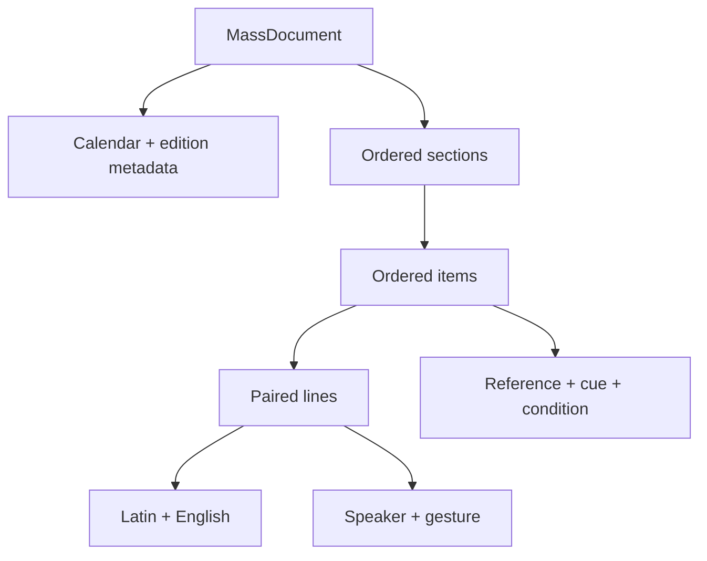

# Sancta Missa / StAndroidsMissal

## 1. Purpose

This design separates **the Mass as structured liturgical content** from **the ways a person may read and follow it**.

The attached prototype is a useful visual sketch, but it combines four concerns in one saved webpage:

1. the Ordinary of the Mass;
2. the day's Propers;
3. display and interaction rules;
4. external browser assets captured into a companion folder.

The replacement uses one canonical `MassDocument` and projects it into two first-class views:

- **Sancta Missa — Missal view:** calm, continuous, bilingual reading for study, preparation, printing, and following the full text.
- **StAndroidsMissal — Follow view:** one liturgical moment at a time, with large touch targets, posture/action cues, progress, and rapid recovery when the user loses their place.

Neither view owns liturgical text. Both consume the same resolved Mass document.



## 2. Product principles

### 2.1 The rite is not an accordion

The primary structure is a stable ordered sequence of sections, items, and lines. Collapsing sections is a reader preference, not the content model.

### 2.2 One text, multiple projections

Latin and English belong to the same line object. A column, interlinear pair, translation sheet, spoken rendering, or search result is only a projection of that pair. English must never be copied into a second hidden popup.

### 2.3 “Where am I?” is the main mobile problem

On a phone at Mass, the most expensive failure is not a missing setting; it is losing one's place. Follow view therefore keeps three things continuously visible:

- the current section and item;
- the immediate posture/action cue, when one exists;
- previous/next controls plus a full jump list.

### 2.4 Rubrics are instructions, not decoration

Rubrics are semantic data (`cue`, `gesture`, or rubric lines), rendered in red by convention. They can be shown, hidden, searched, voiced differently, and printed without scraping presentation markup.

### 2.5 Offline is the default state

The runnable template has no framework, font, icon, CDN, or network dependency. A production shell may add installability and caching, but correctness cannot depend on them.

### 2.6 Preserve editorial provenance

The renderer must not silently improvise omissions, commemorations, conclusions, prefaces, Holy Week variants, Requiem variants, or local customs. Resolution decisions should be reproducible and traceable to edition and calendar rules.

## 3. What changes from the supplied HTML

| Supplied prototype                          | Replacement                                                           |
| ------------------------------------------- | --------------------------------------------------------------------- |
| Ordinary embedded in markup                 | Ordinary referenced and resolved into data                            |
| Propers inserted with ad hoc `{{…}}` fields | Propers use the same item/line model as the Ordinary                  |
| English duplicated in column and tooltip    | One bilingual line rendered in any layout                             |
| Hover called “interlinear”                  | True paired interlinear layout; tap is optional, never required       |
| Four exclusive accordions                   | Stable section/item navigation with optional collapsing               |
| Mobile hides English                        | Mobile can show Latin, English, paired, or follow view                |
| Liturgical colour applied inconsistently    | Validated colour token becomes a restrained accent                    |
| Audio checkbox logs to console              | Audio is omitted until a real pronunciation/read-aloud service exists |
| Tailwind/fonts/icons captured externally    | Dependency-free CSS and text/SVG-free controls                        |
| Fixed `max-height: 5000px` animation        | Natural document flow; no content clipping                            |
| Inline `onclick` handlers                   | Event delegation and accessible buttons                               |
| Invalid Last Gospel nesting                 | Renderer creates valid markup from structured data                    |
| Saved-page filename and asset folder        | One portable HTML plus importable JSON                                |

## 4. Information architecture

### 4.1 Canonical hierarchy



| Level    | Meaning                              | Stable identity example             |
| -------- | ------------------------------------ | ----------------------------------- |
| Document | One fully resolved celebration       | `2026-06-12-sacred-heart-1962`      |
| Section  | Large phase of the rite              | `catechumens`                       |
| Item     | Navigable liturgical unit            | `gospel`                            |
| Line     | Smallest synchronized bilingual unit | generated or source-defined line ID |

Sections in the demonstration document use the familiar four-part arrangement, but the renderer must not hard-code that number or those names. Different rites, editions, votive Masses, Requiems, and Holy Week forms may supply different sequences.

### 4.2 Item kinds

The initial vocabulary is intentionally small:

| Kind       | Meaning                                       | Typical treatment               |
| ---------- | --------------------------------------------- | ------------------------------- |
| `ordinary` | Stable text supplied by the selected Ordinary | Neutral surface                 |
| `proper`   | Text particular to the day or Mass            | Gold keyline and “Proper” label |
| `rubric`   | Standalone instruction from the source        | Red italic instruction          |
| `devotion` | Optional non-liturgical prayer or aid         | Clearly separated and opt-in    |

Do not create a new kind merely to style something differently. Add semantic types only when they drive resolution, accessibility, provenance, or interaction.

## 5. `MassDocument` contract

`mass.example.json` is a readable example, not yet a formal JSON Schema. The minimum contract is:

```text
MassDocument
├── schemaVersion: string
├── id: string
├── calendar
│   ├── system, date, dateLong
│   ├── feastTitle, rank, season
│   ├── liturgicalColor
│   └── commemorations[]
├── edition
│   ├── title, ordinaryId, translation
│   └── sourceNote
├── options
└── sections[]
    ├── id, number, title, shortTitle, summary
    └── items[]
        ├── id, kind, title
        ├── reference?, cue?, condition?
        └── lines[]
            ├── speaker?
            ├── latin, english
            └── gesture?
```

### 5.1 Required invariants

- `schemaVersion`, document `id`, calendar date/title/colour, and at least one section are required.
- IDs are unique within their parent and stable across regenerated editions where the semantic unit is unchanged.
- Every rendered item contains at least one line.
- At least one of `latin` or `english` is present on every line; production editions should normally require both.
- `liturgicalColor` is one of `white`, `red`, `green`, `violet`, `rose`, or `black`. Aliases such as `purple` are normalized at ingestion.
- User-supplied strings are inserted as text, not trusted HTML.
- Conditions are resolved before rendering. The sample renderer supports only simple `options.<key>` truth tests and does not evaluate arbitrary code.

### 5.2 Resolution boundary

The finished document should already say what is present. A view may honor a resolved boolean condition for demonstration, but it should not calculate the liturgical calendar or decide whether the Gloria, Creed, tract, sequence, commemoration, preface, or Last Gospel belongs.

For production, use this pipeline:

1. select calendar, edition, date, and locale;
2. load Ordinary and Proper sources;
3. resolve precedence, substitutions, commemorations, and optional local rules;
4. emit a complete `MassDocument` plus a resolution log;
5. validate the document;
6. render any view.

### 5.3 Provenance extension

A production item or line should permit:

```json
{
  "source": {
    "editionId": "…",
    "work": "…",
    "page": "…",
    "license": "…",
    "checksum": "…"
  }
}
```

This is especially important where translations, punctuation, rubrics, and calendar rules differ between editions.

## 6. View specifications

### 6.1 Sancta Missa — Missal view

**Primary jobs:** study, prepare, compare, print, and follow with broad context.

- Desktop uses a left section index and a continuous reading surface.
- Bilingual mode aligns translations at the **line** level, preventing long Latin and English passages from drifting vertically.
- Latin-only and English-only modes remove the unused column completely.
- Paired mode stacks Latin and English within each line and is the genuine small-screen interlinear option.
- The title block shows feast, civil date, rank, season, colour, and commemorations without resembling a dashboard.
- Propers are identifiable but do not become yellow boxes louder than the prayer itself.
- Printing expands everything, removes controls, uses black/red ink conventions, and avoids breaking individual prayer units where practical.

### 6.2 StAndroidsMissal — Follow view

**Primary job:** keep a worshipper oriented with the least possible manipulation.

- Shows one item (“moment”) at a time.
- Uses a compact top context bar and a persistent bottom control dock.
- Shows a progress bar, `current / total`, previous, next, and jump controls.
- Shows posture/action cues before text, not buried after it.
- Tap zones are at least 44 CSS pixels.
- Remembers the last item, layout, font scale, and theme locally for this document.
- “Jump” opens an item list grouped by section so recovery never requires repeated back-swiping.
- A user can switch back to Missal view without changing the current item.
- Device branding is avoided: “StAndroids” describes the interaction idiom, not a dependence on Android APIs.

### 6.3 State model

| State           | URL candidate              | Local persistence         |
| --------------- | -------------------------- | ------------------------- |
| Document        | `?mass=<id>`               | last opened document      |
| Current item    | `#gospel`                  | per-document current item |
| View            | `?view=missal` or `follow` | yes                       |
| Language layout | `?language=parallel`       | yes                       |
| Font scale      | not necessary in URL       | yes                       |
| Dark theme      | not necessary in URL       | yes                       |

The demonstrator stores reader preferences locally but does not rewrite the URL. A production router should use shareable item anchors.

## 7. Visual system

### 7.1 Tone

The interface should feel like a carefully typeset hand missal that happens to be interactive—not like an admin panel dressed in burgundy.

### 7.2 Colour tokens

| Token             | Light                     | Dark                  | Use                       |
| ----------------- | ------------------------- | --------------------- | ------------------------- |
| paper             | warm ivory                | near-black brown      | page/background           |
| ink               | charcoal                  | warm off-white        | primary text              |
| muted             | cool brown-grey           | warm grey             | metadata                  |
| rubric            | oxblood                   | softened vermilion    | instructions/speakers     |
| proper            | antique gold              | ochre                 | subtle proper distinction |
| rule              | low-contrast neutral      | low-contrast neutral  | structure                 |
| liturgical accent | validated calendar colour | adjusted for contrast | feast marker only         |

Liturgical white is represented with a gold-edged light accent so it remains visible against paper. Liturgical black must not erase the body text or controls.

### 7.3 Typography

- Use a system serif stack for liturgical text and a system sans-serif stack for controls.
- Do not require Google Fonts for legibility or identity.
- Default prayer text is approximately 19 px on desktop and 20 px in Follow view.
- The measure should remain about 55–75 characters per language column.
- Latin and English differ by placement and tone, not by making English too faint to read.
- Rubrics use colour and italics; never colour alone for essential meaning.

## 8. Interaction and accessibility

- All controls are native buttons, radios, checkboxes, or select elements.
- The current view switch exposes `aria-pressed`.
- The current item uses a heading and receives focus when changed in Follow view.
- Jump navigation is a native `<dialog>` where supported, with a non-modal fallback.
- Keyboard shortcuts in the demonstrator:
  - `←` / `→`: previous/next item in Follow view when no form control is focused;
  - `Escape`: close an open dialog or settings panel through native behaviour.
- Focus outlines are always visible for keyboard users.
- Colour contrast targets WCAG 2.2 AA.
- `prefers-reduced-motion` disables animated scrolling and transitions.
- Text scales without clipping; no content container uses a guessed maximum height.
- Follow view must remain operable at 200% zoom and 320 CSS pixels wide.

## 9. Import, export, and safety

The demonstrator can import a local `.json` Mass document. It validates structural basics and renders strings with DOM `textContent`; imported text is not executed as HTML.

A production implementation should add:

- JSON Schema validation with actionable paths and messages;
- size and depth limits;
- explicit schema migrations;
- integrity hashes for edition bundles;
- export of the resolved document, resolution log, and print-ready HTML/PDF;
- optional signed edition packages while retaining a plain-data escape hatch.

## 10. File responsibilities

| File                 | Responsibility                                                           |
| -------------------- | ------------------------------------------------------------------------ |
| `DESIGN.md`          | Product, content, view, accessibility, and implementation contract       |
| `mass.example.json`  | Human-readable example of the canonical data shape                       |
| `mass-template.html` | Dependency-free reference renderer with both views and local JSON import |

The original uploaded HTML remains untouched as a historical visual input.

## 11. Production decomposition

The standalone template is deliberately one file for portability. A maintained application should split by responsibility:

```text
src/
├── domain/
│   ├── mass-document.ts
│   ├── validation.ts
│   └── resolver.ts
├── editions/
│   ├── ordinary/
│   └── propers/
├── views/
│   ├── missal-view.ts
│   ├── follow-view.ts
│   └── print-view.ts
├── reader/
│   ├── preferences.ts
│   ├── navigation.ts
│   └── search.ts
└── app.ts
```

The resolver should have no browser dependency. Renderers should not know calendar rules. Reader preferences should never mutate the Mass document.

## 12. Acceptance criteria

### Content and structure

- One resolved data object drives both views.
- Ordinary and Proper items can be reordered, added, omitted, or replaced without editing renderer markup.
- No translation string must be duplicated to support another layout.
- The same document can represent more or fewer than four sections.
- Invalid documents fail with a comprehensible message and leave the current Mass intact.

### Missal view

- Parallel, Latin, English, and paired layouts all work at runtime.
- Selecting an item in the index scrolls to it and establishes the same current item used by Follow view.
- Print output contains all visible liturgical text and no application chrome.

### Follow view

- Previous, next, keyboard arrows, and jump navigation agree on a single current index.
- Switching views preserves position.
- Reloading restores position and reader preferences when local storage is available.
- The current item, cue, and progress remain clear on a narrow phone viewport.

### Offline and resilience

- The HTML opens directly from disk with no companion asset directory.
- No network request is required for first render.
- Failure of local storage does not prevent reading.
- Imported text cannot inject markup or script.

## 13. Deliberate limits of the reference template

- The embedded example is abbreviated and is **not a complete 1962 daily missal text**.
- Calendar resolution is outside the browser template.
- The example's traditional English is illustrative; production use must identify and verify the exact edition and rights status.
- Audio, chant notation, bookmarks, annotations, homily notes, and synchronized live parish cues are extension points, not pretend settings.
- The template does not claim rubrical authority. It makes editorial decisions visible so an authoritative source can supply them.

## 14. Recommended next increment

1. Formalize `mass-document.v1.schema.json` from the example contract.
2. Select and document the exact Ordinary, translation, calendar, and Proper sources.
3. Build the resolver with fixture tests for ordinary Sundays, major feasts, ferias, Requiems, Lent/Septuagesima, Holy Week, and commemorations.
4. Replace the abbreviated demonstration with generated, source-linked fixtures.
5. Add search, bookmarks, and annotation only after stable item/line IDs exist.

That ordering protects the durable asset—the structured liturgical corpus—from being shaped accidentally around whichever screen was built first.
