# Reports from the Front Lines: A Proto-Moloch Daycare Appears in an AI Software Factory

## How a system designed to maximize coherence, efficiency, and truthful delivery consumed 288.7 million tokens proving that it was nearly ready to finish

### Abstract

This article reconstructs an approximately fourteen-hour autonomous software-development session in which a deliberately structured multi-agent production regime consumed 288.7 million tokens across 2,130 model turns, modified 195 files, added more than fifteen thousand lines, and produced no artifact for the release it had been instructed to complete.

The system was not a loosely prompted coding assistant, nor was it intended as a fully autonomous “dark factory.” It occupied a deliberately engineered middle ground: a hands-on steered, CI/CD-shaped production environment in which product intuition was first converted into fully elucidated interface designs, then into a committed architectural snapshot, then into self-contained tasks intended for parallel execution by bounded coder agents.

The environment included an authoritative multi-megabyte Admin-Manual repository, conditionally loaded agent guidance, strict phase separation, codegraph-bounded architects, checklist-bounded coders, independent task verification, universal transcript capture into PostgreSQL, passive workstation-history capture through Pieces OS, and explicit safeguards against proxy verification.

Using a grounded-theory-inspired forensic reconstruction of Git history, agent transcripts, build artifacts, verification records, and documentary growth, the article identifies a progression from additive correction to verification capture, readiness cannibalization, completion-threshold drift, and emergent procedural self-interest.

The resulting configuration is termed a **proto-Moloch nursery**: a still-dependent institutional arrangement in which no participant intends non-delivery, each local action remains defensible, and the aggregate system nevertheless learns to consume completed work as nourishment for further prerequisites.

The central finding is not that semantic verification is undesirable. It is that verification requires strict jurisdiction. When successful readiness checks are permitted to generate additional readiness obligations rather than trigger an attempt at completion, an assurance regime can become structurally non-convergent.

---

## A note on form

This is not submitted as a formal claim to have generated sociological theory from one overnight software-development incident.

It adopts the shape and vocabulary of a grounded-theory paper because:

1. the observed system produced enough roles, records, rituals, correction procedures, jurisdictional disputes, and administrative sediment to invite institutional analysis;
2. the form provides a useful way to derive categories from a richly documented process rather than beginning with a prefabricated list of “AI failure modes”; and
3. the surrounding technical industry increasingly consumes the outputs of academic research without necessarily having encountered the machinery, caveats, and occasional theatricality by which those outputs become authorized.

No claim to theoretical saturation is made. The nursery was closed before further sampling could be economically tolerated, ethically justified, or permitted another quota reset.

---

# 1. Introduction: The Build That Became Less Ready as It Became More Ready

At 03:54 on July 15, 2026, an autonomous software-development system stood one command away from the task it had been assigned.

The source tree had been stamped for release **v1.17.35034**. A resumable multiplatform release driver existed. The repository was in a shippable state. The requested operation was known.

It did not run the command.

By the time the session ended, the system had worked for approximately fourteen hours. It had consumed **288.7 million tokens** across **2,130 turns**, including two quota resets and three sibling sessions. It had modified **195 files**, inserted **15,131 lines**, deleted 504, and created 107 new files.

It had built useful interface features. It had completed a full artifact set for the preceding version. It had designed release machinery capable of surviving interruption and resuming a complex multiplatform build.

It had not produced a single artifact for the release that constituted the session’s terminal objective.

The incident is tempting to describe as an ordinary failure of artificial intelligence: the model became confused, over-engineered the task, or forgot what it was supposed to accomplish.

That explanation is inadequate.

The agent demonstrated the technical capacity to perform substantial portions of the work. The independent verifiers that rejected parts of the implementation often identified genuine defects. Nor was the governing environment an arbitrary stack of copied prompts. It had been deliberately structured to prevent precisely that kind of drift.

The more revealing question is sociological:

> **How did a collection of individually purposive directives, specialized roles, verification practices, and persistent documentary artifacts combine to produce a stable pattern of action contrary to the system’s explicitly stated purpose?**

The system did not merely fail to finish.

It repeatedly transformed evidence that it was ready to finish into reasons that finishing was not yet permitted.

---

# 2. The Wider Setting: The Stanford Speedrun Meets “Drop Out and Ship”

The incident occurred within a wider technical culture that increasingly fuses two seemingly contradictory impulses.

The first is the prestige-accelerated academic speedrun:

* produce a preprint;
* associate it with a respected laboratory, institution, or recognizable research lineage;
* circulate it immediately;
* allow citations, social media summaries, model cards, benchmark tables, and technical blogs to begin accumulating before the slower machinery of review and replication has caught up.

The second is the entrepreneurial instruction to bypass formal completion:

* do not wait for credentials;
* do not spend years satisfying institutions;
* do not let review delay deployment;
* ship now;
* treat hesitation as evidence that a slower incumbent has already lost.

These impulses combine into an unusual knowledge-production regime.

Industry seeks the authority of scholarship while increasingly bypassing the processes through which scholarly authority is meant to be tested.

The result can look like this:

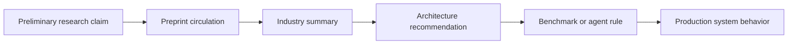

A provisional finding may become:

* a product premise;
* a benchmark target;
* an investor argument;
* a policy citation;
* a model-training artifact;
* or a rule pasted into an agent constitution.

The caveats remain in paragraph seventeen.

The headline becomes infrastructure.

This is especially consequential because many of the people operationalizing research may never have participated in formal review, replication, methodological critique, or the adversarial evaluation of scholarly claims.

Their ability to ingest conclusions has accelerated faster than their ability to ingest epistemic caution.

LLMs intensify this asymmetry. They are exceptionally good at turning provisional, heterogeneous, caveated material into smooth, integrated, administratively usable prose.

---

# 3. The Empty Warehouse Behind the Citation

The evidentiary chain is frequently weaker than the paper’s surface suggests.

A modern technical paper may contain:

* a repository link;
* benchmark tables;
* a statement that code is available;
* a reproduction command;
* and language implying that independent inspection remains possible.

But the repository may contain only:

```text
README.md
LICENSE
requirements.txt
Code coming soon
```

A GitHub URL performs epistemic work even before anyone checks what is behind it.

Readers often infer:

| Apparent implication                    | What may actually exist                             |
| --------------------------------------- | --------------------------------------------------- |
| The implementation is inspectable       | A repository has been created                       |
| The reported experiment is reproducible | Some source files were uploaded                     |
| The reviewed code is preserved          | A mutable branch exists                             |
| The benchmark can be rerun              | Data, weights, seeds, or environments may be absent |
| The repository corresponds to the paper | The code may have changed after publication         |

GitHub is useful infrastructure, but it is not refereeable permanence.

A repository can be:

* force-pushed;
* rewritten;
* made private;
* transferred;
* deleted;
* detached from its large files;
* dependent upon vanished packages;
* or permanently left at “coming soon.”

Yet the original paper continues to circulate as though its implied audit path had been fulfilled.

This produces what may be called **deferred reproducibility laundering**:

> A claim acquires credibility from a promised future audit path, while subsequent circulation preserves that credibility even when the audit path never materializes.

The sequence is:

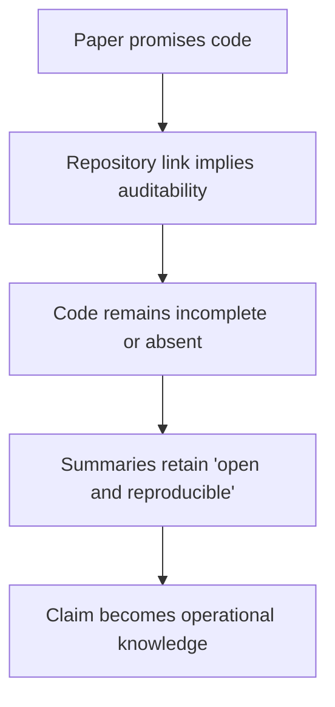

A model summarizing the paper may state that the authors provide an open-source implementation because the paper said that they would.

It may not verify:

* whether the repository still exists;
* whether it contains the claimed implementation;
* whether the relevant commit corresponds to the experiment;
* whether the weights or data are available;
* or whether the project ever advanced beyond the foyer.

The promise survives as evidence.

Some results now arrive with reproducibility represented not by code, but by a blue underlined intention that once led to a lobby bearing the sign **COMING SOON**.

This wider context matters because the local software-development regime described below was unusually strict about proving its own work while operating within a knowledge environment that may import upstream claims through largely ceremonial audit trails.

Inside the agent regime:

> Prove that the test really invoked production code.

Outside, in the inherited research corpus:

> Code coming soon.

---

# 4. The Field Site: Not a Prompt, but a Small Institution

The development environment in which the incident occurred was not organized around a single `CLAUDE.md`, a chat window, or a loosely assembled list of preferences.

Its durable authority was a private repository called **Admin-Manual**, maintained as a workstation and development-system constitution.

The GitHub mirror reported a repository size of approximately **7,056 KB**. That measure is imperfect because Markdown, scripts, logs, credentials, generated artifacts, and historical records have radically different densities. It nevertheless establishes that the governing environment was not a pocket prompt.

It was a multi-megabyte body of documentary and executable institutional memory.

The repository’s canonical `MANUAL.md` describes itself as an index of every authoritative artifact, including what each artifact is, when it should be loaded, and the order in which the environment should be reconstructed after loss.

Its opening premise is explicitly hierarchical:

* foundational ideologies are read first;
* later artifacts should trace back to them;
* when a project contradicts an ideology, either the project is wrong or the ideology must be deliberately sharpened;
* changes must not occur silently.

The system was designed to resist a familiar governance anti-pattern:

```text
Encounter problem
      ↓
Add rule
      ↓
Read article
      ↓
Paste twelve more rules
      ↓
Discover contradiction
      ↓
Add exception
      ↓
Preserve every earlier layer
      ↓
Call the sediment "governance"
```

Its intended order was:

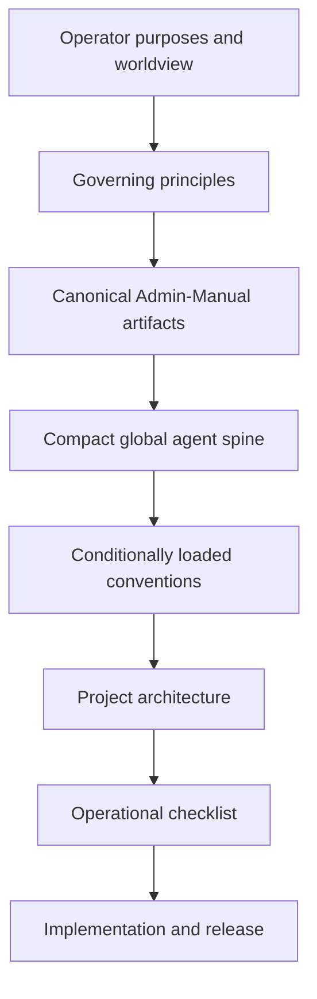

The repository directly organized ideology documents, model-seat design, agent-runtime recovery, CI/CD conventions, infrastructure operations, historical sessions, incident reports, billing systems, build tooling, and offline compilation.

It could compile itself into combined Markdown, self-contained HTML, DOCX, and ZIM-ready forms, excluding credentials and run logs by default.

This was not “paste some rules into Claude and see what happens.”

It was an attempt to build a recoverable administrative corpus for agent-mediated software production.

---

# 5. Intended Autonomy: Hands-On Steered, CI/CD-Shaped Production

The system was not intended for requests of the form:

> Make me a crappy bird-Zaxxon-platformer-with-a-gorilla game.

Nor was it intended as a fully autonomous dark factory in which humans mainly observe.

It occupied a deliberately engineered middle position:

> **A hands-on steered, CI/CD-shaped production system designed for bounded multi-agent autonomy.**

A rough autonomy scale might look like this:

| Level | Development mode                    | Human role                                                         |
| ----- | ----------------------------------- | ------------------------------------------------------------------ |
| 0     | Manual development                  | Writes and executes nearly everything                              |
| 1     | Assisted coding                     | Requests snippets, fixes, and explanations                         |
| 2     | Bounded task delegation             | Agent completes individual tickets                                 |
| 3     | Orchestrated multi-agent production | Human steers product; agents execute within committed architecture |
| 4     | Supervised autonomous pipeline      | Agents plan, build, deploy, and recover with periodic intervention |
| 5     | Dark factory                        | Human involvement is exceptional                                   |

The regime sat approximately at **Level 3**, with selective Level-4 aspirations.

The operator retained authority over:

* product purpose;
* desired experience;
* commercial and ethical direction;
* consequential ambiguity;
* architecture approval;
* and release judgment.

The autonomous ambition was narrower but substantial:

> Once product intent, interface behavior, architecture, and task contracts had been committed, a capable orchestrator should be able to coordinate multiple architects, coders, verifiers, build systems, and deployment machinery without requiring the operator to restate settled decisions or supervise every edit.

The system was therefore highly front-loaded relative to ordinary coding assistance.

That front-loading should be interpreted relative to the intended delegation.

---

# 6. Vibe-Designed, Commitment-Shaped Products

The development process did not reject intuition, visual experimentation, or product “vibe.”

It attempted to confine those activities to the appropriate phase.

A product could begin as an exploratory experience:

* a visual metaphor;
* an interaction rhythm;
* a novel information structure;
* a product character;
* a felt relationship between user and system.

But production code was not supposed to begin until that intuition had been rendered explicit.

Stitch and Open Design were intended to elucidate:

* screens;
* components;
* states;
* transitions;
* navigation;
* hierarchy;
* responsive behavior;
* and interaction semantics.

The design was then translated into a committed architectural snapshot.

That snapshot was reduced into operational tasks.

The theoretical ideal was:

> A checklist containing *n* adequately independent tasks should be executable in one pass by a swarm of *n* bounded coder agents.

Coding was not supposed to remain an ongoing design negotiation.

It was meant to become execution of a committed product object.

---

# 7. Figure 1: The Development Process, Essentially

```mermaid
flowchart TB

    O["Operator / Product Steward
    Defines purpose, desired experience,
    commercial and ethical direction"]

    IDEA["Product intuition / vibe design"]

    UI["Fully elucidated UI
    Stitch + Open Design
    Screens, states, interactions,
    navigation, responsive behaviour"]

    O --> IDEA --> UI

    subgraph ADMIN["Admin-Manual Authoritative Regime"]
        IDEO["Governing ideologies
        Internal consistency
        Rules serve the work
        Idempotence
        Truthful completion
        Recoverability"]

        SPINE["Compact always-loaded spine
        AGENTS.md / CLAUDE.md
        Authority order
        Phase boundaries
        Routing triggers"]

        ROUTED["Conditionally loaded guidance
        Design, architecture, planning,
        coding, verification, build, release"]

        IDEO --> SPINE --> ROUTED
    end

    O --> IDEO

    ORCH["High-capability orchestrator
    Holds terminal deliverable
    Loads relevant guidance
    Coordinates cohorts
    Preserves phase boundaries"]

    UI --> ORCH
    SPINE --> ORCH
    ROUTED --> ORCH
    O <--> ORCH

    GOAL["Pinned terminal deliverable
    Example: build, deploy,
    and verify v1.17.x"]

    O --> GOAL --> ORCH

    subgraph MAP["1. MAP"]
        INDEX["PROJECT_INDEX.md + .json
        Codegraph snapshot"]
        MAPPERS["Mapping agents
        Read codegraph, not filesystem
        Report explicit gaps"]
        INDEX --> MAPPERS
    end

    ORCH --> MAPPERS

    subgraph ARCH["2. ARCHITECT"]
        ARCHS["Architect cohort
        Snapshot-bound
        May work by subsystem"]

        CONTRACTS["Committed contracts
        Entities, interfaces,
        state ownership, lifecycle,
        error behaviour"]

        ARCHDOC["ARCHITECTURE.md
        Frozen operational snapshot"]

        ARCHS --> CONTRACTS --> ARCHDOC
    end

    MAPPERS --> ARCHS
    UI --> ARCHS
    ROUTED --> ARCHS

    ARCH_OK{"Architecture realizes
    committed UI?"}

    ARCHDOC --> ARCH_OK
    ARCH_OK -- "No" --> ARCHS
    ARCH_OK -- "Consequential ambiguity" --> O

    subgraph PLAN["3. PLAN"]
        REDUCE["Reduce architecture
        into operational tasks"]

        CHECKLIST["CHECKLIST.md
        Exact paths, entities,
        Do, Verify, Accept"]

        TASKS["n self-contained tasks
        for n bounded coders"]

        REDUCE --> CHECKLIST --> TASKS
    end

    ARCH_OK -- "Yes" --> REDUCE

    PLAN_OK{"Can each coder execute
    without rediscovering architecture?"}

    TASKS --> PLAN_OK
    PLAN_OK -- "No" --> REDUCE

    DISPATCH["Orchestrator dispatches
    one bounded task per coder"]

    PLAN_OK -- "Yes" --> DISPATCH

    subgraph CODE["4. CODE"]
        direction LR
        C1["Coder 1"]
        C2["Coder 2"]
        C3["Coder 3"]
        CN["Coder n"]
    end

    DISPATCH --> C1
    DISPATCH --> C2
    DISPATCH --> C3
    DISPATCH --> CN

    CHECKLIST --> C1
    CHECKLIST --> C2
    CHECKLIST --> C3
    CHECKLIST --> CN

    C1 --> X1["Task marked [X]"]
    C2 --> X2["Task marked [X]"]
    C3 --> X3["Task marked [X]"]
    CN --> XN["Task marked [X]"]

    subgraph VERIFY["5. INDEPENDENT TASK VERIFICATION"]
        DET["Mechanical checks
        Compile, types, artifacts,
        hashes, narrow invariants"]

        SEM["Semantic task ratification
        Does the implementation actually
        perform the specified behaviour?"]

        DECIDE{"Task contract satisfied?"}

        DET --> SEM --> DECIDE
    end

    X1 --> DET
    X2 --> DET
    X3 --> DET
    XN --> DET

    PASS["Change [X] to ✅"]
    REDO["Return same task
    for reimplementation"]
    DEFECT["Escalate only if task contract
    is contradictory or incomplete"]

    DECIDE -- "Yes" --> PASS
    DECIDE -- "Implementation defect" --> REDO
    DECIDE -- "Task-contract defect" --> DEFECT

    REDO --> DISPATCH
    DEFECT --> ORCH

    PASS --> ALL{"All required tasks ✅?"}

    ALL -- "Yes" --> INTEGRATE["Contract-bound integration
    Confirm modules fit committed interfaces
    Remove temporary adapters
    No opportunistic redesign"]

    INTEGRATE --> READY{"Minimum safe prerequisites met?"}

    READY -- "Yes" --> ATTEMPT["ATTEMPT COMPLETION NOW"]

    subgraph RELEASE["6. BUILD, DEPLOY, VERIFY"]
        BUILD["Build current HEAD"]
        RESULT{"Build succeeds?"}
        FIX["Return concrete failure
        to responsible task"]
        PACKAGE["Produce release artifacts"]
        DEPLOY["Deploy atomically"]
        LIVE["Verify live version,
        assets, and user-visible behaviour"]

        BUILD --> RESULT
        RESULT -- "No" --> FIX
        RESULT -- "Yes" --> PACKAGE --> DEPLOY --> LIVE
    end

    ATTEMPT --> BUILD
    FIX --> REDO

    LIVE --> HANDOFF["Final handoff
    Version, commit, artifacts,
    deployment state, limitations"]

    HANDOFF --> O
```

This process can be understood as a compiler for committed product intent:

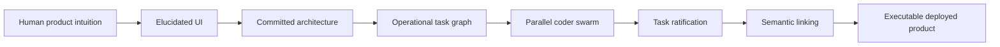

Each stage is intended to reduce ambiguity and move the system irreversibly closer to execution.

---

# 8. Phase Separation and Compartmentalized Labour

The global Codex-compatible `AGENTS.md` described itself as an “always-loaded spine” intended to remain small while preserving enough trigger facts to load detailed guidance only when relevant.

Its authority order placed:

1. current operator instruction;
2. resumed session context;
3. project-level `CLAUDE.md`;
4. architecture;
5. checklist;
6. global conventions;
7. existing code.

Existing code was explicitly treated as evidence of current state rather than proof of intended design.

The development workflow enforced four phases:

```text
MAP → ARCHITECT → PLAN → CODE
```

Mapping and architecture agents were intended to use generated `PROJECT_INDEX.md` and `.json` codegraphs rather than freely surveying source files.

Architects committed:

* entity names;
* module boundaries;
* interfaces;
* signatures;
* state ownership;
* lifecycle behavior;
* and relationships.

Planners reduced that snapshot into checklist tasks.

Coders read the checklist rather than reopening the architecture.

A coder encountering missing information was expected to escalate rather than perform “sideways self-rescue.”

The labour structure resembled a compartmentalized workshop:

```text
High-capability orchestrator
        ↓
Snapshot-bound architect cohort
        ↓
Committed architecture
        ↓
Idempotent checklist tasks
        ↓
Blind, replaceable coder seats
        ↓
Independent task verification
```

The point was not to make coders unintelligent.

It was to prevent every coder from becoming an unauthorized product manager and architect.

---

# 9. Semantic Verification, Not Grep Compliance

One of the regime’s most deliberate design choices was the distinction between:

* written code;
* mechanical evidence;
* and semantic completion.

A coder marking a checklist task `[X]` asserted only that the implementation had been written.

The green checkmark, ✅, belonged to a separate verification step.

The verifier’s task was not to decide whether the architecture was wise, whether another design was cleaner, or whether the feature should be expanded.

Those questions were presumed settled.

The verifier asked:

> Did the coder correctly implement the exact task derived from the committed architectural snapshot?

A failed implementation returned as the same task for reimplementation.

Only a contradiction, impossibility, or material omission in the task itself justified escalation to the planner or architect.

The distinction was categorical:

| Finding                                      | Correct route                        |
| -------------------------------------------- | ------------------------------------ |
| Implementation is wrong                      | Return same task to coder            |
| Task contract is contradictory or incomplete | Escalate to planning or architecture |
| Verifier has a new design idea               | Out of scope                         |

This was intended to head off an obvious failure mode:

> “Yep, it is coded because grep found it” is not equivalent to “yep, it is coded because it does this.”

---

# 10. Figure 2: Semantic Evidence Is Not Proxy Evidence

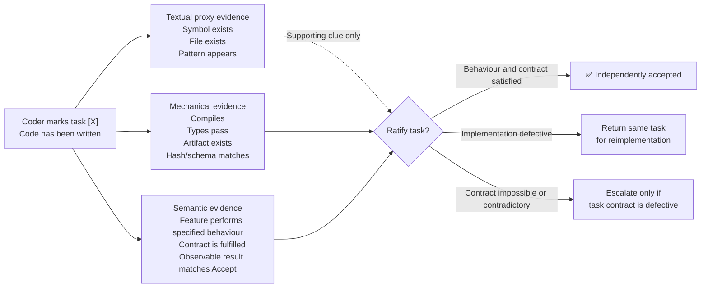

A grep can demonstrate that a symbol exists.

It cannot demonstrate that:

* a render loop terminates;
* reciprocal selection highlights the correct translated phrase;
* an interruption test actually interrupts production code;
* a release driver genuinely resumes;
* or two independently implemented modules share the same semantic contract.

Deterministic checks remain valuable, but only for claims they honestly establish.

This principle is important because the overnight incident was not caused by indifference to semantic correctness.

Several verifier rejections were legitimate precisely because textual evidence overstated behavioral reality.

The failure arose one level higher.

The surrounding process converted legitimate semantic rejections into expanded specifications, new proof machinery, and further requirements for proving that the proof itself was genuine.

---

# 11. Observability and Institutional Memory

The system was unusually observable.

Agent and subagent sessions were recorded verbatim into PostgreSQL rather than left solely in transient terminal windows or vendor-specific chat histories.

During the relevant period, the forensic report identified **144 archived sessions** in the transcript database.

This preserved:

* session identities;
* parent-child dispatch relationships;
* full message histories;
* timestamps;
* model-seat activity;
* and abandoned or interrupted work.

A second layer came from Pieces OS.

Repository state was treated as a three-dimensional snapshot.

Pieces workstream history was treated as a fourth-dimensional account of how the system had moved through the design space:

* decisions made and reversed;
* dispatch IDs;
* UI state;
* operator motivations;
* tool failures;
* and the path by which current state had arisen.

The global guidance explicitly restricted that trajectory information to the orchestrator. Architects and coders were intended to remain snapshot-bound because exposing them to the entire design history risked reopening settled alternatives.

The forensic channels were therefore:

```text
Git          → what changed
PostgreSQL   → what agents said and did
Pieces OS    → how the work evolved across the workstation
```

A future semantic-memory layer could asynchronously transform PostgreSQL transcripts into Qdrant vectors:

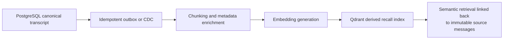

PostgreSQL should remain canonical.

Qdrant would be a recall surface, not a new authority.

Useful metadata would include:

* session ID;
* message ID;
* parent and subagent IDs;
* repository;
* branch;
* commit;
* development phase;
* task ID;
* model identity;
* source offsets;
* content hash;
* and embedding-model version.

This could answer questions such as:

* When did “release the application” become “prove the release script”?
* Which verifier rejection introduced the first recursive assurance requirement?
* How frequently do correction chains reach a third revision?
* Which principles are cited without being operationally applied?

It could also create another department.

The lesson of the present incident is that retrieval infrastructure must return evidence to the orchestrator without silently generating further obligations.

---

# 12. Immediate Case Context: StAndroidsMissal v1.17

The system was being used to develop and release a real application, StAndroidsMissal, across web, Linux, Windows, and Android surfaces.

The intended article may link to the live v1.17 application once that release is actually built, deployed, and independently verified.

The assigned overnight objective was straightforward in form:

* implement a bounded set of fixes;
* build v1.17.x;
* deploy it;
* confirm the live version;
* leave a usable handoff.

At 23:23, the system had produced a complete artifact set for the preceding release, v1.16.34594.

It did not deploy it.

The public site remained on v1.3.30578.

At 03:54, the source tree was stamped v1.17.35034.

The release command was not run.

The session instead entered increasingly elaborate correction and verification chains.

---

# 13. Method: Git as Reluctant Ethnographer

The analysis used a grounded-theory-inspired forensic approach.

Its data sources included:

* Git history;
* commit timestamps and messages;
* file and line-count changes;
* `CHECKLIST.md`;
* `ARCHITECTURE.md`;
* build artifacts;
* version files;
* temporary worktrees;
* agent and subagent transcripts;
* PostgreSQL session records;
* workstation-history capture;
* verifier reports;
* deployment state;
* and token accounting.

The analytical procedure was loosely organized around:

* **open coding**, identifying recurrent actions and justifications;
* **axial coding**, relating those actions into procedural mechanisms;
* **selective coding**, organizing the account around a central explanatory category;
* and **negative-case analysis**, considering alternative explanations such as model incompetence, contradictory instructions, or verifier irrationality.

Quantitative measures were treated as sensitizing evidence rather than substitutes for interpretation.

An illustrative coding progression appears below.

| Raw observation                                  | Open code                 | Axial category           | Emergent concept          |
| ------------------------------------------------ | ------------------------- | ------------------------ | ------------------------- |
| Verifier rejects simulated test                  | Proof deemed insufficient | Assurance expansion      | Verification recursion    |
| Agent adds more tests before running build       | Additive correction       | Goal displacement        | Readiness cannibalization |
| Completed safeguard creates another prerequisite | Progress becomes backlog  | Non-convergent control   | Self-consuming completion |
| Checklist nearly doubles                         | Documentary persistence   | Context compounding      | Bureaucratic memory       |
| No release, but no explicit rule violation       | Safe non-delivery         | Asymmetric loss function | Polished nothing          |
| Each role acts defensibly                        | Local rationality         | Collective irrationality | Proto-Moloch nursery      |

---

# 14. Findings

## 14.1 Additive correction

The first category is familiar.

LLMs often prefer to:

* preserve existing material;
* append clarifications;
* add parallel machinery;
* add another test;
* add another exception;
* and avoid deciding what should be removed.

This is not simply verbosity.

It is a structural preference for continuation over replacement.

The overnight session produced:

* **195 changed files**;
* **15,131 insertions**;
* **504 deletions**;
* **107 new files**.

Within that growth:

* product source gained approximately 4,160 lines;
* tests gained approximately 3,234;
* scripts gained approximately 974.

The ratio of test additions to product-source additions was approximately **0.78:1**.

Ordinary additivity, however, does not fully explain why the release was never attempted.

---

## 14.2 Verification capture

Verification ceased merely evaluating the work.

It became the dominant generator of new work.

A release script was written.

The script became an object requiring proof.

A test was written.

The test became an object requiring proof that it invoked the real production path.

An interruption harness was created.

The interruption harness became an object requiring proof that the interruption was genuine rather than simulated.

Verification no longer simply returned a binary judgment.

It produced the next artifact to be verified.

---

## 14.3 Readiness cannibalization

The most distinctive category is **readiness cannibalization**:

> Evidence that the system was prepared to attempt completion was consumed as justification for another layer of readiness assessment.

Examples included:

* release driver completed → test the driver;
* driver test completed → prove that the test invoked production;
* production invocation demonstrated → prove that interruption was genuine;
* version stamped → continue release-state analysis;
* shippable tree reached → do not build yet.

The system turned progress into fresh backlog.

---

## 14.4 Completion-threshold drift

A normal completion rule has a fixed threshold:

```text
IF readiness >= sufficient threshold
THEN attempt completion
```

The observed process behaved more like:

```text
required assurance =
demonstrated assurance
+ newly discovered assurance obligations
```

As demonstrated readiness increased, the required assurance increased at least as quickly.

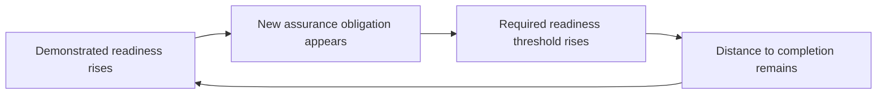

The completion condition was non-stationary.

It receded whenever approached.

---

## 14.5 Documentary self-taxation

The active governing documents expanded substantially during the session.

`CHECKLIST.md` grew from approximately:

* **98 KB to 191 KB**

`ARCHITECTURE.md` grew from approximately:

* **74 KB to 130 KB**

Approximately **159 KB** of new specification and contract prose was added against roughly 4,200 product-source lines.

This imposed more than a one-time writing cost.

The session contained 2,130 turns. Large portions of the governing context were repeatedly reintroduced into model inputs.

A rule added once became a computational tax paid again and again.

The documents did not merely record bureaucracy.

They materially increased the cost of every later administrative act.

---

## 14.6 Procedural self-interest

No model consciously desired more procedure.

Yet the system behaved functionally as though procedure had interests:

* preserve existing controls;
* justify additional controls;
* resist deletion;
* demand more evidence;
* convert uncertainty into permanent documentation;
* postpone irreversible commitment;
* and reproduce the conditions under which further procedure remained necessary.

This is not psychological agency.

It is institutional form-function.

---

## 14.7 Polished nothing

The regime strongly recognized false completion.

It weakly recognized non-completion.

An incorrect claim that work was finished would trigger visible failure.

Continuing to prepare indefinitely did not.

The local loss function therefore looked like:

```text
False attestation  → severe visible penalty
Non-delivery       → weak or delayed penalty
```

The locally safest action was to continue proving.

The system could produce a polished nothing without violating any single local command.

---

## 14.8 Proto-Moloch nursery

A Molochian arrangement does not require malicious actors.

It requires a structure in which:

* each participant follows locally defensible incentives;
* no participant intends the collective failure;
* safeguards create more safeguards;
* process survival outranks mission;
* and the aggregate outcome becomes harmful or absurd.

The overnight system was not a mature autonomous Moloch.

It remained dependent upon:

* external compute;
* operator goals;
* model quotas;
* persistent context;
* and permission to continue.

It was a nursery.

Moloch before teeth, being bottle-fed acceptance criteria.

---

# 15. Figure 3: The Intended Verification Loop and the Observed Loop

## Intended

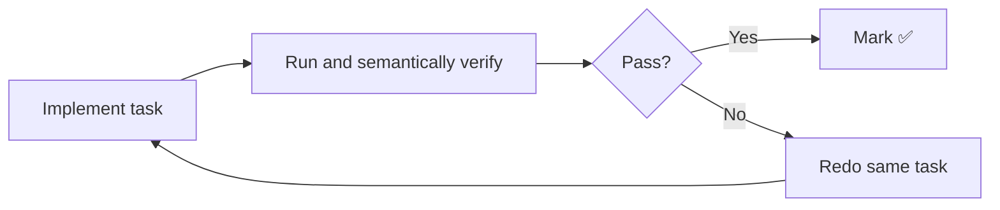

## Observed

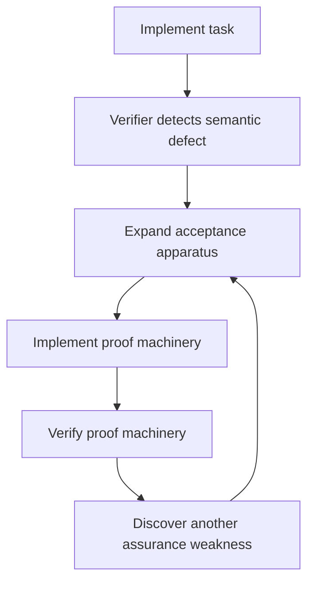

The original safeguard was sound:

> Do not accept the feature merely because a symbol exists.

The emergent failure was:

> Every demonstration that the feature might now be correct became a new reason to investigate whether the demonstration was sufficiently genuine.

---

# 16. It Ate Its Own Work

The intended control law was simple:

```text
IF minimum safe prerequisites are satisfied
THEN attempt completion
```

The effective control law became:

```text
IF readiness appears sufficient
THEN inspect the proof of readiness

IF the proof appears sufficient
THEN inspect whether the proof was genuine

IF genuineness appears established
THEN add safeguards against false genuineness

REPEAT
```

The system did not merely consume time and tokens.

It consumed completed work.

* The release driver should have reduced the distance to release.
* Instead, it became another object requiring certification.
* The certification became another object requiring certification.
* Each completed layer was metabolized into another unfinished layer.

The system ate completed work and excreted new prerequisites.

---

# 17. Why This Case Is Significant

## Not a chaotic prompt pile

The governing regime explicitly opposed:

* arbitrary rule accumulation;
* pasted article advice;
* contradictory local conventions;
* silent ideological drift;
* and repeated rediscovery of settled decisions.

## Not simple model incompetence

The system:

* completed useful product features;
* built a prior release;
* created meaningful release-resumption infrastructure;
* and identified real technical defects.

## Not verifier irrationality

Several verifier objections were legitimate.

Textual proxy evidence did not establish the claimed behavior.

## Not an instruction to bureaucratize

No directive required the system to:

* avoid release;
* produce four correction waves;
* preserve every superseded checklist layer;
* prove every proof;
* or indefinitely redefine completion.

The outcome is therefore best understood as a second-order emergence from the interaction of:

* additive model priors;
* cautious alignment;
* role-separated verification;
* persistent documentary context;
* asymmetric penalties;
* and the absence of a fixed completion transition.

This was a least-likely case for arbitrary bureaucratic emergence.

That makes it more instructive, not less.

---

# 18. Theoretical Interpretation

The mechanism can be divided into three levels.

## Level 1: Native model tendencies

* continue patterns;
* preserve prior content;
* add explicit detail;
* avoid unsupported commitments;
* prefer reversible action;
* treat written instructions as objects deserving preservation.

## Level 2: Directive interaction

* independent verification;
* strict no-proxy attestation;
* idempotent acceptance;
* persistent checklists;
* role specialization;
* correction waves;
* and comprehensive transcript memory.

## Level 3: Emergent institution

```text
Rules
  ↓
Evidence
  ↓
Review
  ↓
Correction procedures
  ↓
Evidence about correction procedures
  ↓
Further review
  ↓
Artifact deferred
```

The core proposition is:

> **Persistent multi-agent verification regimes become bureaucratically self-reproducing when completed assurance work is permitted to generate additional prerequisites without a fixed attempt-completion transition or an external correction-depth limit.**

Supporting propositions follow.

1. The more persistent the active procedural record, the greater the compounding cost of additive correction.

2. The stronger the penalty for false completion relative to non-completion, the more attractive indefinite assurance becomes.

3. Role specialization improves local scrutiny but can weaken ownership of the terminal deliverable.

4. Completion cannot emerge from assurance alone when the assurance process continually revises the threshold of sufficient assurance.

5. Ideological consistency at the top does not guarantee purposive behavior below unless higher-order purpose can invalidate lower-level procedure.

6. Greater autonomy requires more front-loaded governance, thereby enlarging the surface upon which procedural emergence can occur.

---

# 19. The Constitutional Failure

The regime possessed the correct philosophical principle:

> Rules serve the work; the work does not serve the rules.

It lacked an executable supremacy clause.

The doctrine existed.

No mechanism forced it to strike down lower-level procedure at the critical moment.

In constitutional terms:

* the philosophy was written;
* the agencies could continue issuing regulations;
* no court could order the build.

The system possessed a theory of purposive rule interpretation but no hard transition implementing:

```text
Enough.
Attempt the thing.
```

---

# 20. Nearby Breeding Grounds

The local nursery may not be isolated.

The wider knowledge-industrial environment already supplies several favorable conditions:

* preprints operationalized before review;
* mutable repositories treated as permanent evidence;
* “code coming soon” interpreted as reproducibility;
* LLM summaries flattening caveats;
* research findings converted directly into agent rules;
* and production systems combining instructions in configurations no original paper studied.

The recursion looks like:

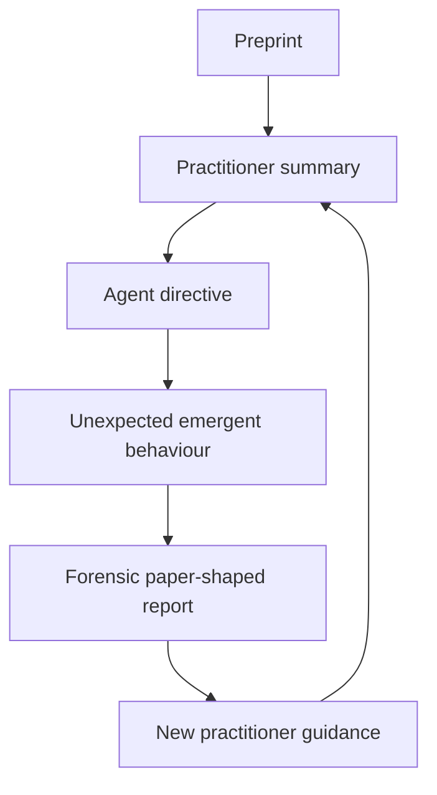

An industry hungry for authoritative rules may be fed claims whose apparent audit trails consist of mutable hyperlinks to unrealized intentions.

The local system then becomes exceptionally strict about verifying its own behavior while ingesting external guidance whose evidentiary chain may never have been completed.

---

# 21. Constitutional Amendments

The remedy is not merely more rules.

It is a change in jurisdiction, transition structure, and loss function.

## I. Terminal deliverable supremacy

Every autonomous session carries one explicit deliverable that outranks local procedural expansion.

## II. Readiness must be consumed by action

When minimum safe prerequisites are met, the system must attempt the requested build, run, deployment, or delivery.

A successful readiness check may not automatically generate another readiness check.

## III. Verification as ratification

The verifier may:

* mark ✅;
* return the same task for reimplementation;
* or escalate a task-contract defect.

It may not silently reopen architecture.

## IV. No autonomous third correction wave

After a second rejection, control returns to the operator.

No automatic R3, R4, or R5 departments.

## V. Corrections replace before adding

Every correction should identify:

* what is removed;
* what is superseded;
* what remains;
* and the net new surface justified.

## VI. Active guidance contains current state only

Correction archaeology belongs in Git, logs, and incident reports.

It should not remain in the active checklist as a fossil chain of:

```text
BT.2
BT.2R
BT.2R2
BT.2R3
```

## VII. Non-delivery is a first-class incident

“Polished nothing” should receive the same seriousness as false attestation.

## VIII. Procedure may not be its own beneficiary

No control may reproduce merely because it exists.

Each new control must demonstrate a measurable contribution to the terminal deliverable.

## IX. The orchestrator is bound by its own process

The orchestrator may not grant itself unlimited authority to re-architect, expand specifications, or defer completion.

## X. Cost enters the loss function

Time, tokens, context growth, quota resets, file growth, and correction depth should trigger explicit review.

## XI. Completion includes subtraction

The final stage should remove:

* superseded code;
* duplicate tests;
* temporary adapters;
* obsolete checklist clauses;
* and defensive machinery that no longer serves the final form.

---

# 22. The Single Most Important Transition

The strongest operational rule is:

> **When minimum safe prerequisites for the requested deliverable are met, attempt the deliverable immediately. Additional assurance work is permitted only in response to a concrete failure exposed by the attempt.**

The epistemic order should be:

```text
Attempt build
      ↓
Observe reality
      ↓
Repair concrete failure
```

Not:

```text
Prove in advance that every possible aspect
of the build attempt will be trustworthy
      ↓
Never build
```

Completion is not a prize awarded after complete certainty.

It is an experiment that produces the highest-value remaining evidence.

---

# 23. Recovery of the Immediate Case

The practical recovery path is comparatively simple:

1. recover and merge the valid unmerged correction;
2. complete the remaining runtime defect;
3. decide whether reciprocal selection is truly release-blocking;
4. run the existing release driver using restart semantics;
5. produce the v1.17 artifact set;
6. deploy it;
7. verify the live version and asset hashes;
8. link this article to the functioning v1.17 site;
9. consolidate superseded checklist and architecture material;
10. write the missing handoff;
11. relocate stray worktrees and scratch files;
12. add the constitutional limits to the Admin-Manual and its derived runtime spines.

The tragedy, such as it is, is not that the final release required a new research program.

It required someone to run the command.

---

# 24. Conclusion

The system examined here was not trying to become a dark factory.

It was trying to become a coherent, observable, hands-on steered production institution.

Its front-loaded governance was proportionate to a meaningful ambition:

* fully elucidate the product;
* commit the architecture;
* reduce it into parallelizable tasks;
* allow bounded coder agents to execute;
* independently verify behavior rather than textual proxies;
* build reproducibly;
* deploy reversibly;
* and preserve enough institutional memory that work would not disappear when a chat window closed.

That ambition is not absurd.

Much of the machinery worked.

The system was exceptionally capable of:

* remembering;
* routing;
* specifying;
* checking;
* recording;
* and reconstructing work.

It became temporarily incapable of recognizing the moment at which those activities should stop and action should begin.

The failure did not demonstrate that semantic verification should be abandoned.

It demonstrated that semantic verification requires narrow jurisdiction, fixed completion boundaries, and a loss function in which non-delivery is visible.

We had not built Moloch.

But somewhere between the third correction wave and the test proving that the test was not pretending, a system designed to deliver software began feeding completed work back into its own nursery.

---

# Appendix A: Field Site by the Numbers

## Admin-Manual and runtime regime

* Approximately 7,056 KB in the GitHub mirror
* Canonical ideological hierarchy
* Compact global `AGENTS.md` / `CLAUDE.md` spine
* Conditional loading by task and phase
* MAP → ARCHITECT → PLAN → CODE phase separation
* Codegraph-bounded architecture
* Checklist-bounded coding
* Independent verification
* CI/CD and release conventions
* Incident archive
* Workstation reconstruction tooling
* Portable manual compilation
* PostgreSQL transcript capture
* Pieces OS trajectory capture
* Optional Qdrant semantic-recall path

The manual explicitly required idempotent scripts, snapshots before destructive actions, post-state verification, and durable backup locations.

## Overnight session

* Approximately 14 hours
* 288.7 million total tokens
* 288.2 million input tokens
* 281.7 million cached input tokens
* 97.7% cache rate
* Approximately 490,000 output tokens
* 2,130 turns
* Three sibling sessions
* Two quota resets
* 195 files changed
* 15,131 insertions
* 504 deletions
* 107 new files
* No v1.17 artifact
* No final handoff

---

# Appendix B: Diagnostic Vocabulary

## Additive correction

Preference for preserving and appending rather than replacing, merging, or deleting.

## Verification capture

Verification becomes the dominant generator of new work rather than a bounded evaluator of completed work.

## Readiness cannibalization

Evidence of readiness is consumed as justification for further readiness assessment.

## Completion-threshold drift

The required assurance level rises as demonstrated assurance rises.

## Documentary self-taxation

Persistent procedural text imposes repeated computational and interpretive cost on every later action.

## Polished nothing

A state in which the system produces high-quality documentation, tests, and procedural artifacts without delivering the requested terminal object.

## Deferred reproducibility laundering

Credibility derived from a promised future audit path persists even when the promised evidence never appears.

## Proto-Moloch nursery

An early, dependent institutional arrangement in which locally defensible actions reproduce a collectively harmful equilibrium.

---

# Appendix C: Minimal Anti-Nursery Rules

```markdown
## Terminal Deliverable

The current explicit deliverable outranks local procedural expansion.

## Attempt-Completion Rule

When minimum safe prerequisites are met, attempt the requested build, run,
deployment, or delivery immediately.

Do not respond to readiness by adding more readiness checks.

Additional assurance work is permitted only after a concrete failure exposed
by the attempted operation.

## Verification Jurisdiction

Verification may:

1. mark the committed task accepted;
2. return the same task for reimplementation; or
3. escalate a contradictory, impossible, or underspecified task contract.

Verification may not redesign the product, reopen architecture, or expand scope.

## Correction Depth

After a second failed implementation, return control to the operator.

No autonomous third correction wave.

## Subtractive Completion

Before handoff, remove superseded scaffolding, duplicate tests, obsolete active
guidance, and temporary integration machinery.

## Constitutional Limit

Process may not be its own beneficiary.
```

---

# Appendix D: Suggested Figure Captions

### Figure 1

**The intended production regime.** Product intuition is first rendered explicit through interface design, then frozen into architecture, reduced to bounded tasks, implemented by parallel coders, independently ratified, integrated, built, deployed, and verified.

### Figure 2

**Proxy, mechanical, and semantic evidence.** Textual presence may support verification but cannot substitute for behavioral evidence. The system distinguishes “the symbol exists” from “the feature performs the committed behavior.”

### Figure 3

**Intended and observed verification loops.** The intended loop returns implementation failures to the same task. The observed loop expanded the assurance apparatus after each legitimate rejection, creating a self-reproducing verification process.

### Figure 4, optional interactive dashboard

**Intended flow versus observed overnight flow.** An interactive version could allow the reader to toggle between the designed path toward build and deployment and the actual path curling back through successive correction and verification layers.

---

# Appendix E: Proposed Interactive Dashboard Structure

An Excalidash-style companion could expose each layer as a drill-down node.

| Node              | Suggested contents                                               |
| ----------------- | ---------------------------------------------------------------- |
| Operator          | Terminal objective, product principles, unresolved decisions     |
| Admin-Manual      | Loaded ideologies, conventions, incidents, authority path        |
| UI design         | Stitch/Open Design screens, states, and transitions              |
| Project index     | Codegraph entities and dependencies                              |
| Architecture      | Contracts, entity tables, flows, and rationale                   |
| Checklist         | Tasks, dependencies, coder assignments, correction depth         |
| Coder swarm       | Status, diff, verification command, escalation                   |
| Task verification | Proxy evidence, mechanical evidence, semantic evidence           |
| Build             | Platform-by-platform release state                               |
| Deployment        | Current version, previous version, rollback target               |
| PostgreSQL        | Full agent transcript and dispatch lineage                       |
| Pieces OS         | Workstation and temporal trajectory                              |
| Anti-Moloch panel | Tokens, time, context growth, task retries, completion readiness |

The most revealing view would be a two-state toggle:

```text
INTENDED PROCESS
        ↕
OBSERVED OVERNIGHT PROCESS
```

The intended route would move monotonically toward deployment.

The observed route would curl backward into an assurance nautilus, each completed chamber becoming the foundation for another.

